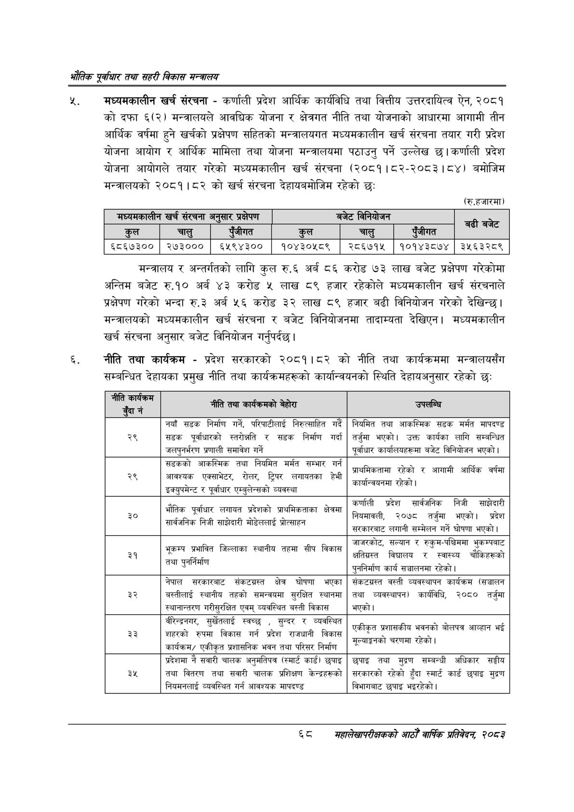

# Page 90 QA

## Rendered page


## Extracted text

```text
भरोतिक एवधार तथा सहरी विकास
न्‌. मध्यमकालीन खर्च संरचना -कर्णाली प्रदेश आर्थिक कार्यविधि तथा वित्तीय उत्तरदायित्व ऐन, २०८१ को दफा ६(२) मन्त्रालयले आवधिक योजना र क्षेत्रगत नीति तथा योजनाको आधारमा आगामी तीन आर्थिक वर्षमा हुने खर्चको प्रक्षेपण सहितको मन्त्रालयगत मध्यमकालीन खर्च संरचना तयार गरी प्रदेश योजना आयोग र आर्थिक मामिला तथा योजना मन्त्रालयमा पठाउनु पर्ने उल्लेख छ। कर्णाली प्रदेश योजना आयोगले तयार गरेको मध्यमकालीन खर्च संरचना (२०८१।८२-२०८३। ८४) बमोजिम मन्त्रालयको २०८१।८२ को खर्च संरचना देहायबमोजिम रहेको छः
(रु.हजारमा)
मन्त्रालय र अन्तर्गतको लागि कुल रु.६ अर्ब ८६ करोड ७३ लाख बजेट प्रक्षेपण गरेकोमा अन्तिम बजेट रु.१० अर्ब ४३ करोड लाख ८९ हजार रहेकोले मध्यमकालीन खर्च संरचनाले प्रक्षेपण गरेको भन्दा रु.३ अर्ब ५६ करोड ३२ लाख ८९ हजार बढी विनियोजन गरेको देखिन्छ। मन्त्रालयको मध्यमकालीन खर्च संरचना र बजेट विनियोजनमा तादाम्यता देखिएन। मध्यमकालीन खर्च संरचना अनुसार बजेट विनियोजन गर्नुपर्दछ |
नीति तथा कार्यक्रम -प्रदेश सरकारको २०८१।८२ को नीति तथा कार्यक्रममा मन्त्रालयसँग सम्बन्धित देहायका प्रमुख नीति तथा कार्यक्रमहरूको कार्यान्वयनको स्थिति देहायअनुसार रहेको छः
६८
मंहालेखापरीक्षकको आठौँ वाषिक प्रतिवेदन २०८२

| मध्यमकालीन खर्च संरचना अनुसार प्रक्षेपण   | मध्यमकालीन खर्च संरचना अनुसार प्रक्षेपण   | मध्यमकालीन खर्च संरचना अनुसार प्रक्षेपण   | बजेट विनियोजन   | बजेट विनियोजन   | बजेट विनियोजन   |   बढी बजेट |
|-------------------------------------------|-------------------------------------------|-------------------------------------------|-----------------|-----------------|-----------------|------------|
| कुल                                       | चालु                                      | पुँजीगत                                   | कुल             | चालु            | पुँजीगत         |            |
| ६८६७३००                                   | &#124; २७३०००                             | ६४५९४३००                                  | १०४३०५८९        | २८६७१५          | १०१४३८७४        |    ३५६३२८९ |

| नीति कार्यनन ुदा नं | नीति तथा बेहोरा |  |
| --- | --- | --- |
| २९ | नयाँ सडक निर्माण गर्ने, परिपाटीलाई गर्दै सडक पूर्वाधारको स्तरोचति र सडक निर्माण गर्दा जलपुनर्भरण प्रणाली समावेश गर्ने | नियमित तथा आकस्मिक सडक मर्मत मापदण्ड तर्जुमा भएको। उक्त कार्यका लागि सम्बन्धित पूर्वाधार कार्यालयहरूमा बजेट विनिवोजन भएको \| |
| २९ | सडकको आकस्मिक तथा नियमित मर्मत सम्भार गर्न - हेभी आवश्यक एक्साभेटर, रोलर, ट्रिपर लगावतका हेभी इक्युपभेन्ट र पूर्वाधार ९न्चुलेन्सको व्यवस्था | न < परमिमिकतामा रहेको र आगामी आर्थिक वर्षमा. रहेको कार्यान्वबनमा १ |
| ३० | प्रदेशको यम भौतिक पूर्वाधार लगायत प्रदे श्राथमिकताका क्षेत्रमा साझेदारी मोडललाई प्र सार्वजनिक निजी साझेदारी भाडेललाई प्रोत्साहन | कर्णाली प्रदेश सार्षणनिक निजी साझेदारी -. निवमानली, २०७८ तर्जुमा भएको। प्रदेश मेलन गर्ने घोषणा भएको सरकारजाट लगानी सम्मेलन गर्ने घोषणा भएको \| |
| ३१ | ~ भूकम्प प्रभावित स्थानीय तहमा सीप विकास ~ - तथा पुनर्निर्माण = | जाजरकोट, सल्यान र रुकुम-पश्चिममा भुकम्पबाट = चा २ क्षतिग्रस्त विद्यालय र स्वास्थ्य चोकिहरूको ~. रहेको पुननिर्माण कार्य सञ्चालनमा रहेको। |
| ३२ | नेपाल सरकारबाट संकटभ्रह्त क्षेत्र घोषणा भएका बल्तीलाई स्थानीय तहको क्षमन्वथमा सुरक्षित स्थानमा स्वानान्तरण गरीसुरक्षित एवम्‌ व्ववस्थित बस्ती विकास | संकटभ्रष्त वस्ती व्यवस्थापन कार्यक्रम (सञ्चालन तथा व्यवस्थापन) कार्यविधि, २०८० तर्जुमा भएको। |
| ३३ | बारन्क्रनणर, चुखतलाई स्वच्छ, सुन्दर र व्यवस्थित शहरको रुपमा विकास गर्न प्रदेश राजधानी विकास - कार्यक्रम/ एकीकृत श्रर॥लानिक भवन तथा परिसर निर्माण | एकीकृत करीव भवनको बोलपत्र आव्हान भई त्रशासकीव वह उत न चरणमा रहेको। मूल्वाङ्गको |
| ३५ | प्रदेशमा नै सवारी चालक अनुधति५त्र (स्मार्ट कार्ड) छपाइ तथा वितरण तथा सवारी चालक प्रशिक्षण केन्द्रहरूको निवमनलाई व्यवस्थित गर्न आवश्यक मापदण्ड | छपाइ तथा मुद्रण सम्बन्धी अधिकार सङ्घीय सरकारको रहेको हुँदा स्मार्ट कार्ड छपाइ मुद्रण विभागबाट छपाइ भइरहेको \| |
```

## Flags
- table_page
- medium_quality_table
