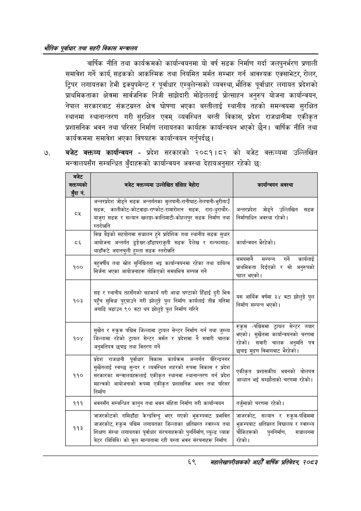

# Page 91 QA

## Rendered page


## Extracted text

```text
भरोतिक एवधार तथा सहरी विकास
वार्षिक नीति तथा कार्यक्रमको कार्यान्वयनमा यो वर्ष सडक निर्माण गर्दा जलपुनर्भरण प्रणाली समावेश गर्ने कार्य सडकको आकस्मिक तथा नियमित मर्मत सम्भार गर्न आवश्यक एक्साभेटर, रोलर, ट्रिपर लगायतका हेभी इक्युपमेन्ट र पूर्वाधार एम्बुलेन्सको व्यवस्था, भौतिक पूर्वाधार लगायत प्रदेशको प्राथमिकताका क्षेत्रमा सार्वजनिक निजी साझेदारी मोडेललाई प्रोत्साहन अनुरुप योजना कार्यान्वयन, नेपाल सरकारबाट संकटग्रस्त क्षेत्र घोषणा भएका बस्तीलाई स्थानीय तहको समन्वयमा सुरक्षित स्थानमा स्थानान्तरण गरी सुरक्षित एवम्‌ व्यवस्थित बस्ती विकास, प्रदेश राजधानीमा एकीकृत प्रशासनिक भवन तथा परिसर निर्माण लगायतका कार्यहरू कार्यान्वयन भएको छैन। वार्षिक नीति तथा कार्यक्रममा समावेश भएका विषयहरू कार्यान्वयन गर्नुपर्दछ |
बजेट वक्तव्य कार्यान्वयन -प्रदेश सरकारको २०८१।८२ को बजेट वक्तव्यमा उल्लिखित मन्त्रालयसँग सम्बन्धित बुँदाहरूको कार्यान्वयन अवस्था देहायअनुसार रहेको छः
६९
सहालेखापरीक्षकको वाषिक प्रतिवेदन २०८२

| 'बजेट बत्तम्वको बुँदा नं. | 'बजेट ५००५ उल्लेखित संक्षिप्त बेहोरा | कार्यान्चयन अवस्था |
| --- | --- | --- |
|  | अन्तरञ्रदेश जोड्ने सडक अन्तर्गतका मुलपानी-रानीघाट-तेलपानी-भुरीगाउँ |  |
|  | सडक, कालीकोट-कोटबाडानराष्कोट-रामारोशन सडक, रारा-घुराचौर- बाजुरा सडक र सल्यान खलङ्गा-कालिमाटी-कोहल९ सडक निर्माण तथा स्तरोञ्जति | अन्तरञ्रदेश जोड्ने उल्लिखित सडक निर्माणाधिन अवस्था रहेको। |
| ८६ | विश्व बैङ्कको सहो११। सञ्चालन हुने प्रादेशिक तथा स्थानीय सडक सुधार आयोजना अन्तर्गत डुङ्गैेघर-डाँडा५०शुली सडक दैलेख र बल्कामाङ- थाडांकटे अदानचुली हुम्ला सडक ल्तरोच्ति | कार्यान्वथन भैरहेको। |
| १०० | त - - चहुवर्षीय तथा स्रोत सुनिब्चितता भइ कार्यान्वयनमा रहेका तथा दायित्व बा नि सिर्जना भएका आयोजनाहरू तोकिएको समयभित्र सम्पन्न गर्ने | सम्पन्न गर्ने कार्यलाई दिईएको र सो प्राथमिकता रो र सो अनुरुपको = पहल भएको \| |
| १०३ | सङ्घ र स्थानीय तहसैँगको सहकार्य गरी आधा घण्टाको हिँडाई दुरी भित्र ५ क पहुँच सुविधा पुरयाउने गरी झोलुङ्गे पुल निर्माण कार्यलाई तीब्र गतिमा = fifi“ = अगाडि बढाउन ९० वटा थप झोलुङ्गे पुल निर्माण गरिने | . यस आर्थिक वर्षमा ३४ वटा झोलुङ्गे पुल सम्पन्न भएको लौ निर्माण सम्पन्न भएको \| |
| १०४ | ~ सुर्खेत र रुकुम पश्चिम जिल्लामा ट्रायल सेन्टर निर्माण गर्न तथा जुम्ला = - जिल्लामा रहेको ट्रायल सेन्टर मर्मत र प्रदेशमा नै सवारी चालक लिप्त छपाइ - अनुमतिपत्र छुपाइ तथा वितरण गर्ने | रुकुम -पश्चिममा ट्रायल सेन्टर तयार ब्रा भएको। सुर्खेतमा कार्वान्चकनको चरणमा. रहेको। सवारी चालक अनुमति पत्र ब्ररहेको छपाइ मुद्रण विभागबाट भैरहेको। |
| ११० | प्रदेश राजधानी पूर्वाधार विकास कार्यक्रम अन्तर्गत बारिन्द्रणणर चुर्खेतलाई स्वच्छ सुन्दर र व्यवस्थित शहरको रुपमा विकास र प्रदेश = सरकारका मन्त्रालबहरूलाई एकीकृत स्थानमा स्थानान्तरण गर्न प्रदेश ~ महत्वको आयोजनाको रूपमा एकीकृत प्रशासनिक भवन तथा परिसर निर्माण | - एकीकृत भवनको बोलपत्र - ४ . आव्हान भई सम्झौताको चरणमा रहेको \| |
| १११ | भवनसँग सम्बन्धित कानुन तथा भवन संहिता निर्माण गरी कार्यान्वन | तर्जुमाको चरणमा रहेको। |
|  |  |  |
| ११३ | जाजरकोटको रामिडाँडा केन्द्रबिन्दु भएर गएको भूकन्पनाट प्रभावित आजरकोट, रुकुम पश्चिम लगायतका जिल्लाका क्षतिग्रस्त स्वास्थ्य तथा | जाजरकोट, सल्यान र रुकुम-पश्चिममा भुकम५१८ क्षतिग्रस्त विद्यालय र स्वास्थ्य |
|  | शिक्षण संस्था लगावतका पूर्वाधार धर्चनाहरूको पुनर्निर्माण, ७००८ व्याक बेटर (बिबिवि) को मूल न॥न्थताना रही यस्ता भवन संरचनाहरू निर्माण | चोकिहरकको पुननिर्माण सञ्चालनमा रहेको। |
```

## Flags
- table_page
- medium_quality_table
