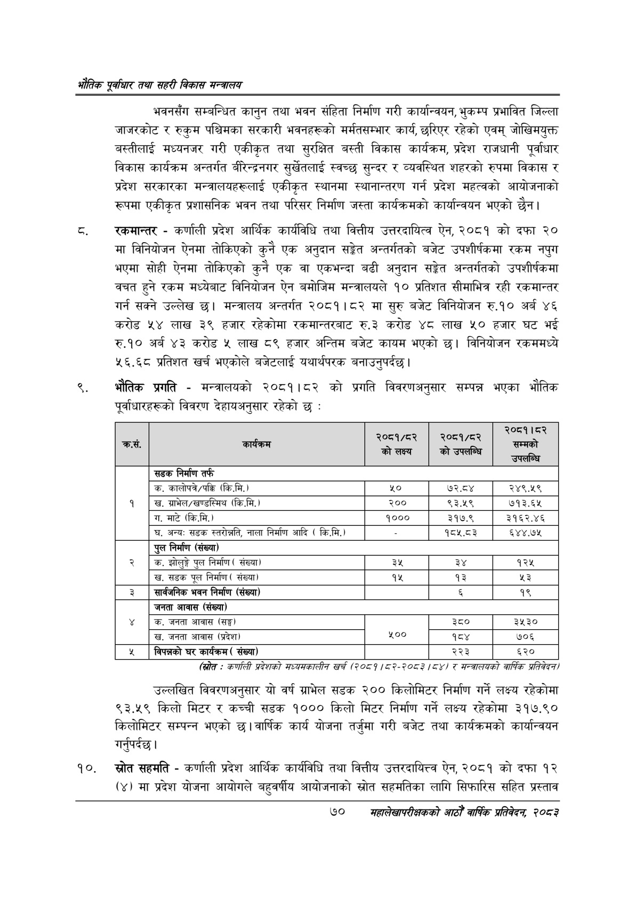

# Page 92 QA

## Rendered page


## Extracted text

```text
भरोतिक एवधार तथा सहरी विकास
भवनसँग सम्बन्धित कानुन तथा भवन संहिता निर्माण गरी कार्यान्वयन, भुकम्प प्रभावित जिल्ला जाजरकोट र रुकुम पश्चिमका सरकारी भवनहरूको मर्मतसम्भार कार्य, छरिएर रहेको एवम्‌ जोखिमयुक्त बस्तीलाई मध्यनजर गरी एकीकृत तथा सुरक्षित बस्ती विकास कार्यक्रम, प्रदेश राजधानी पूर्वाधार विकास कार्यक्रम अन्तर्गत बीरिन्द्रनगर सुर्खेतलाई स्वच्छ सुन्दर र व्यवस्थित शहरको रुपमा विकास र प्रदेश सरकारका मन्त्रालयहरूलाई एकीकृत स्थानमा स्थानान्तरण गर्न प्रदेश महत्वको आयोजनाको रूपमा एकीकृत प्रशासनिक भवन तथा परिसर निर्माण जस्ता कार्यक्रमको कार्यान्वयन भएको छैन।
रकमान्तर -कर्णाली प्रदेश आर्थिक कार्यविधि तथा वित्तीय उत्तरदायित्व ऐन, २०८१ को दफा २० मा विनियोजन ऐनमा तोकिएको कुनै एक अनुदान सङ्केत अन्तर्गतको बजेट उपशीर्षकमा रकम नपुग भएमा सोही ऐनमा तोकिएको कुनै एक वा एकभन्दा बढी अनुदान सङ्गेत अन्तर्गतको उपशीर्षकमा वचत हुने रकम मध्येबाट विनियोजन ऐन बमोजिम मन्त्रालयले १० प्रतिशत सीमाभित्र रही रकमान्तर गर्न सक्ने उल्लेख | मन्त्रालय अन्तर्गत २०८१।८२ मा सुरु बजेट विनियोजन रु.१० अर्ब ४६ करोड लाख ३९ हजार रहेकोमा रकमान्तरबाट रु.३ करोड ४८ लाख ५० हजार घट भई रु.१० अर्ब ४३ करोड ५ लाख ८९ हजार अन्तिम बजेट कायम भएको छ। विनियोजन रकममध्ये ५६.६८ प्रतिशत खर्च भएकोले बजेटलाई यथार्थपरक बनाउनुपर्दछ |
भौतिक प्रगति -मन्त्रालयको २०८१।८२ को प्रगति विवरणअनुसार सम्पन्न भएका भौतिक पूर्वाधारहरूको विवरण देहायअनुसार रहेको छ:
( -कर्णली प्रदेशको सध्यसकालीन खर्च (२०८१/८२-२०८३/८४४ र मन्त्रालयको वार्षिक प्रतिवेकन/
उल्लखित विवरणअनुसार यो वर्ष ग्राभेल सडक २०० किलोमिटर निर्माण गर्ने लक्ष्य रहेकोमा ९३.५९ किलो मिटर र कच्ची सडक १००० किलो मिटर निर्माण गर्ने लक्ष्य रहेकोमा ३१७.९० किलोमिटर सम्पन्न भएको छ। वार्षिक कार्य योजना तर्जुमा गरी बजेट तथा कार्यक्रमको कार्यान्वयन गर्नुपर्दछ |
स्रोत सहमति -कर्णाली प्रदेश आर्थिक कार्यविधि तथा वित्तीय उत्तरदायित्त ऐन, २०८१ को दफा १२ (४) मा प्रदेश योजना आयोगले बहुवर्षीय आयोजनाको स्रोत सहमतिका लागि सिफारिस सहित प्रस्ताव
७०
सहालेखापरीक्षकको आठौँ वा्िकि प्रतिवेदन २०८२

| क्रस. | . १ | २०६१/५२ को लक्ष्य | र२०८१/८२ = को उपसम्धि | नल रै सम्मको = उपलान्च |
| --- | --- | --- | --- | --- |
|  | 'सडक निर्माण तर्फ |  |  |  |
|  | 'क. कालोपत्रे/पक्रि (कि.मि.) | ५० | ७२.८४ | २४९.५९ |
| १ | ग्राभेल/खछण्डस्मिय (कि.मि. ) | २०० | ९३.५९ | ७१३.६५ |
|  | ग. माटे (कि.मि.) | १००० | ३१७.९ | ३१६२.४६ |
|  | , अन्य: सडक ह्तरोश्ति, नाला निर्माण आदि ( कि.मि.) |  | १८५.८३ | ६४४.७५ |
|  | पुल निर्माण (संख्या) |  |  |  |
| २ | क. झोलुङ्गे पुल निर्माण ( संख्या) | ३५ | ३४ | १२५ |
|  | 'ख. सडक पूल निर्माण ( संख्या) | १५ | १३ | %३ |
| ३ | सार्वजनिक भवन निर्माण (संख्या) |  |  | १९ |
|  | जनता आवास (संख्या) |  |  |  |
| ४ | क. जनता आवास (सङ्घ) |  | ३८० | ३५३० |
|  | 'ख. जनता आवास (प्रदेश) | २०० | १८४ | ७०६ |
| ५ | विपन्नको घर कार्यक्रम ( संख्या) |  | २२३ | ६२० |
```

## Flags
- table_page
- medium_quality_table
