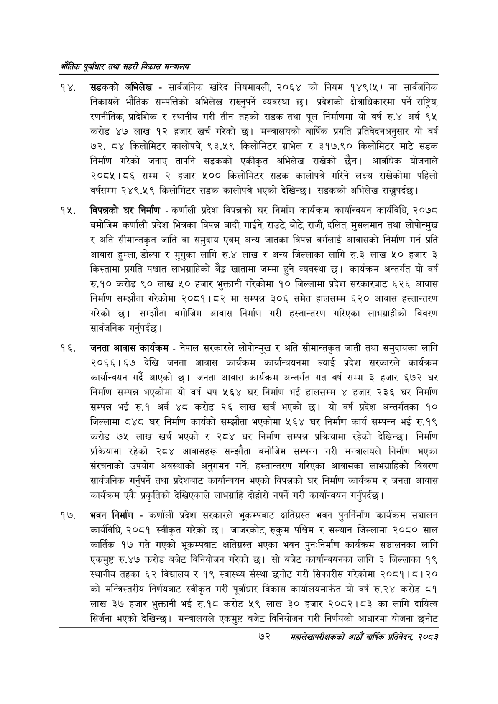

# Page 94 QA

## Rendered page


## Extracted text

```text
भरोतिक एवधार तथा सहरी विकास
सडकको अभिलेख -सार्वजनिक खरिद नियमावली, २०६४ को नियम १४९(५) मा सार्वजनिक निकायले भौतिक सम्पत्तिको अभिलेख राख्नुपर्ने व्यवस्था छ। प्रदेशको क्षेत्राधिकारमा पर्ने राष्ट्रिय, रणनीतिक, प्रादेशिक र स्थानीय गरी तीन तहको सडक तथा पूल निर्माणमा यो वर्ष रु.४ अर्ब ९५ करोड ४७ लाख १२ हजार खर्च गरेको छ। मन्त्रालयको बार्षिक प्रगति प्रतिवेदनअनुसार यो वर्ष ७२, ८४ किलोमिटर कालोपत्रे, ४३.५९ किलोमिटर ग्राभेल र ३१७.९० किलोमिटर माटे सडक निर्माण गरेको जनाए तापनि सडकको एकीकृत अभिलेख राखेको छैन। आवधिक योजनाले २०८५।८६ सम्म २ हजार ५०० किलोमिटर सडक कालोपत्रे गरिने लक्ष्य राखेकोमा पहिलो वर्षसम्म २४९.५९ किलोमिटर सडक कालोपत्रे भएको देखिन्छ। सडकको अभिलेख राख्नुपर्दछ |
विपन्नको घर निर्माण -कर्णाली प्रदेश विपन्नको घर निर्माण कार्यक्रम कार्यान्वयन कार्यविधि, २०७८ बमोजिम कर्णाली प्रदेश भित्रका विपन्न बादी, गाईने, राउटे, बोटे, राजी, दलित, मुसलमान तथा लोपोन्मुख र अति सीमान्तकृत जाति वा समुदाय एवम्‌ अन्य जातका विपन्न वर्गलाई आवासको निर्माण गर्न प्रति आवास हुम्ला, डोल्पा र मुगुका लागि रु.४ लाख र अन्य जिल्लाका लागि रु.३ लाख ५० हजार ३ किस्तामा प्रगति पश्चात लाभग्राहिको बैङ्क खातामा जम्मा हुने व्यवस्था | कार्यक्रम अन्तर्गत यो वर्ष रु.१० करोड ९० लाख ५० हजार भुक्तानी गरेकोमा १० जिल्लामा प्रदेश सरकारबाट ६२६ आवास निर्माण सम्झौता गरेकोमा २०८१।८२ मा सम्पन्न ३०६ समेत हालसम्म ६२० आवास हस्तान्तरण गरेको छ। सम्झौता बमोजिम आवास निर्माण गरी हस्तान्तरण गरिएका लाभग्राहीको विवरण सार्वजनिक गर्नुपर्दछ |
जनता आवास कार्यक्रम -नेपाल सरकारले लोपोन्मूख र अति सीमान्तकृत जाती तथा समुदायका लागि २०६६।१६७ देखि जनता आवास कार्यक्रम कार्यान्वयनमा ल्याई प्रदेश सरकारले कार्यक्रम कार्यान्वयन गर्दै आएको | जनता आवास कार्यक्रम अन्तर्गत गत वर्ष सम्म ३ हजार ६७२ घर निर्माण सम्पन्न भएकोमा यो वर्ष थप ५६४ घर निर्माण भई हालसम्म ४ हजार २३६ घर निर्माण सम्पन्न भई रु.१ अर्ब ४८ करोड २६ लाख खर्च भएको छ। यो वर्ष प्रदेश अन्तर्गतका १० जिल्लामा ८४८ घर निर्माण कार्यको सम्झौता भएकोमा ५६४ घर निर्माण कार्य सम्पन्न भई रु.१९ करोड ७५ लाख खर्च भएको र २८४ घर निर्माण सम्पन्न प्रक्रियामा रहेको देखिन्छ। निर्माण प्रक्रियामा रहेको २८४ आवासहरू सम्झौता बमोजिम सम्पन्न गरी मन्त्रालयले निर्माण भएका संरचनाको उपयोग अवस्थाको अनुगमन गर्ने, हस्तान्तरण गरिएका आवासका लाभग्राहिको विवरण सार्वजनिक गर्नुपर्ने तथा प्रदेशबाट कार्यान्वयन भएको विपन्नको घर निर्माण कार्यक्रम र जनता आवास कार्यक्रम एकै प्रकृतिको देखिएकाले लाभग्राहि दोहोरी नपर्ने गरी कार्यान्वयन गर्नुपर्दछ |
भवन निर्माण -कर्णाली प्रदेश सरकारले भूकम्पबाट क्षतिग्रस्त भवन पुनर्निर्माण कार्यक्रम सञ्चालन कार्यविधि, २०८१ स्वीकृत गरेको | जाजरकोट, रुकुम पश्चिम र सल्यान जिल्लामा २०८० साल कार्तिक १७ गते गएको भूकम्पबाट क्षतिग्रस्त भएका भवन पुनःनिर्माण कार्यक्रम सञ्चालनका लागि एकमुष्ट रु.४७ करोड बजेट विनियोजन गरेको छ। सो बजेट कार्यान्वयनका लागि ३ जिल्लाका १९ स्थानीय तहका ६२ विद्यालय र १९ स्वास्थ्य संस्था छनोट गरी सिफारीस गरेकोमा २०८१। ८। २० को मन्त्रिस्तरीय निर्णयबाट स्वीकृत गरी पूर्वाधार विकास कार्यालयमार्फत यो वर्ष रु.२४ करोड ८१ लाख ३७ हजार भुक्तानी भई रु.१८ करोड ५९ लाख ३० हजार २०८२।८३ का लागि दायित्व सिर्जना भएको देखिन्छ। मन्त्रालयले एकमुष्ट बजेट विनियोजन गरी निर्णयको आधारमा योजना छनोट
७२
सहालेखापरीक्षकको वाषिक प्रतिवेदन २०८२
```

## Flags
- None
