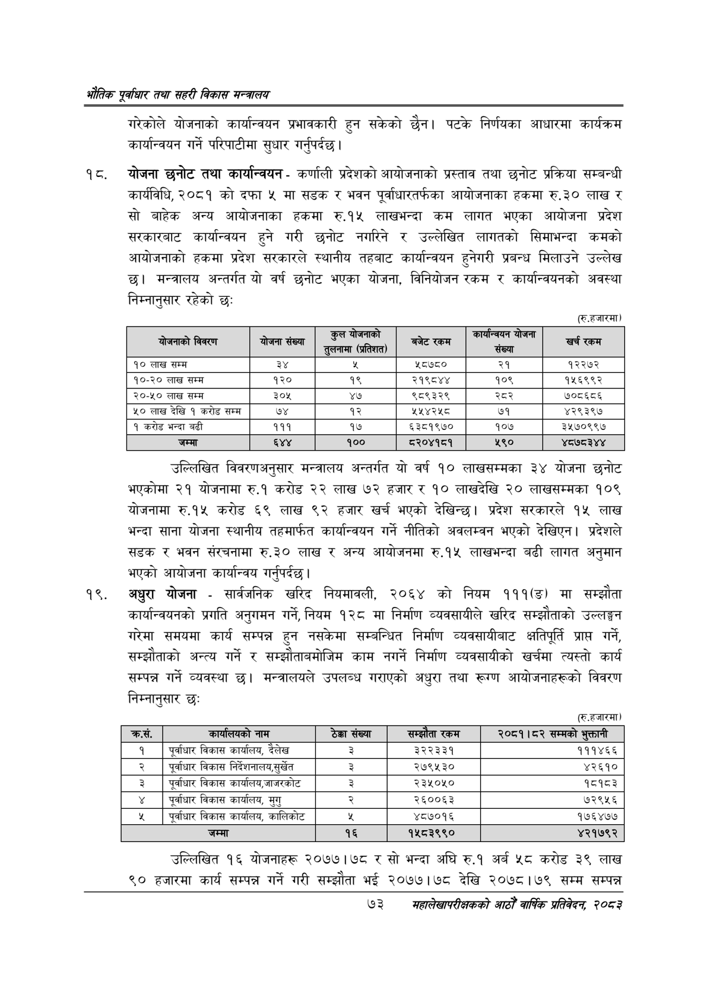

# Page 95 QA

## Rendered page


## Extracted text

```text
भरोतिक एवधार तथा सहरी विकास
गरेकोले योजनाको कार्यान्वयन प्रभावकारी हुन सकेको छैन। पटके निर्णयका आधारमा कार्यक्रम कार्यान्वयन गर्ने परिपाटीमा सुधार गर्नुपर्दछ |
१८, योजना छनोट तथा कार्यान्वयन -कर्णाली प्रदेशको आयोजनाको प्रस्ताव तथा छनोट प्रक्रिया सम्बन्धी कार्यविधि, २०८१ को दफा ५ मा सडक र भवन पूर्वाधारतर्फका आयोजनाका हकमा रु.३० लाख र सो बाहेक अन्य आयोजनाका हकमा रु.१४५ लाखभन्दा कम लागत भएका आयोजना प्रदेश सरकारबाट कार्यान्वयन हुने गरी छनोट नगरिने र उल्लेखित लागतको सिमाभन्दा कमको आयोजनाको हकमा प्रदेश सरकारले स्थानीय तहबाट कार्यान्वयन हुनेगरी प्रबन्ध मिलाउने उल्लेख | मन्त्रालय अन्तर्गत यो वर्ष छुनोट भएका योजना, विनियोजन रकम र कार्यान्वयनको अवस्था निम्नानुसार रहेको छः
(रु.हजारमा)
१००
उल्लिखित विवरणअनुसार मन्त्रालय अन्तर्गत यो वर्ष १० लाखसम्मका ३४ योजना छनोट भएकोमा २१ योजनामा रु.१ करोड २२ लाख ७२ हजार र १० लाखदेखि २० लाखसम्मका १०९ योजनामा रु.१५ करोड ६९ लाख ९२ हजार खर्च भएको देखिन्छ। प्रदेश सरकारले १५ लाख भन्दा साना योजना स्थानीय तहमार्फत कार्यान्वयन गर्ने नीतिको अवलम्वन भएको देखिएन। प्रदेशले सडक र भवन संरचनामा रु.३० लाख र अन्य आयोजनमा रु.१५ लाखभन्दा बढी लागत अनुमान भएको आयोजना कार्यान्वय गर्नुपर्दछ |
अधुरा योजना -सार्वजनिक खरिद नियमावली, २०६४ को नियम १११(ङ) मा सम्झौता कार्यान्वयनको प्रगति अनुगमन गर्ने, नियम १२८ मा निर्माण व्यवसायीले खरिद सम्झौताको उल्लङ्घन गरेमा समयमा कार्य सम्पन्न हुन नसकेमा सम्बन्धित निर्माण व्यवसायीबाट क्षतिपूर्ति प्राप्त गर्ने, सम्झौताको अन्त्य गर्ने र सम्झौताबमोजिम काम नगर्ने निर्माण व्यवसायीको खर्चमा त्यस्तो कार्य सम्पन्न गर्ने व्यवस्था | मन्त्रालयले उपलब्ध गराएको अधुरा तथा रूगण आयोजनाहरूको विवरण निम्नानुसार छः
(रु.हजारमा)
उल्लिखित १६ योजनाहरू २०७७।७८ र सो भन्दा अघि रु.१ अर्ब ५८ करोड ३९ लाख ९० हजारमा कार्य सम्पन्न गर्ने गरी सम्झौता भई २०७७।७८ देखि २०७८।७९ सम्म सम्पन्न
७३
सहालेखापरीक्षकको वाषिक प्रतिवेदन २०८२

| 'बोजनाको विवरण | योजना संख्या | कुल योजनाको तुलनामा (प्रतिशत) | बजेटरकम | संख्या | खुन रकम |
| --- | --- | --- | --- | --- | --- |
| १० लाख सम्म | ३ | [क | ५८७८० | २१ | १२२७२ |
| १०-२० लाख सम्म | १२० | १९ | २१९८४४ | १०९ | १५६९९२ |
| २०-५० लाख सम्म | ३०४५ | ४७ | ९८९३२९ | स्वर | ७०८६८६ |
| ५० लाख देखि १ करोड सम्म | ७४ | १२ | २४५४२५८ | ७१ | ४२९३९७ |
| १ करोड भन्दा बढी | १११ | १७ | ६३८१९७० | १०७ | ३५७०९९७ |
| जम्मा | ६४४ | १०० | ८२०४१८१ | ५९० | ४८७८३४४ |

| क्रस. | वरर्चालणको नाम | ठेक्का संख्या | 'सम्झंता रकम | २०८१।८२ सम्मको भुक्तानी |
| --- | --- | --- | --- | --- |
| १ | पूर्वाधार विकास कार्यालय, दैलेख | ३ | ३३३३ | १११४६६ |
| २ | पूर्वाधार विकास निर्देशनालब,सुर्खेत |  | २७९५३० | ४२६१० |
| ३ | पूर्वाधार विकास कार्यालय,जाजरकोट | ३ | २३५०५० | १८१८३ |
| ४ | पूर्वाधार विकास कार्यालय, मुगु | २ | २६००६३ | ७२९५६ |
| ५ | पूर्वाधार विकास कार्यालय, कालिकोट | रू | ४८७०१६ | १७६४७७ |
| ६ | जम्मा | १६ | १५८३९९० | ४२१७९२ |
```

## Flags
- table_page
- medium_quality_table
