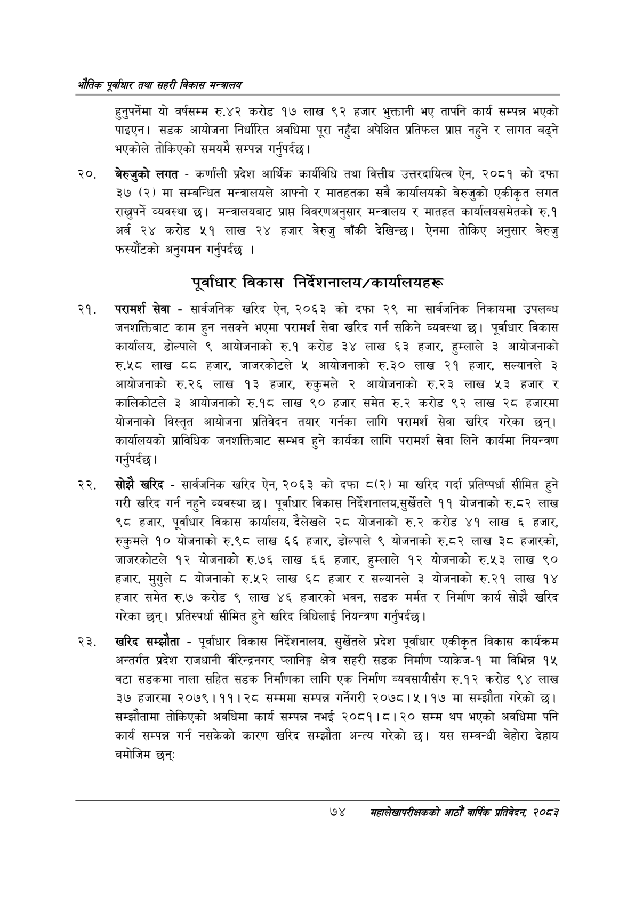

# Page 96 QA

## Rendered page


## Extracted text

```text
भरोतिक एवधार तथा सहरी विकास
हुनुपर्नेमा यो वर्षसम्म रु.४२ करोड १७ लाख ९२ हजार भुक्तानी भए तापनि कार्य सम्पन्न भएको पाइएन। सडक आयोजना निर्धारित अवधिमा पूरा नहुँदा अपेक्षित प्रतिफल प्राप्त नहुने र लागत बढ्ने भएकोले तोकिएको समयमै सम्पन्न गर्नुपर्दछ |
२०, बेरुजुको लगत -कर्णाली प्रदेश आर्थिक कार्यविधि तथा वित्तीय उत्तरदायित्व ऐन, २०८१ को दफा ३७ (२) मा सम्बन्धित मन्त्रालयले आफ्नो र मातहतका सबै कार्यालयको बेरुजुको एकीकृत लगत राख्नुपर्ने व्यवस्था छ। मन्त्रालयबाट प्राप्त विवरणअनुसार मन्त्रालय र मातहत कार्यालयसमेतको रु.१ अर्ब २४ करोड ५१ लाख २४ हजार बेरुजु बाँकी देखिन्छ। ऐनमा तोकिए अनुसार बेरुजु फस्यौटको अनुगमन गर्नुपर्दछ |
पूर्वाधार विकास निर्देशनालय/कार्यालयहरू
परामर्श सेवा -सार्वजनिक खरिद ऐन, २०६३ को दफा २९ मा सार्वजनिक निकायमा उपलब्ध जनशक्तिबाट काम हुन नसक्ने भएमा परामर्श सेवा खरिद गर्न सकिने व्यवस्था छ। पूर्वाधार विकास कार्यालय, डोल्पाल ९ आयोजनाको रु.१ करोड ३४ लाख ६३ हजार, हुम्लाले ३ आयोजनाको रुश«८ठ लाख दद हजार, जाजरकोटले ५ आयोजनाको रु.३० लाख २१ हजार, सल्यानले ३ आयोजनाको € लाख ९३ हजार, रुकुमले २ आयोजनाको रु.२३ लाख ५३ हजार र कालिकोटले ३ आयोजनाको रु.१८ लाख ९० हजार समेत रु.२ करोड ९२ लाख २८ हजारमा योजनाको विस्तृत आयोजना प्रतिवेदन तयार गर्नका लागि परामर्श सेवा खरिद गरेका छन्‌। कार्यालयको प्राविधिक जनशक्तिबाट सम्भव हुने कार्यका लागि परामर्श सेवा लिने कार्यमा नियन्त्रण गर्नुपर्दछ |
सोझै खरिद -सार्वजनिक खरिद ऐन, २०६३ को दफा ८(२) मा खरिद गर्दा प्रतिष्पर्धा सीमित हुने गरी खरिद गर्न नहुने व्यवस्था छ। पूर्वाधार विकास निर्देशनालय,सुर्खेतले ११ योजनाको रु.८२ लाख ९८ हजार, पूर्वाधार विकास कार्यालय, दैलेखले २८ योजनाको रु.२ करोड ४१ लाख ६ हजार, रुकुमले १० योजनाको रु.९८ लाख ६६ हजार, डोल्पाले ९ योजनाको रु.८२ लाख ३८ हजारको, जाजरकोटले १२ योजनाको रु.७६ लाख ६६ हजार, हुम्लाले १२ योजनाको रु.५३ लाख ९० हजार, मुगुले ८ योजनाको रु.५२ लाख ६८ हजार र सल्यानले ३ योजनाको रु.२१ लाख १४ हजार समेत रु.७ करोड ९ लाख ४६ हजारको भवन, सडक मर्मत र निर्माण कार्य सोझै खरिद गरेका छन्‌। प्रतिस्पर्धा सीमित हुने खरिद विधिलाई नियन्त्रण गर्नुपर्दछ |
खरिद सम्झौता -पूर्वाधार विकास निर्देशनालय, सुर्खेतले प्रदेश पूर्वाधार एकीकृत विकास कार्यक्रम अन्तर्गत प्रदेश राजधानी वीरेन्द्रनगर प्लानिङ्ग क्षेत्र सहरी सडक निर्माण प्याकेज-१ मा विभिन्न १५ बटा सडकमा नाला सहित सडक निर्माणका लागि एक निर्माण व्यवसायीसँग रु.१२ करोड ९४ लाख ३७ हजारमा २०७९।११। २८ सम्ममा सम्पन्न गर्नेगरी २०७८।५।१७ मा सम्झौता गरेको छ। सम्झौतामा तोकिएको अवधिमा कार्य सम्पन्न नभई २०८१।८।२० सम्म थप भएको अवधिमा पनि कार्य सम्पन्न गर्न नसकेको कारण खरिद सम्झौता अन्त्य गरेको छ। यस सम्वन्धी बेहोरा देहाय बमोजिम छन्‌ः
७४
सहालेखापरीक्षकको आठौँ वा्िकि प्रतिवेदन २०८२
```

## Flags
- None
