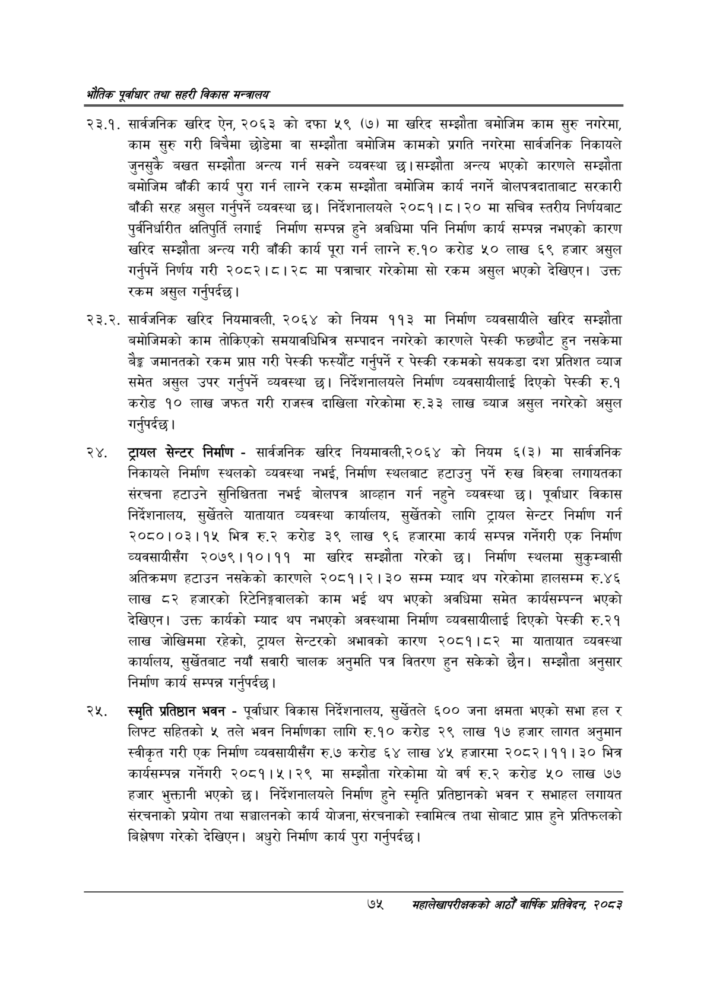

# Page 97 QA

## Rendered page


## Extracted text

```text
भरोतिक एवधार तथा सहरी विकास
२३.१. सार्वजनिक खरिद ऐन, २०६३ को दफा ५९ (७) मा खरिद सम्झौता बमोजिम काम सुरु नगरेमा, काम सुरु गरी बिचैमा छोडेमा वा सम्झौता बमोजिम कामको प्रगति नगरेमा सार्वजनिक निकायले जुनसुकै बखत सम्झौता अन्त्य गर्न सक्ने व्यवस्था छ। सम्झौता अन्त्य भएको कारणले सम्झौता बमोजिम बाँकी कार्य पुरा गर्न लाग्ने रकम सम्झौता बमोजिम कार्य नगर्ने बोलपत्रदाताबाट सरकारी बाँकी सरह असुल गर्नुपर्ने व्यवस्था छ। निर्देशनालयले २०८१।८। २० मा सचिव स्तरीय निर्णयबाट पुर्वनिर्धारीत क्षतिपुर्ति लगाई निर्माण सम्पन्न हुने अवधिमा पनि निर्माण कार्य सम्पन्न नभएको कारण खरिद सम्झौता अन्त्य गरी बाँकी कार्य पूरा गर्न लाग्ने रु.१० करोड ५० लाख ६९ हजार असुल गर्नुपर्ने निर्णय गरी २०८२।८।२८ मा पत्राचार गरेकोमा सो रकम असुल भएको देखिएन। उक्त रकम असुल गर्नुपर्दछ।
. सार्वजनिक खरिद नियमावली, २०६४ को नियम ११३ मा निर्माण व्यवसायीले खरिद सम्झौता बमोजिमको काम तोकिएको समयावधिभित्र सम्पादन नगरेको कारणले पेस्की फछ्यौट हुन नसकेमा बैङ्क जमानतको रकम प्राप्त गरी पेस्की फस्यौंट गर्नुपर्ने र पेस्की रकमको सयकडा दश प्रतिशत व्याज समेत असुल उपर गर्नुपर्ने व्यवस्था छ। निर्देशनालयले निर्माण व्यवसायीलाई दिएको पेस्की रु.१ करोड १० लाख जफत गरी राजस्व दाखिला गरेकोमा रु.३३ लाख ब्याज असुल नगरेको असुल गर्नुपर्दछ |
ट्रायल सेन्टर निर्माण -सार्वजनिक खरिद नियमावली,२०६४ को नियम ६(३) मा सार्वजनिक निकायले निर्माण स्थलको व्यवस्था नभई, निर्माण स्थलबाट हटाउनु पर्ने रुख बिरुवा लगायतका संरचना हटाउने सुनिश्चितता नभई बोलपत्र आव्हान गर्न नहुने व्यवस्था छ। पूर्वाधार विकास निर्देशनालय, सुर्खेतले यातायात व्यवस्था कार्यालय, सुर्खेतको लागि ट्रायल सेन्टर निर्माण गर्न २०८०।०३।१४ भित्र रु.२ करोड ३९ लाख ९६ हजारमा कार्य सम्पन्न गर्नेगरी एक निर्माण व्यवसायीसँग २०७९।१०।११ मा खरिद सम्झौता गरेको छ। निर्माण स्थलमा सुकुम्बासी अतिक्रमण हटाउन नसकेको कारणले २०८१।२। ३० सम्म म्याद थप गरेकोमा हालसम्म रु.४६ लाख ८२ हजारको रिटेनिङ्जालको काम भई थप भएको अवधिमा समेत कार्यसम्पन्न भएको देखिएन। उक्त कार्यको म्याद थप नभएको अवस्थामा निर्माण व्यवसायीलाई दिएको पेस्की रु.२१ लाख जोखिममा रहेको, ट्रायल सेन्टरको अभावको कारण २०८१।८२ मा यातायात व्यवस्था कार्यालय, सुर्खेतबाट नयाँ सवारी चालक अनुमति पत्र वितरण हुन सकेको छैन। सम्झौता अनुसार निर्माण कार्य सम्पन्न गर्नुपर्दछ |
स्मृति प्रतिष्ठान भवन -पूर्वाधार विकास निर्देशनालय, सुर्खेतले ६०० जना क्षमता भएको सभा हल र लिफ्ट सहितको ५ तले भवन निर्माणका लागि रु.१० करोड २९ लाख १७ हजार लागत अनुमान स्वीकृत गरी एक निर्माण व्यवसायीसँग रु.७ करोड ६४ लाख ४५ हजारमा २०८२।११। ३० भित्र कार्यसम्पन्न गर्नेगरी २०८१।५।२९ मा सम्झौता गरेकोमा यो वर्ष रु.२ करोड लाख ७७ हजार भुक्तानी भएको छ। निर्देशनालयले निर्माण हुने स्मृति प्रतिष्ठानको भवन र सभाहल लगायत संरचनाको प्रयोग तथा सञ्चालनको कार्य योजना, संरचनाको स्वामित्व तथा सोबाट प्राप्त हुने प्रतिफलको बिश्लेषण गरेको देखिएन। अधुरो निर्माण कार्य पुरा गर्नुपर्दछ |
७४ सहालेखापरीक्षकको आठौँ वाक प्रतिवेदन २०८२
```

## Flags
- None
