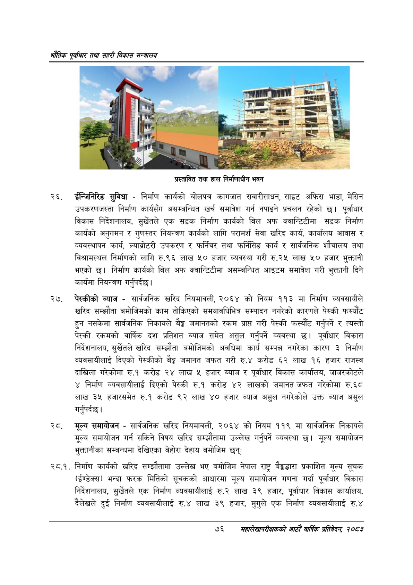

# Page 98 QA

## Rendered page


## Extracted text

```text
श्ोतिक एकधार तथा सहरी विकास मन्त्रालय
प्रस्तावित तथा हाल निर्माणाधीन भवन
ईन्जिनिरिङ सुविधा -निर्माण कार्यको बोलपत्र कागजात सवारीसाधन, साइट अफिस भाडा, मेसिन उपकरणजस्ता निर्माण कार्यसँग असम्बन्धित खर्च समावेश गर्न नपाइने प्रचलन रहेको छ। पूर्वाधार विकास निर्देशनालय, सुर्खेतले एक सडक निर्माण कार्यको बिल अफ क्वान्टिटीमा सडक निर्माण कार्यको अनुगमन र गुणस्तर नियन्त्रण कार्यको लागि परामर्श सेवा खरिद कार्य, कार्यालय आवास र व्यवस्थापन कार्य, ल्याब्रोटी उपकरण र फर्निचर तथा फर्निसिङ कार्य र सार्वजनिक शौचालय तथा विश्वामस्थल निर्माणको लागि रु.९६ लाख ५० हजार व्यवस्था गरी रु.२५ लाख ५० हजार भुक्तानी भएको छ। निर्माण कार्यको बिल अफ क्वान्टिटीमा असम्बन्धित आइटम समावेश गरी भुक्तानी दिने कार्यमा नियन्त्रण गर्नुपर्दछ |
२७, पेस्कीको ब्याज -सार्वजनिक खरिद नियमावली, २०६४ को नियम ११३ मा निर्माण व्यवसायीले खरिद सम्झौता बमोजिमको काम तोकिएको समयावधिभित्र सम्पादन नगरेको कारणले पेस्की फस्यौट हुन नसकेमा सार्वजनिक निकायले बैङ्ग जमानतको रकम प्राप्त गरी पेस्की फस्यौट गर्नुपर्ने र त्यस्तो पेस्की रकमको वार्षिक दश प्रतिशत ब्याज समेत असुल गर्नुपर्ने व्यवस्था छ। पूर्वाधार विकास निर्देशनालय, सुर्खेतले खरिद सम्झौता बमोजिमको अवधिमा कार्य सम्पन्न नगरेका कारण ३ निर्माण व्यवसायीलाई दिएको पेस्कीको बैङ्क जमानत जफत गरी रु.४ करोड ६२ लाख १६ हजार राजस्व दाखिला गरेकोमा रु.१ करोड २४ लाख ५ हजार ब्याज र पूर्वाधार विकास कार्यालय, जाजरकोटले ४ निर्माण व्यवसायीलाई दिएको पेस्की रु.१ करोड ४२ लाखको जमानत जफत गरेकोमा रु.६८ लाख ३५ हजारसमेत रु.१ करोड ९२ लाख ४० हजार ब्याज असुल नगरेकोले उक्त ब्याज असुल गर्नुपर्दछ |
२्ट. मूल्य समायोजन -सार्वजनिक खरिद नियमावली, २०६४ को नियम ११९ मा सार्वजनिक निकायले मूल्य समायोजन गर्न सकिने विषय खरिद सम्झौतामा उल्लेख गर्नुपर्ने व्यवस्था छ। मूल्य समायोजन भुक्तानीका सम्बन्धमा देखिएका बेहोरा देहाय बमोजिम छन्‌:
२८.१. निर्माण कार्यको खरिद सम्झौतामा उल्लेख भए बमोजिम नेपाल राष्ट्र बेङ्गद्धारा प्रकाशित मूल्य सूचक (ईण्डेक्स) भन्दा फरक मितिको सूचकको आधारमा मूल्य समायोजन गणना गर्दा पूर्वाधार विकास निर्देशनालय, सुर्खेतले एक निर्माण व्यवसायीलाई रु.२ लाख ३९ हजार, पूर्वाधार विकास कार्यालय, दैलेखले दुई निर्माण व्यवसायीलाई रु.४ लाख ३९ हजार, मुगुले एक निर्माण व्यवसायीलाई रु.४
७६
सहालेखापरीक्षकको वाषिक प्रतिवेदन २०८२
```

## Flags
- None
