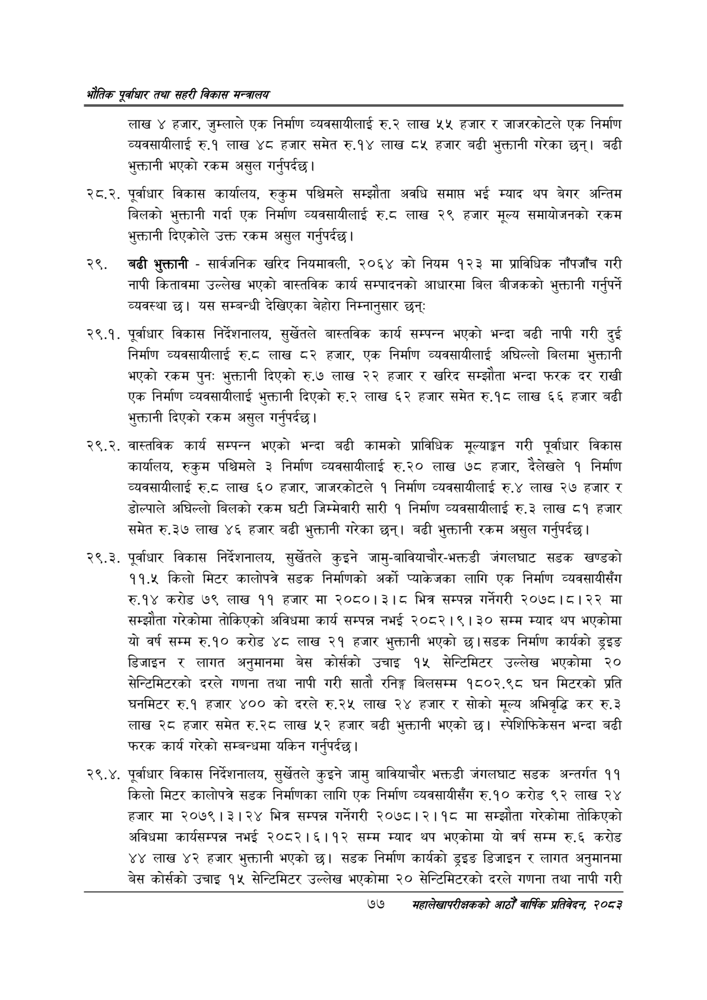

# Page 99 QA

## Rendered page


## Extracted text

```text
भरोतिक एवधार तथा सहरी विकास
लाख ४ हजार, जुम्लाले एक निर्माण व्यवसायीलाई रु.२ लाख ५५ हजार र जाजरकोटले एक निर्माण व्यवसायीलाई रु.१ लाख ४८ हजार समेत रु.१४ लाख ८५ हजार बढी भुक्तानी गरेका छन्‌। बढी भुक्तानी भएको रकम असुल गर्नुपर्दछ |
२८.२. पूर्वाधार विकास कार्यालय, रुकुम पश्चिमले सम्झौता अवधि समाप्त भई म्याद थप बेगर अन्तिम बिलको भुक्तानी गर्दा एक निर्माण व्यवसायीलाई रु.८ लाख २९ हजार मूल्य समायोजनको रकम भुक्तानी दिएकोले उक्त रकम असुल गर्नुपर्दछ।
बढी भुक्तानी -सार्वजनिक खरिद नियमावली, २०६४ को नियम १२३ मा प्राविधिक नाँपजाँच गरी नापी कितावमा उल्लेख भएको वास्तविक कार्य सम्पादनको आधारमा बिल बीजकको भुक्तानी गर्नुपर्ने व्यवस्था | यस सम्बन्धी देखिएका बेहोरा निम्नानुसार छन्‌:
२९.१. पूर्वाधार विकास निर्देशनालय, सुर्खेतले बास्तविक कार्य सम्पन्न भएको भन्दा बढी नापी गरी दुई निर्माण व्यवसायीलाई रु.८ लाख ८२ हजार, एक निर्माण व्यवसायीलाई अघिल्लो बिलमा भुक्तानी भएको रकम पुनः भुक्तानी दिएको रु.७ लाख २२ हजार र खरिद सम्झौता भन्दा फरक दर राखी एक निर्माण व्यवसायीलाई भुक्तानी दिएको रु.२ लाख ६२ हजार समेत रु.१८ लाख ६६ हजार बढी भुक्तानी दिएको रकम असुल गर्नुपर्दछ।
२९.२. वास्तविक कार्य सम्पन्न भएको भन्दा बढी कामको प्राविधिक मूल्याङ्गन गरी पूर्वाधार विकास कार्यालय, रुकुम पश्चिमले ३ निर्माण व्यवसायीलाई रु.२० लाख ७८ हजार, देलेखले १ निर्माण व्यवसायीलाई रु.८ लाख ६० हजार, जाजरकोटले १ निर्माण व्यवसायीलाई रु.४ लाख २७ हजार र डोल्पाले अघिल्लो बिलको रकम घटी जिम्मेवारी सारी १ निर्माण व्यवसायीलाई रु.३ लाख ८१ हजार समेत रु.३७ लाख ४६ हजार बढी भुक्तानी गरेका छन्‌। बढी भुक्तानी रकम असुल गर्नुपर्दछ |
२९.३. पूर्वाधार विकास निर्देशनालय, सुर्खेतले कुइने जामु-बावियाचौर-भक्तडी जंगलघाट सडक खण्डको ११.५ किलो मिटर कालोपत्रे सडक निर्माणको अर्को प्याकेजका लागि एक निर्माण व्यवसायीसँग रु.१४ करोड ७९ लाख ११ हजार मा २०८०।३।८ भित्र सम्पन्न गर्नेगरी २०७८।८।२२ मा सम्झौता गरेकोमा तोकिएको अविधमा कार्य सम्पन्न नभई २०८२।९। ३० सम्म म्याद थप भएकोमा यो वर्ष सम्म रु.१० करोड ४८ लाख २१ हजार भुक्तानी भएको छ। सडक निर्माण कार्यको ३८ डिजाइन र लागत अनुमानमा बेस कोर्सको उचाइ १५ सेन्टिमिटर उल्लेख भएकोमा २० सेन्टिमिटरको दरले गणना तथा नापी गरी सातौ रनिङ्ग बिलसम्म १८०२.९८ घन मिटरको प्रति घनमिटर रु.१ हजार ४०० को दरले रु.२५ लाख २४ हजार र सोको मूल्य अभिवृद्धि कर रु.३ लाख २८ हजार समेत रु.२८ लाख ५२ हजार बढी भुक्तानी भएको छ। स्पेशिफिकेसन भन्दा बढी फरक कार्य गरेको सम्बन्धमा यकिन गर्नुपर्दछ |
२९.४, पूर्वाधार विकास निर्देशनालय, सुर्खेतले कुइने जामु बावियाचौर भक्तडी जंगलघाट सडक अन्तर्गत ११ किलो मिटर कालोपत्रे सडक निर्माणका लागि एक निर्माण व्यवसायीसँग रु.१० करोड ९२ लाख २४ हजार मा २०७९। ३। २४ भित्र सम्पन्न गर्नेगरी २०७८।२।१८ मा सम्झौता गरेकोमा तोकिएको अविधमा कार्यसम्पन्न नई ० | | सम्म म्याद थप भएकोमा यो वर्ष सम्म रु.६ करोड ४४ लाख ४२ हजार भुक्तानी भएको सडक निर्माण कार्यको ड्ुइङ डिजाइन र लागत अनुमानमा बेस कोर्सको उचाइ १५ सेन्टिमिटर उल्लेख भएकोमा २० सेन्टिमिटरको दरले गणना तथा नापी गरी
७७
सहालेखापरीक्षकको आठौँ वार्षिक प्रतिवेदन २०८२
```

## Flags
- None
