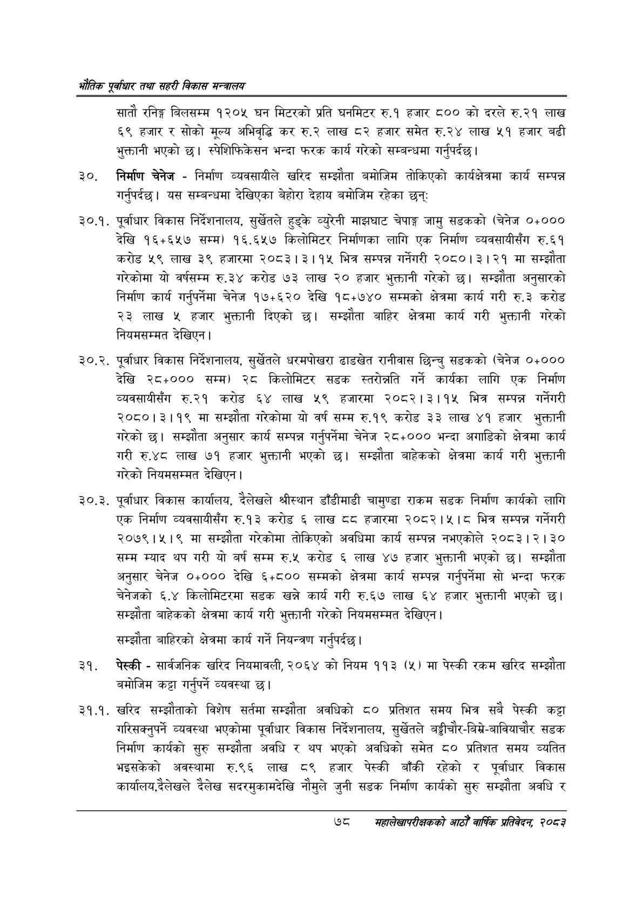

# Page 100 QA

## Rendered page


## Extracted text

```text
भरोतिक एवधार तथा सहरी विकास
सातौ रनिङ्ग बिलसम्म १२०५ घन मिटरको प्रति घनमिटर रु.१ हजार ८०० को दरले रु.२१ लाख ६९ हजार र सोको मूल्य अभिवृद्धि कर रु.२ लाख ८२ हजार समेत रु.२४ लाख ५१ हजार बढी भुक्तानी भएको | स्पेशिफिकेसन भन्दा फरक कार्य गरेको सम्बन्धमा गर्नुपर्दछ।
निर्माण चेनेज -निर्माण व्यवसायीले खरिद सम्झौता बमोजिम तोकिएको कार्यक्षेत्रमा कार्य सम्पन्न गर्नुपर्दछ। यस सम्बन्धमा देखिएका बेहोरा देहाय बमोजिम रहेका छन्‌ः
३०.१. पूर्वाधार विकास निर्देशनालय, सुर्खेतले हुड्के व्युरेनी माझघाट चेपाङ्ग जामु सडकको (चेनेज ०५००० देखि १६%६५७ सम्म) १६.६५७ किलोमिटर निर्माणका लागि एक निर्माण व्यवसायीसँग रु.६१ करोड ५९ लाख ३९ हजारमा २०८३।३।१४ भित्र सम्पन्न गर्नेगरी २०८०।३। २१ मा सम्झौता गरेकोमा यो वर्षसम्म रु.३४ करोड ७३ लाख २० हजार भुक्तानी गरेको छ। सम्झौता अनुसारको निर्माण कार्य गर्नुपर्नेमा चेनेज १७५६२० देखि १८५७४० सम्मको क्षेत्रमा कार्य गरी रु.३ करोड २३ लाख ५ हजार भुक्तानी दिएको छ। सम्झौता बाहिर क्षेत्रमा कार्य गरी भुक्तानी गरेको नियमसम्मत देखिएन।
३०.२. पूर्वाधार विकास निर्देशनालय, सुर्खेतले धरमपोखरा ढाडखेत रानीवास छिन्चु सडकको (चेनेज ०४००० देखि २८०००० सम्म) २८ किलोमिटर सडक स्तरोन्नति गर्ने कार्यका लागि एक निर्माण व्यवसायीसँग रु.२१ करोड ६४ लाख ५९ हजारमा २०८२।३।१५ भित्र सम्पन्न गर्नेगरी २०८०।३।१९ मा सम्झौता गरेकोमा यो वर्ष सम्म रु.१९ करोड ३३ लाख ४१ हजार भुक्तानी गरेको छ। सम्झौता अनुसार कार्य सम्पन्न गर्नुपर्नेमा चेनज २८५००० भन्दा अगाडिको क्षेत्रमा कार्य गरी रु.४८ लाख ७१ हजार भुक्तानी भएको छ। सम्झौता बाहेकको क्षेत्रमा कार्य गरी भुक्तानी गरेको नियमसम्मत देखिएन |
३०.३. पूर्वाधार विकास कार्यालय, दैलेखले श्रीस्थान डाँडीमाडी चामुण्डा राकम सडक निर्माण कार्यको लागि एक निर्माण व्यवसायीसँग रु.१३ करोड ६ लाख ५५ हजारमा २०८२।५।८ भित्र सम्पन्न गर्नेगरी २०७९।५।९ मा सम्झौता गरेकोमा तोकिएको अवधिमा कार्य सम्पन्न नभएकोले २०८३। | ३० सम्म म्याद थप गरी यो बर्ष सम्म रु.४ करोड ६ लाख ४७ हजार भुक्तानी भएको छ। सम्झौता अनुसार चेनेज ०४००० देखि §+५०० सम्मको क्षेत्रमा कार्य सम्पन्न गर्नुपर्नेमा सो भन्दा फरक चेनेजको ६.४ किलोमिटरमा सडक खन्ने कार्य गरी रु.६७ लाख ६४ हजार भुक्तानी भएको छ। सम्झौता बाहेकको क्षेत्रमा कार्य गरी भुक्तानी गरेको नियमसम्मत देखिएन |
सम्झौता बाहिरको क्षेत्रमा कार्य गर्ने नियन्त्रण गर्नुपर्दछ।
पेस्की -सार्वजनिक खरिद नियमावली, २०६४ को नियम ११३ (५) मा पेस्की रकम खरिद सम्झौता बमोजिम कट्टा गर्नुपर्ने व्यवस्था |
३१.१. खरिद सम्झौताको विशेष सर्तमा सम्झौता अवधिको ८० प्रतिशत समय भित्र सबै पेस्की कट्टा गरिसक्नुपर्ने व्यवस्था भएकोमा पूर्वाधार विकास निर्देशनालय, सुर्खेतले बडीचौर-बिम्ने-बावियाचौर सडक निर्माण कार्यको सुरु सम्झौता अवधि र थप भएको अवधिको समेत ८० प्रतिशत समय व्यतित भइसकेको अवस्थामा रु.९६ लाख ८९ हजार पेस्की बाँकी रहेको र पूर्वाधार विकास कार्यालय,दैेलेखले दैलेख सदरमुकामदेखि नौमुले जुनी सडक निर्माण कार्यको सुरु सम्झौता अवधि र
७८
सहालेखापरीक्षकको आठौँ वा्िकि प्रतिवेदन २०८२
```

## Flags
- None
