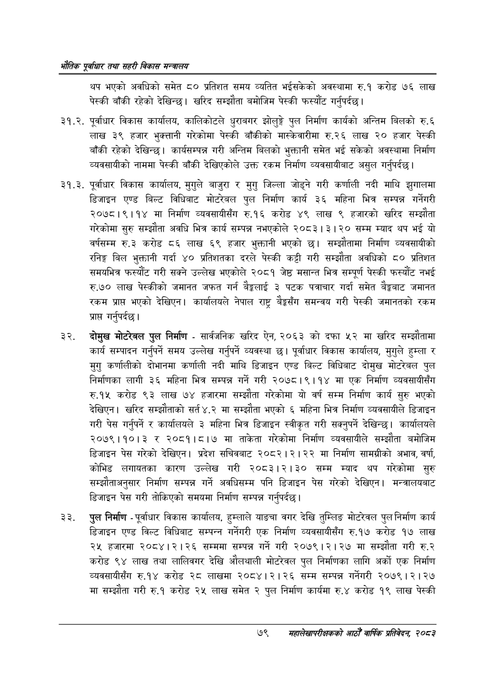

# Page 101 QA

## Rendered page


## Extracted text

```text
भरोतिक एवधार तथा सहरी विकास
थप भएको अवधिको समेत ८० प्रतिशत समय व्यतित भईसकेको अवस्थामा रु.१ करोड ७६ लाख पेस्की बाँकी रहेको देखिन्छ। खरिद सम्झौता बमोजिम पेस्की फस्यौंट गर्नुपर्दछ |
२१.२. पूर्वाधार विकास कार्यालय, कालिकोटले धुराबगर झोलुङ्गे पुल निर्माण कार्यको अन्तिम बिलको रु.६ लाख ३९ हजार भुक्तानी गरेकोमा पेस्की बाँकीको मास्केवारीमा रु.२६ लाख २० हजार पेस्की बाँकी रहेको देखिन्छ। कार्यसम्पन्न गरी अन्तिम बिलको भुक्तानी समेत भई सकेको अवस्थामा निर्माण व्यवसायीको नाममा पेस्की बाँकी देखिएकोले उक्त रकम निर्माण व्यवसायीबाट असुल गर्नुपर्दछ |
२१.३. पूर्वाधार विकास कार्यालय, मुगुले बाजुरा र मुगु जिल्ला जोड्ने गरी कर्णाली नदी माथि झुगालमा डिजाइन एण्ड बिल्ट विधिबाट मोटरेबल पुल निर्माण कार्य ३६ महिना भित्र सम्पन्न गर्नेगरी २०७८।९।१४ मा निर्माण व्यवसायीसँग रु.१६ करोड ४९ लाख ९ हजारको खरिद सम्झौता गरेकोमा सुरु सम्झौता अवधि भित्र कार्य सम्पन्न नभएकोले २०८३।३।२० सम्म म्याद थप भई यो वर्षसम्म रु.३ करोड ८६ लाख ६९ हजार भुक्तानी भएको छ। सम्झौतामा निर्माण व्यवसायीको रनिङ्ग बिल भुक्तानी गर्दा ४० प्रतिशतका दरले पेस्की कट्टी गरी सम्झौता अवधिको ८० प्रतिशत समयभित्र फस्यौट गरी सक्ने उल्लेख भएकोले २०८१ जेष्ठ मसान्त भित्र सम्पूर्ण पेस्की फस्यौट नभई रु.७० लाख पेस्कीको जमानत जफत गर्न बेङ्कलाई ३ पटक पत्राचार गर्दा समेत बेङ्कबाट जमानत रकम प्राप्त भएको देखिएन। कार्यालयले नेपाल राष्ट्र समन्वय गरी पेस्की जमानतको रकम प्राप्त गर्नुपर्दछ।
दोमुख मोटरेबल पुल निर्माण -सार्वजनिक खरिद ऐन, २०६३ को दफा ५२ मा खरिद सम्झौतामा कार्य सम्पादन गर्नुपर्ने समय उल्लेख गर्नुपर्ने व्यवस्था छ। पूर्वाधार विकास कार्यालय, मुगुले हुम्ला र मुगु कर्णालीको दोभानमा कर्णाली नदी माथि डिजाइन एण्ड बिल्ट विधिबाट दोमुख मोटरेबल पुल निर्माणका लागी ३६ महिना भित्र सम्पन्न गर्ने गरी २०७८।९।१४ मा एक निर्माण व्यवसायीसँग रु.१५ करोड ९३ लाख ७४ हजारमा सम्झौता गरेकोमा यो वर्ष सम्म निर्माण कार्य सुरु भएको देखिएन। खरिद सम्झौताको सर्त ४.२ मा सम्झौता भएको ६ महिना भित्र निर्माण व्यवसायीले डिजाइन गरी पेस गर्नुपर्ने र कार्यालयले ३ महिना भित्र डिजाइन स्वीकृत गरी सक्नुपर्ने देखिन्छ। कार्यालयले २०७९।१०।३ र २०८१।८।७ मा ताकेता गरेकोमा निर्माण व्यवसायीले सम्झौता बमोजिम डिजाइन पेस गरेको देखिएन। प्रदेश सचिवबाट २०८२।२।२२ मा निर्माण सामग्रीको अभाव, वर्षा, कोभिड लगायतका कारण उल्लेख गरी २०८३।२।३० सम्म म्याद थप गरेकोमा सुरु सम्झौताअनुसार निर्माण सम्पन्न गर्ने अवधिसम्म पनि डिजाइन पेस गरेको देखिएन। मन्त्रालयबाट डिजाइन पेस गरी तोकिएको समयमा निर्माण सम्पन्न गर्नुपर्दछ |
पुल निर्माण -पूर्वाधार विकास कार्यालय, हुम्लाले याङचा वगर देखि तुम्लिङ मोटरेवल पुल निर्माण कार्य डिजाइन एण्ड विल्ट विधिबाट सम्पन्न गर्नेगरी एक निर्माण व्यवसायीसँग रु.१७ करोड १७ लाख २५ हजारमा २०८४।२।२६ सम्ममा सम्पन्न गर्ने गरी २०७९।२।२७ मा सम्झौता गरी रु.२ करोड ९४ लाख तथा लालिवगर देखि औलथाली मोटरेवल पुल निर्माणका लागि अर्को एक निर्माण व्यवसायीसँग रु.१४ करोड २८ लाखमा २०८४।२।२६ सम्म सम्पन्न गर्नेगरी २०७९ | २१२७ मा सम्झौता गरी रु.१ करोड २५ लाख समेत २ पुल निर्माण कार्यमा रु.४ करोड १९ लाख पेस्की
७९
सहालेखापरीक्षकको वाषिक प्रतिवेदन २०८२
```

## Flags
- None
