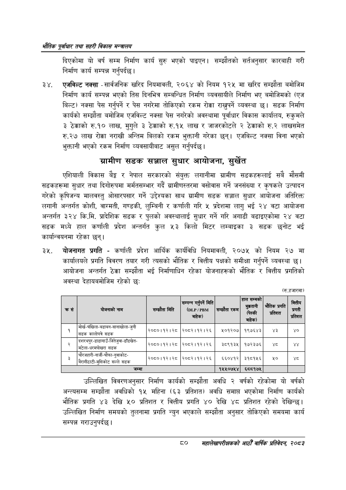

# Page 102 QA

## Rendered page


## Extracted text

```text
भरोतिक एवधार तथा सहरी विकास
दिएकोमा यो वर्ष सम्म निर्माण कार्य सुरु भएको पाइएन। सम्झौतको सर्तअनुसार कारबाही गरी निर्माण कार्य सम्पन्न गर्नुपर्दछ |
एजविल्ट नक्सा -सार्वजनिक खरिद नियमावली, २०६४ को नियम १२५ मा खरिद सम्झौता बमोजिम निर्माण कार्य सम्पन्न भएको तिस दिनभित्र सम्बन्धित निर्माण व्यवसायीले निर्माण भए बमोजिमको (एज बिल्ट) नक्सा पेस गर्नुपर्ने र पेस नगरेमा तोकिएको रकम रोक्का राख्ुपर्ने व्यवस्था छ। सडक निर्माण कार्यको सम्झौता बमोजिम एजविल्ट नक्सा पेस नगरेको अवस्थामा पूर्वाधार विकास कार्यालय, रुकुमले ३ ठेक्काको रु.१० लाख, ३ ठेक्काको रु.१५ लाख र जाजरकोटले २ ठेक्काको रु.२ लाखसमेत रु.२७ लाख रोक्का नराखी अन्तिम बिलको रकम भुक्तानी गरेका छन्‌। एजबिल्ट नक्सा विना भएको भुक्तानी भएको रकम निर्माण व्यवसायीबाट असुल गर्नुपर्दछ |
गआमीण सडक सञ्जाल सुधार आयोजना, सुर्खेत
एशियाली विकास बेङ्ग र नेपाल सरकारको संयुक्त लगानीमा ग्रामीण सडकहरूलाई सबै मौसमी सडकहरूमा सुधार तथा दिगोरुपमा मर्मतसम्भार गर्दै ग्रामीणस्तरमा वसोवास गर्ने जनसंख्या र कृषकले उत्पादन गरेको कृषिजन्य मालवस्तु ओसारपसार गर्ने उद्देश्यका साथ ग्रामीण सडक सञ्जाल सुधार आयोजना अतिरिक्त लगानी अन्तर्गत कोशी, वाग्मती, गण्डकी, लुम्बिनी र कर्णाली गरि ५ प्रदेशमा लागु भई २४ वटा आयोजना अन्तर्गत ३२४ कि.मि. प्रादेशिक सडक र पुलको अवस्थालाई सुधार गर्ने गरि अगाडी बढाइएकोमा २४ वटा सडक मध्ये हाल कर्णाली प्रदेश अन्तर्गत कुल ५३ किलो मिटर लम्बाइका ३ सडक छनोट भई कार्यान्वयनमा रहेका छन्‌।
योजनागत प्रगति -कर्णाली प्रदेश आर्थिक कार्यविधि नियमावली, २०७५ को नियम २७ मा कार्यालयले प्रगति विवरण तयार गरी त्यसको भौतिक र वित्तीय पक्षको समीक्षा गर्नुपर्ने व्यवस्था छ। आयोजना अन्तर्गत ठेक्का सम्झौता भई निर्माणाधिन रहेका योजनाहरूको भौतिक र वित्तीय प्रगतिको अवस्था देहायबमोजिम रहेको छः:
(रु.हजारमा)
उल्लिखित विवरणअनुसार निर्माण कार्यको सम्झौता अवधि २ वर्षको रहेकोमा यो वर्षको अन्त्यसम्म सम्झौता अवधिको १५ महिना (६३ प्रतिशत) अवधि समाप्त भएकोमा निर्माण कार्यको भौतिक प्रगति ४३ देखि ५० प्रतिशत र वित्तीय प्रगति ४० देखि ४८ प्रतिशत रहेको देखिन्छ। उल्लिखित निर्माण समयको तुलनामा प्रगति न्युन भएकाले सम्झौता अनुसार तोकिएको समयमा कार्य सम्पन्न गराउनुपर्दछ।
८०
महालेखापरीक्षकको भाठोँ वार्षिक प्रतिवेदन २०८२

| क्रस | योजनाको योजनाको नाम | सम्झौता मिति | भने सम्पन्न मिति (/ बाहेक) | सम्झौता रकम | हाल सम्मको भुक्कतानी ३ 'बाहेक) | भौतिक क प्रगति \| धक? | क्त्तीय प्रगती प्रतिशत |
| --- | --- | --- | --- | --- | --- | --- | --- |
| १ | मोर्ख-चंखिला-वडाबन-सानाखोला-जुनी. 'सडक कालोपत्रै सडक | २०५०१९३१३५ | २०८२।१२।२६ | ५०१२०७ | १९७६४३ | ४३ | ४० |
|  | दशरथपुर-डाडागाउँ-जितेजुवा-ढाँडखेत- = 'मटेला-घरमोखत सडक | २०५०१९३१३५ | २०८२।१२।२६ | ३८९१३४५ | १७२३७६ | ४८ |  |
| ३ | चौरजहारी-नार्जी-चौफा-नुवाकोट- सल्ले ३०८८-मुसिकोट सल्ले सडक | \| २०६०।१२। २८ | २०८२।१२।२६ | ६६०४१२ | ३१८१५६ |  |  |
|  | जम्मा |  |  | १५५०७५४ | ६८८१७४५ |  |  |
```

## Flags
- table_page
- medium_quality_table
