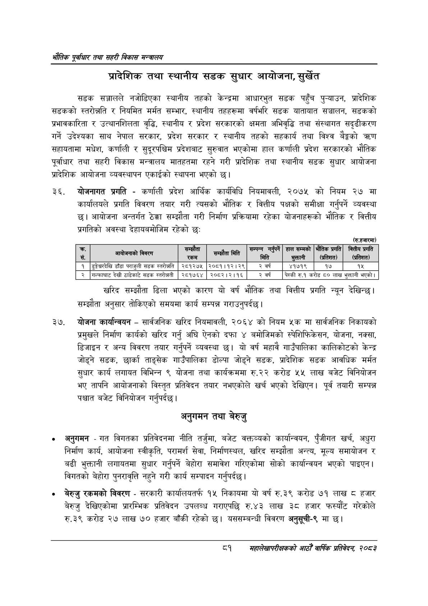

# Page 103 QA

## Rendered page


## Extracted text

```text
भरोतिक एवधार तथा सहरी विकास
प्रादेशिक तथा स्थानीय सडक सुधार आयोजना, सुर्खेत
सडक सञ्जालले नजोडिएका स्थानीय तहको केन्द्रमा आधारभुत सडक पहुँच पुन्याउन, प्रादेशिक सडकको स्तरोन्नति र नियमित मर्मत सम्भार, स्थानीय तहहरूमा वर्षभरि सडक यातायात सञ्चालन, सडकको प्रभावकारिता र उत्थानशिलता वृद्धि, स्थानीय र प्रदेश सरकारको क्षमता अभिवृद्धि तथा संस्थागत सदृढीकरण गर्ने उदेश्यका साथ नेपाल सरकार, प्रदेश सरकार र स्थानीय तहको सहकार्य तथा विश्व बैङ्कको त्रषण सहायतामा मधेश, कर्णाली र सुदूरपश्चिम प्रदेशबाट सुरुवात भएकोमा हाल कर्णाली प्रदेश सरकारको भौतिक पूर्वाधार तथा सहरी विकास मन्त्रालय मातहतमा रहने गरी प्रादेशिक तथा स्थानीय सडक सुधार आयोजना प्रादेशिक आयोजना व्यवस्थापन एकाईको स्थापना भएको छ।
योजनागत प्रगति -कर्णाली प्रदेश आर्थिक कार्यविधि नियमावली, २०७५ को नियम २७ मा कार्यालयले प्रगति विवरण तयार गरी त्यसको भौतिक र वित्तीय पक्षको समीक्षा गर्नुपर्ने व्यवस्था छ। आयोजना अन्तर्गत ठेक्का सम्झौता गरी निर्माण प्रक्रियामा रहेका योजनाहरूको भौतिक र वित्तीय प्रगतिको अवस्था देहायबमोजिम रहेको छ:
(रु.हजारमा)
खरिद सम्झौता ढिला भएको कारण यो वर्ष भौतिक तथा वित्तीय प्रगति न्यून देखिन्छ। सम्झौता अनुसार तोकिएको समयमा कार्य सम्पन्न गराउनुपर्दछ।
योजना कार्यान्वयन -सार्वजनिक खरिद नियमावली, २०६४ को नियम ५क मा सार्वजनिक निकायको प्रमुखले निर्माण कार्यको खरिद गर्नु अघि ऐनको दफा ४ बमोजिमको स्पेशिफिकेसन, योजना, नक्सा, डिजाइन र अन्य विवरण तयार गर्नुपर्ने व्यवस्था छ। यो वर्ष महावै गाउँपालिका कालिकोटको केन्द्र जोड्ने सडक, छार्का ताङ्सेक गाउँपालिका डोल्पा जोड्ने सडक, प्रादेशिक सडक आवधिक मर्मत सुधार कार्य लगायत विभिन्न ९ योजना तथा कार्यक्रममा रु.२२ करोड ५५ लाख बजेट विनियोजन भए तापनि आयोजनाको विस्तृत प्रतिवेदन तयार नभएकोले खर्च भएको देखिएन। पूर्व तयारी सम्पन्न पश्चात बजेट विनियोजन गर्नुपर्दछ।
अनुगमन तथा बेरुजु
अनुगमन -गत विगतका प्रतिवेदनमा नीति तर्जुमा, बजेट वक्तव्यको कार्यान्वयन, पुँजीगत खर्च, अधुरा निर्माण कार्य, आयोजना स्वीकृति, परामर्श सेवा, निर्माणस्थल, खरिद सम्झौता अन्त्य, मूल्य समायोजन र बढी भुक्तानी लगायतमा सुधार गर्नुपर्ने बेहोरा समावेश गरिएकोमा सोको कार्यान्वयन भएको पाइएन। विगतको बेहोरा पुनरावृत्ति नहुने गरी कार्य सम्पादन गर्नुपर्दछ |
० बेरुजु रकमको विवरण -सरकारी कार्यालयतर्फ १५ निकायमा यो वर्ष रु.३९ करोड ७१ लाख ८ हजार बेरुजु देखिएकोमा प्रारम्भिक प्रतिवेदन उपलब्ध गराएपछि रु.४३ लाख ३८ हजार फस्यौट गरेकोले रु.३९ करोड २७ लाख ७० हजार बाँकी रहेको छ। यससम्बन्धी विवरण अनुसूची-९ मा छ।
८१
सहालेखापरीक्षकको वाषिक प्रतिवेदन २०८२

| क्र | विवरण | सम्झौता रकम | सम्झौता मिति | सम्पन्न मिति | हाल सम्मको अन \| | भेतिक प्रगति एना | वित्तीय प्रगति \| लल |
| --- | --- | --- | --- | --- | --- | --- | --- |
| १ | डुङ्गेचरदेखि डाँडा पराजुली सडक स्तरोन्नति | २८१२७५ | २०८१।१२।२९ | २ वर्ष | ४१७१९ | १७ | १५ |
| २ | गल्फाघाट देखी ठाडेकाटे डक स्तरोन्नती | २८१७६४ | २०८२।२।१६ | २ वर्ष | पेस्की रु.१ | करोड ८० लाख | भुक्तानी भएको \| |
```

## Flags
- table_page
- medium_quality_table
