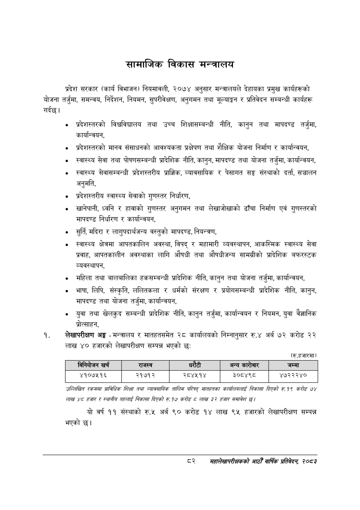

# Page 104 QA

## Rendered page


## Extracted text

```text
सामाजिक विकास मन्त्रालय
प्रदेश सरकार (कार्य विभाजन) नियमावली, २०७४ अनुसार मन्त्रालयले देहायका प्रमुख कार्यहरूको योजना तर्जुमा, समन्वय, निर्देशन, नियमन, सुपरीवेक्षण, अनुगमन तथा मूल्याङ्कन र प्रतिवेदन सम्बन्धी कार्यहरू गर्दछ।
प्रदेशस्तरको विश्वविद्यालय तथा उच्च शिक्षासम्बन्धी नीति, कानुन तथा मापदण्ड तर्जुमा, कार्यान्वयन,
० प्रदेशस्तरको मानव संसाधनको आवश्यकता प्रक्षेपण तथा शैक्षिक योजना निर्माण र कार्यान्वयन,
० स्वास्थ्य सेवा तथा पोषणसम्बन्धी प्रादेशिक नीति, कानुन, मापदण्ड तथा योजना तर्जुमा, कार्यान्वयन,
स्वास्थ्य सेवासम्बन्धी प्रदेशस्तरीय प्राज्ञिक, व्यावसायिक र पेसागत सङ्घ संस्थाको दर्ता, सञ्चालन अनुमति,
प्रदेशस्तरीय स्वास्थ्य सेवाको गुणस्तर निर्धारण,
० खानेपानी, ध्वनि र हावाको गुणस्तर अनुगमन तथा लेखाजोखाको ढाँचा निर्माण एवं गुणस्तरको मापदण्ड निर्धारण र कार्यान्वयन,
० सुर्ति, मदिरा र लागुपदार्थजन्य वस्तुको मापदण्ड, नियन्त्रण,
० स्वास्थ्य क्षेत्रमा आपतकालिन अवस्था, विपद्‌ र महामारी व्यवस्थापन, आकस्मिक स्वास्थ्य सेवा प्रवाह, आपतकालीन अवस्थाका लागि औषधी तथा औषधीजन्य सामग्रीको प्रादेशिक बफरस्टक व्यवस्थापन,
महिला तथा बालबालिका हकसम्बन्धी प्रादेशिक नीति, कानुन तथा योजना तर्जुमा, कार्यान्वयन,
भाषा, लिपि, संस्कृति, ललितकला र धर्मको संरक्षण र प्रयोगसम्बन्धी प्रादेशिक नीति, कानुन, मापदण्ड तथा योजना तर्जुमा, कार्यान्वयन,
युवा तथा खेलकुद सम्बन्धी प्रादेशिक नीति, कानुन तर्जुमा, कार्यान्वयन र नियमन, युवा वैज्ञानिक प्रोत्साहन,
लेखापरीक्षण अङ्ग -मन्त्रालय र मातहतसमेत २८ कार्यालयको निम्नानुसार रु.४ अर्ब ७२ करोड २२ लाख ४० हजारको लेखापरीक्षण सम्पन्न भएको छः:
(रु.हजारमा)
उल्लिखित रकसमा प्राविधिक शिक्षा तथा व्यावसायिक तालिम परिषद्‌ मातहतका कारयलियलाई निकासा दिएको रु १९ करोङ ७४ लाख ४८ हजार र स्थानीय तहलाई निकासा दिएको रु १७ करोड लाख २२ हजार समावेश छ।
यो वर्ष ११ संस्थाको रु.४५ अर्ब ० करोड १४ लाख ९५ हजारको लेखापरीक्षण सम्पन्न भएको छ।
दर
सहालेखापरीक्षकको वाषिक प्रतिवेदन २०८२

| िानिबोजन खर्च | राजस्व |  |  | अन्य कारोबार | जम्मा |
| --- | --- | --- | --- | --- | --- |
| ४१०७५१६ | २१७१२ | २८४४५१४ |  | ३०८४९८ | ४७२२२४० |
```

## Flags
- table_page
- medium_quality_table
