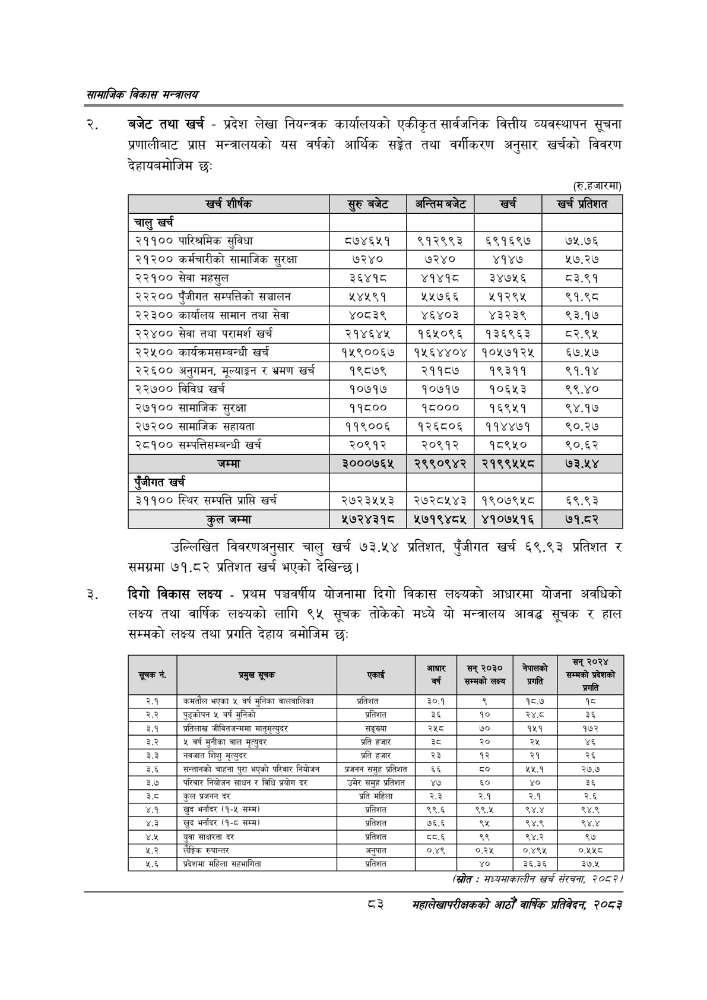

# Page 105 QA

## Rendered page


## Extracted text

```text
सायाजिक विकास
बजेट तथा खर्च -प्रदेश लेखा नियन्त्रक कार्यालयको एकीकृत सार्वजनिक वित्तीय व्यवस्थापन सूचना प्रणालीबाट प्राप्त मन्त्रालयको यस वर्षको आर्थिक सङ्गेत तथा वर्गीकरण अनुसार खर्चको विवरण देहायबमोजिम छ:
(रु.हजारमा)
उल्लिखित विवरणअनुसार चालु खर्च १७३.५४ प्रतिशत, पुँजीगत खर्च ६९.९३ प्रतिशत र समग्रमा ७१.८२ प्रतिशत खर्च भएको देखिन्छ।
दिगो विकास लक्ष्य -प्रथम पञ्चवर्षीय योजनामा दिगो विकास लक्ष्यको आधारमा योजना अवधिको लक्ष्य तथा वार्षिक लक्ष्यको लागि ९५ सूचक तोकेको मध्ये यो मन्त्रालय आवद्ध सूचक र हाल सम्मको लक्ष्य तथा प्रगति देहाय बमोजिम छः:
(स्रोत: सध्यसाकालीन खर्च संरचना; २०८२
८३
महालेखापरीक्षकको आठौँ वार्षिक प्रतिवेदन २०६३

| खर शीष्क | रुरुबबेट | अन्तिमबजेट | खच | खस प्रतिशत |
| --- | --- | --- | --- | --- |
| चालु खर्च |  |  |  |  |
| २११०० पारिश्रमिक सुविधा | ८७४६५१ | ९१२९९३ | ६९१६९७ | ७५.७६ |
| २१२०० कर्मचारीको सामाजिक सुरक्षा | ७२४० | ७२४० | ४१४७ | ५७.२७ |
| २२१०० सेवा महसुल | ३६४१८ | ४१४१८ | ३४७५६ | ८३.९१ |
| २२२०० पुँजीगत सम्पत्तिको सञ्चालन | २४५९१ | ५५७६६ | ५१२९५ | ९१.९८ |
| २२३०० कार्थालष सामान तथा सेवा | ४०८३९ | ४६४०३ | ४३२३९ | ९३.१७ |
| २२४०० सेवा तथा परामर्श खर्च | २१४६४५ | १६५०९६ | १३६९६३ | ८२.९४५ |
| २२५०० कार्यत्रमलन्बन्धी खर्च | १५९००६७ | १५६४४०४ | १०५७१२५ | ६७.१७ |
| २२६०० अनुगमन, मूल्याङ्कन र भ्रमण खर्च | १९८७९ | २११८७ | १९३११ | ९१.१४ |
| २२७०० विविध खर्च | १०७१७ | १०७१७ | १०६५३ | ९९.४० |
| २७१०० चामाजिक सुरक्षा | ११८०० | १८००० | १६९५१ | ९४.१७ |
| २७२०० सामाजिक सहायता | ११९००६ | १२६८०६ | ११४४७१ | ९०.२७ |
| २८१०० चन्पत्तिकम्बन्धी खर्च | २०९१२ | २०९१२ | १८९५० | ९०.६२ |
| जम्मा | ३०००७६५ | २९९०९४२ | २१९९४५४५८ | ७३.५४ |
| पूँजीगत खर्च |  |  |  |  |
| ३११०० स्थिर सम्पत्ति प्राप्ति खर्च | २७२३५५३ | २७२८५४३ | १९०७९५८ | ६९.९३ |
| कुल जम्मा | ५७२४३१८० | २५७१९४८५ | ४१०७५१६ | ७१.८२ |

| सूचक नं. | प्रमुख सूचक | एकाई | आधार छ | सन्‌ २०३० [\| | नेपालको ५५ | 'सम्मको प्रदेशको प्रगति |
| --- | --- | --- | --- | --- | --- | --- |
| २.१ | 'कमतौल भएका ५ वर्ष मुनिका वालवालिका | प्रतिशत | ३०.१ |  | १८.७ | १८ |
| २.२ | पूड्कोपन ५ वर्ष मुनिको | प्रतिशत | ३६ | १० | स्व | ३६ |
| ३.१ | प्रतिलाख जीवितजन्ममा नाचृभृत्युदर | सङ्ख्या | २५८ | ७० | १५१ | १७२ |
| ३.२ | ५ वर्ष मुनीका वाल मृत्युदर | प्रति हजार | डेट | २० | २५ |  |
| ३.३ | नवजात शिशु मृत्युदर | प्रति हजार | २२ | १२ | २१ | २६ |
| ३.६ | सन्तानको चाहना पुरा भएको परिवार नियोजन | प्रजनन समुह प्रतिशत | ६६ |  | २४५. | २७.७ |
| ३.७ | परिवार नियोजन साधन र विधि प्रयोग दर | उमेर समुह प्रतिशत | ४७ | ६० | ४० | ३६ |
| ३५ | कुल प्रजनन दर | प्रति महिला | २.३ | २.१ | २.१ | २.६ |
| ४.१ | खुद भर्नादर (१-५ सम्म) | प्रतिशत | २९.६ | ९९.५ | ९४.४ | ९४.९ |
| ४.३ | खुद भर्नादर (१-८ सम्म | प्रतिशत | ७६.६ | ९५ | ९४.९ | ९४४ |
| ४५ | युवा साक्षरता दर | प्रतिशत | ५्ब६ | ९९ | ९४.२ | ९४ |
| ३ | लैङ्गिक रुपान्तर | अनुपात | ०.४९ | ०.२५ | ०.४९५ | ०.५५८ |
| २.६ | प्रदेशमा महिला सहभागिता | प्रतिशत |  | ४० | ३६.३६ | ३०४ |
```

## Flags
- table_page
- medium_quality_table
