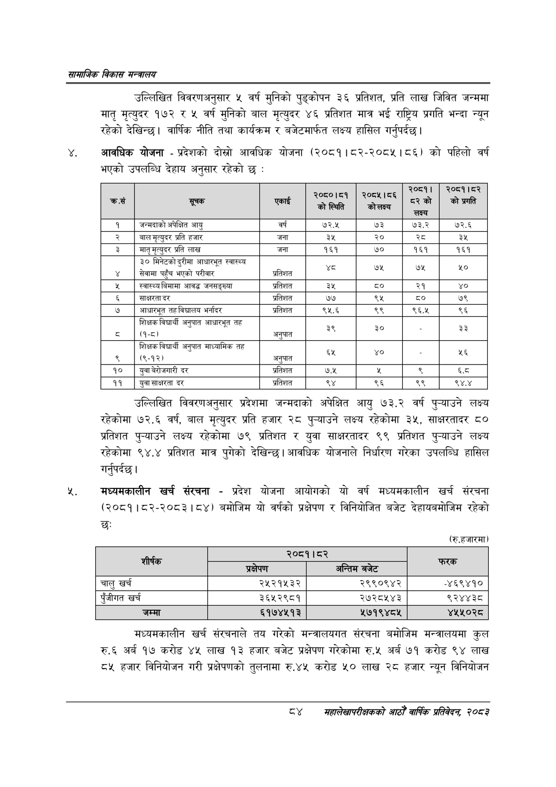

# Page 106 QA

## Rendered page


## Extracted text

```text
सायाजिक विकास
उल्लिखित विवरणअनुसार ५ वर्ष मुनिको पुड्कोपन ३६ प्रतिशत, प्रति लाख जिवित जन्ममा मातृ मृत्युदर १७२ र ५ वर्ष मुनिको बाल मृत्युदर ४६ प्रतिशत मात्र भई राष्ट्रिय प्रगति भन्दा न्यून रहेको देखिन्छ। वार्षिक नीति तथा कार्यक्रम र बजेटमार्फत लक्ष्य हासिल गर्नुपर्दछ |
., आवधिक योजना -प्रदेशको दोत्रो आवधिक योजना (२०८१।८२-२०८५।८६) को पहिलो वर्ष भएको उपलब्धि देहाय अनुसार रहेको छ:
उल्लिखित विवरणअनुसार प्रदेशमा जन्मदाको अपेक्षित आयु ७३.२ वर्ष पुन्याउने लक्ष्य रहेकोमा ७२.६ वर्ष, बाल मृत्युदर प्रति हजार २८ पुन्याउने लक्ष्य रहेकोमा ३५, साक्षरतादर ८० प्रतिशत पुन्याउने लक्ष्य रहेकोमा ७९ प्रतिशत र युवा साक्षरतादर ९९ प्रतिशत पुन्याउने लक्ष्य रहेकोमा ९४.४ प्रतिशत मात्र पुगेको देखिन्छ। आवधिक योजनाले निर्धारण गरेका उपलब्धि हासिल गर्नुपर्दछ |
मध्यमकालीन खर्च संरचना -प्रदेश योजना आयोगको यो वर्ष मध्यमकालीन खर्च संरचना (२०८१।८२-२०८३। ८४) बमोजिम यो वर्षको प्रक्षेपण र विनियोजित बजेट देहायबमोजिम रहेको छः
(रु.हजारमा)
मध्यमकालीन खर्च संरचनाले तय गरेको मन्त्रालयगत संरचना बमोजिम मन्त्रालयमा कुल रु.६ अर्ब १७ करोड ४५ लाख १३ हजार बजेट प्रक्षेपण गरेकोमा रु.५ अर्ब ७१ करोड ९४ लाख ८५ हजार विनियोजन गरी प्रक्षेपणको तुलनामा रु.४५ करोड ५० लाख २८ हजार न्यून विनियोजन
८४
महालेखापरीक्षकको भाठोँ वार्षिक प्रतिवेदन २०८२

| क्रस | 'सूचक | एकाई | २०८०।८१ २ स्थिति | २०८१५।८६. | २०८१। २को लक्ष्य | २०८१।८२ प्रगति को प्रगति |
| --- | --- | --- | --- | --- | --- | --- |
| १ | अन्तदाको अपेक्षित आयु | वर्ष | ७२.५ | ७३ | ७३.२ | ७२.६ |
| २ | वबालमृत्युदर प्रति हजार | जना | ३५ | २० | स्व | ३५ |
| ३ | मातृमृत्युदर प्रति लाख | जना | १६१ | ७० | १६१ | १६१ |
| ४ | ३० मिनेटको दुरीमा आधारभूत स्वास्थ्य सेवामा पहुँच भएको परीवार | प्रतिशत | ५ | ७५ | ७५ | ५० |
| ५ | स्वास्थ्यविमामा आवद्ध जनसङ्खव। | प्रतिशत | ३५ |  | २१ | ४० |
| ६ | साक्षरता दर | प्रतिशत | ७७ | ४ |  | ७९ |
| ७ | आधारभूत तह विद्यालय भर्नादर | प्रतिशत | ९५.६ | ९९ | ९६.४५ | ९६ |
| ८ | शिक्षक विद्यार्थी अनुपात आधारभूत तह ~ (१-८) | अनुपात | ३९ | ३० |  | ३३ |
| ९ | शिक्षक विद्यार्थी अनुपात माध्वामिक तह (९-१२) | अनुपात |  |  |  | २६ |
| १० | युवा बेरोजगारी दर | प्रतिशत | ७.५ | ३ | ९ | ६.८ |
| ११ | युवा साक्षरता दर | प्रतिशत | ९४ | ९६ | ९९ |  |

|  |  | २०८१।८२ |  |
| --- | --- | --- | --- |
|  | प्रक्षेपण | अन्तिम बजेट |  |
| चालु खर्च | २५२१५३२ | २९९०९४२ | ४६९४१० |
| पुँजीगत खर्च | ३६५२९८१ | २८७२८५४३ | ९२४४३८ |
| जम्मा | ६१७४५१३ | ४५७१९४८४५ | ४५५०२८ |
```

## Flags
- table_page
- medium_quality_table
