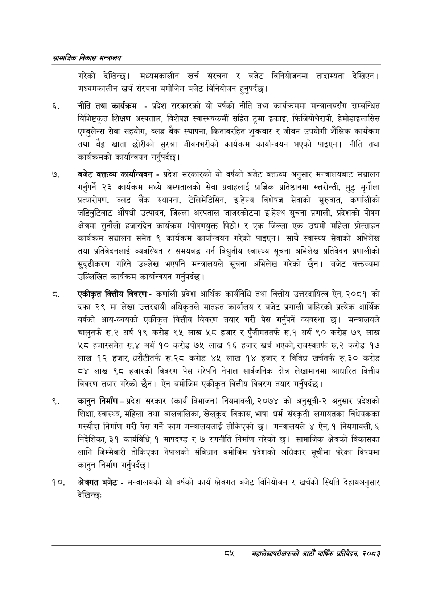

# Page 107 QA

## Rendered page


## Extracted text

```text
सायाजिक विकास
गरेको देखिन्छ। मध्यमकालीन खर्च संरचना र बजेट विनियोजनमा तादाम्यता देखिएन। मध्यमकालीन खर्च संरचना बमोजिम बजेट विनियोजन हुनुपर्दछ |
नीति तथा कार्यक्रम -प्रदेश सरकारको यो वर्षको नीति तथा कार्यक्रममा मन्त्रालयसँग सम्बन्धित विशिष्टकृत शिक्षण अस्पताल, विशेषज्ञ स्वास्थ्यकर्मी सहित ट्रमा इकाइ, फिजियोथेरापी, हेमोडाइलासिस एम्बुलेन्स सेवा सहयोग, ब्लड बैंक स्थापना, किताबरहित शुक्रवार र जीवन उपयोगी शैक्षिक कार्यक्रम तथा बेङ्ग खाता छोरीको सुरक्षा जीवनभरीको कार्यक्रम कार्यान्वयन भएको पाइएन। नीति तथा कार्यक्रमको कार्यान्वयन गर्नुपर्दछ |
बजेट वक्तव्य कार्यान्यवन -प्रदेश सरकारको यो वर्षको बजेट वक्तव्य अनुसार मन्त्रालयबाट सञ्चालन गर्नुपर्ने २३ कार्यक्रम मध्ये अस्पतालको सेवा प्रवाहलाई प्राज्ञिक प्रतिष्ठानमा स्तरोन्ती, मुटु मृगौला प्रत्यारोपण, ब्लड बैंक स्थापना, टेलिमेडिसिन, इ-हेल्थ विशेषज्ञ सेवाको सुरुवात, कर्णालीको जडिवुटिबाट औषधी उत्पादन, जिल्ला अस्पताल जाजरकोटमा इ-हेल्थ सुचना प्रणाली, प्रदेशको पोषण क्षेत्रमा सुनौलो हजारदिन कार्यक्रम (पोषणयुक्त पिठो) र एक जिल्ला एक उचद्चमी महिला प्रोत्साहन कार्यक्रम सञ्चालन समेत ९ कार्यक्रम कार्यान्वयन गरेको पाइएन। साथै स्वास्थ्य सेवाको अभिलेख तथा प्रतिवेदनलाई व्यवस्थित र समयबद्ध गर्न विद्युतीय स्वास्थ्य सूचना अभिलेख प्रतिवेदन प्रणालीको सुदृढीकरण गरिने उल्लेख भएपनि मन्त्रालयले सूचना अभिलेख गरेको छैन। बजेट वकक्तव्यमा उल्लिखित कार्यक्रम कार्यान्वयन गर्नुपर्दछ |
एकीकृत वित्तीय विवरण -कर्णाली प्रदेश आर्थिक कार्यविधि तथा वित्तीय उत्तरदायित्व ऐन, २०८१ को दफा २९ मा लेखा उत्तरदायी अधिकृतले मातहत कार्यालय र बजेट प्रणाली बाहिरको प्रत्येक आर्थिक वर्षको आय-व्ययको एकीकृत वित्तीय विवरण तयार गरी पेस गर्नुपर्ने व्यवस्था छ। मन्त्रालयले चालुतर्फ रु.२ अर्ब १९ करोड ९५ लाख ५८ हजार र पुँजीगततर्फ रु.१ अर्ब ९० करोड ७९ लाख ५८ हजारसमेत रु.४ अर्ब १० करोड ७५ लाख १६ हजार खर्च भएको, राजस्वतर्फ रु.२ करोड १७ लाख १२ हजार, धरौटीतर्फ रु.२८ करोड ४५ लाख १४ हजार र विविध खर्चतर्फ रु.३० करोड ८४ लाख ९८ हजारको विवरण पेस गरेपनि नेपाल सार्वजनिक क्षेत्र लेखामानमा आधारित वित्तीय विवरण तयार गरेको छैन। ऐन बमोजिम एकीकृत वित्तीय विवरण तयार गर्नुपर्दछ |
कानुन निर्माण -प्रदेश सरकार (कार्य विभाजन) नियमावली, २०७४ को अनुसूची-२ अनुसार प्रदेशको शिक्षा, स्वास्थ्य, महिला तथा बालबालिका, खेलकुद विकास, भाषा धर्म संस्कृती लगायतका विधेयकका मस्यौदा निर्माण गरी पेस गर्ने काम मन्त्रालयलाई तोकिएको छ। मन्त्रालयले ४ ऐन, १ नियमावली, ६ निर्देशिका, ३१ कार्यविधि, १ मापदण्ड र ७ रणनीति निर्माण गरेको छ। सामाजिक क्षेत्रको विकासका लागि जिम्मेवारी तोकिएका नेपालको संविधान बमोजिम प्रदेशको अधिकार सूचीमा परेका विषयमा कानुन निर्माण गर्नुपर्दछ।
क्षेत्रगत बजेट -मन्त्रालयको यो वर्षको कार्य क्षेत्रगत बजेट विनियोजन र खर्चको स्थिति देहायअनुसार देखिन्छ:
८४५४
महालेखापरीक्षकको भाठोँ वार्षिक प्रतिवेदन २०८२
```

## Flags
- None
