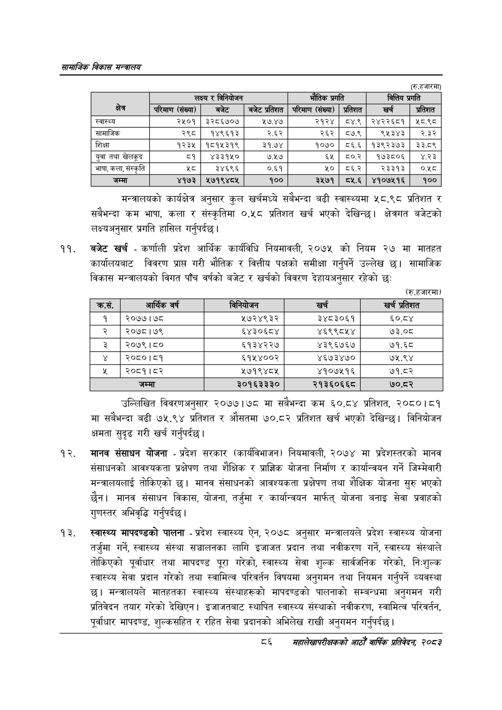

# Page 108 QA

## Rendered page


## Extracted text

```text
सायाजिक विकास
(रु. हजारमा)
मन्त्रालयको कार्यक्षेत्र अनुसार कुल खर्चमध्ये सबैभन्दा बढी स्वास्थ्यमा ५८.९८ प्रतिशत र सबैभन्दा कम भाषा, कला र संस्कृतिमा ०.५८ प्रतिशत खर्च भएको देखिन्छ। क्षेत्रगत बजेटको लक्ष्यअनुसार प्रगति हासिल गर्नुपर्दछ |
बजेट खर्च -कर्णाली प्रदेश आर्थिक कार्यविधि नियमावली, २०७५ को नियम २७ मा मातहत कार्यालयबाट विवरण प्राप्त गरी भौतिक र वित्तीय पक्षको समीक्षा गर्नुपर्ने उल्लेख छ। सामाजिक विकास मन्त्रालयको विगत पाँच वर्षको बजेट र खर्चको विवरण देहायअनुसार रहेको छ:
(रु.हजारमा)
उल्लिखित विवरणअनुसार २०७७।७८ मा सबैभन्दा कम ६०.८४ प्रतिशत, २०८०।८१ मा सबैभन्दा बढी ७५.९४ प्रतिशत र औसतमा ७०.८२ प्रतिशत खर्च भएको देखिन्छ। विनियोजन क्षमता सुदृढ गरी खर्च गर्नुपर्दछ |
मानव संसाधन योजना -प्रदेश सरकार (कार्यविभाजन) नियमावली, २०७४ मा प्रदेशस्तरको मानव संसाधनको आवश्यकता प्रक्षेपण तथा शैक्षिक र प्राज्ञिक योजना निर्माण र कार्यान्वयन गर्ने जिम्मेवारी मन्त्रालयलाई तोकिएको छ। मानव संसाधनको आवश्यकता प्रक्षेपण तथा शैक्षिक योजना सुरु भएको छैन। मानव संसाधन विकास, योजना, तर्जुमा र कार्यान्वयन मार्फत्‌ योजना बनाइ सेवा प्रवाहको गुणस्तर अभिवृद्धि गर्नुपर्दछ |
स्वास्थ्य मापदण्डको पालना -प्रदेश स्वास्थ्य ऐन, २०७८ अनुसार मन्त्रालयले प्रदेश स्वास्थ्य योजना तर्जुमा गर्ने, स्वास्थ्य संस्था सञ्चालनका लागि इजाजत प्रदान तथा नवीकरण गर्ने, स्वास्थ्य संस्थाले तोकिएको पूर्वाधार तथा मापदण्ड पूरा गरेको, स्वास्थ्य सेवा शुल्क सार्वजनिक गरेको, निःशुल्क स्वास्थ्य सेवा प्रदान गरेको तथा स्वामित्व परिवर्तन विषयमा अनुगमन तथा नियमन गर्नुपर्ने व्यवस्था छ। मन्त्रालयले मातहतका स्वास्थ्य संस्थाहरूको मापदण्डको पालनाको सम्बन्धमा अनुगमन गरी प्रतिवेदन तयार गरेको देखिएन। इजाजतबाट स्थापित स्वास्थ्य संस्थाको नवीकरण, स्वामित्व परिवर्तन, पूर्वाधार मापदण्ड, शुल्कसहित र रहित सेवा प्रदानको अभिलेख राखी अनुगमन गर्नुपर्दछ।
३३
सहालेखापरीक्षकको आठोँ वाषिक प्रतिवेदन २०८२

|  |  | लक्ष्य र (कनिपाणन |  | भौतिक प्रगति |  | वित्तिय | प्रगति |
| --- | --- | --- | --- | --- | --- | --- | --- |
| क्षेत्र | परिमाण (संख्या | बजेट | बजेट प्रतिशत | परिमाण (संख्या) | प्रतिशत | खर्च | प्रतिशत |
| स्वास्थ्य | २५०१ | ३२८६७०७ | ₹७.४७ | २१२४ | ८४.९ | २४२२६८१ | १८.९८ |
| सामाजिक | २९८ | १४९६१३ | २.६२ | २६२ | ८७.९ | ९५३४३ | २.३२ |
| शिक्षा | १२३५ | १८१५३१९ | ३१.७४ | १०७० | ८५६.६ | १३९२३७३ | ३३.८९ |
| युवा तथा खेलकूद | ८१ | ४३३१५० |  | ६५ |  | १७३८०६ | ४२३ |
| भाषा, कला, संस्कृति |  | ३४६९६ | ०.६१ | ५२० | ८६.२ | २३३१३ |  |
| जम्मा | ४१७३ | ५७१९४८५ | १०० | ३५७१ | ८०५.६ | ४१०७५१६ | १०० |

| क्रस. | आर्थिक वर्ष | निनिकोणन | खर्च | खर्च प्रतिशत |
| --- | --- | --- | --- | --- |
| १ | २०७७। ७८ | २७२४९३२ | ३४८३०६१ | ६०.८४ |
| २ | २०७८।७९ | ६४३०६८४ | ४६९९८४५४ | ७३.०८ |
| डे | २०७९।८० | ६१३४२२७ | ४३९६७६७ | ७१.६८ |
| ४ | २०८०।८१ | ६१५४००२ | ४६७३४७० | ७५.९४ |
|  | २०८१।८२ | २७१९४८४५ | ४१०७२५१६ | ७१.८२ |
|  | जम्मा | ३०१६३३३० | २१३६०६६८ | ७०.८२ |
```

## Flags
- table_page
- medium_quality_table
