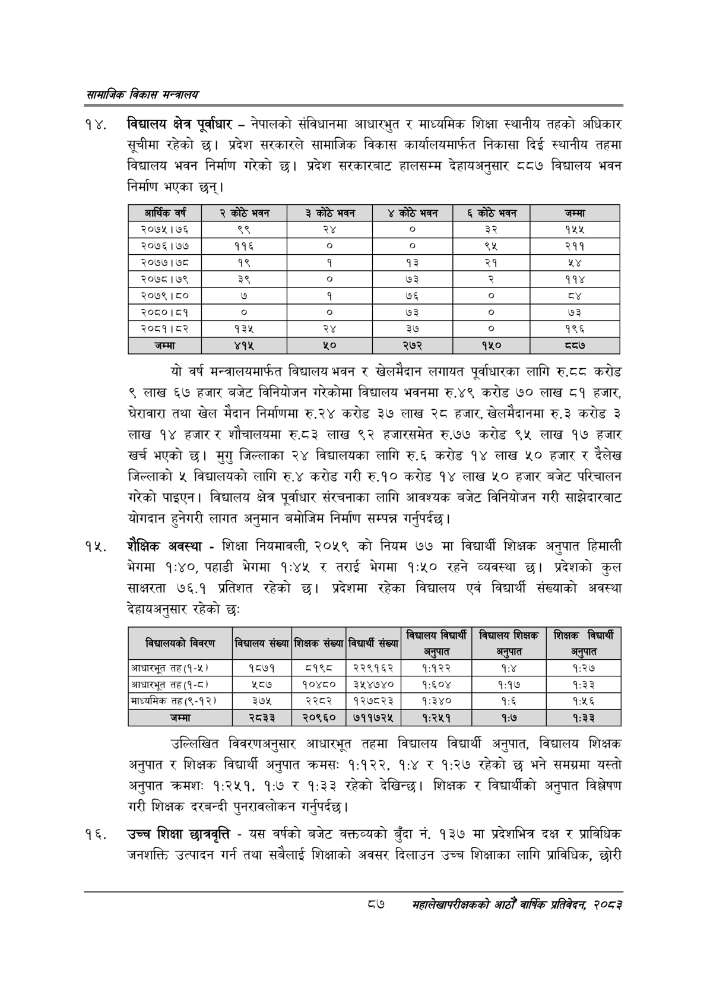

# Page 109 QA

## Rendered page


## Extracted text

```text
सायाजिक विकास
विद्यालय क्षेत्र पूर्वाधार -नेपालको संविधानमा आधारभुत र माध्यमिक शिक्षा स्थानीय तहको अधिकार सूचीमा रहेको छ। प्रदेश सरकारले सामाजिक विकास कार्यालयमार्फत निकासा दिई स्थानीय तहमा विद्यालय भवन निर्माण गरेको छ। प्रदेश सरकारबाट हालसम्म देहायअनुसार ८८७ विद्यालय भवन निर्माण भएका छन्‌।
यो वर्ष मन्त्रालयमार्फत विद्यालय भवन र खेलमैदान लगायत पूर्वाधारका लागि रु.दद करोड ९ लाख ६७ हजार बजेट विनियोजन गरेकोमा विद्यालय भवनमा रु.४९ करोड ७० लाख ८१ हजार, घेरावारा तथा खेल मैदान निर्माणमा रु.२४ करोड ३७ लाख २८ हजार, खेलमैदानमा रु.३ करोड ३ लाख १४ हजार र शौचालयमा रु.८३ लाख ९२ हजारसमेत रु.७७ करोड ९५ लाख १७ हजार खर्च भएको छ। मुगु जिल्लाका २४ विद्यालयका लागि रु.६ करोड १४ लाख ५० हजार र दैलेख जिल्लाको ५ विद्यालयको लागि रु.४ करोड गरी रु.१० करोड १४ लाख ५० हजार बजेट परिचालन गरेको पाइएन। विद्यालय क्षेत्र पूर्वाधार संरचनाका लागि आवश्यक बजेट विनियोजन गरी साझेदारबाट योगदान हुनेगरी लागत अनुमान बमोजिम निर्माण सम्पन्न गर्नुपर्दछ |
शैक्षिक अवस्था -शिक्षा नियमावली, २०५९ को नियम ७७ मा विद्यार्थी शिक्षक अनुपात हिमाली भेगमा १:४०, पहाडी भेगमा १:४५ र तराई भेगमा १:५० रहने व्यवस्था छ। प्रदेशको कुल साक्षरता ७६.१ प्रतिशत रहेको छ। प्रदेशमा रहेका विद्यालय एवं विद्यार्थी संख्याको अवस्था देहायअनुसार रहेको छ:
उल्लिखित विवरणअनुसार आधारभूत तहमा विद्यालय विद्यार्थी अनुपात, विद्यालय शिक्षक अनुपात र शिक्षक विद्यार्थी अनुपात क्रमस: १:१२२, १:४ र १:२७ रहेको छ भने समग्रमा यस्तो अनुपात क्रमश: १:२५१, १:७ र १:३३ रहेको देखिन्छ। शिक्षक र विद्यार्थीको अनुपात विश्लेषण गरी शिक्षक दरबन्दी पुनरावलोकन गर्नुपर्दछ |
उच्च शिक्षा छात्रवृत्ति -यस वर्षको बजेट वक्तव्यको बुँदा नं. १३७ मा प्रदेशभित्र दक्ष र प्राविधिक जनशक्ति उत्पादन गर्न तथा सबैलाई शिक्षाको अवसर दिलाउन उच्च शिक्षाका लागि प्राविधिक, छोरी
८७
महालेखापरीक्षकको भाठोँ वार्षिक प्रतिवेदन २०८२

| आर्थिक वर्ष | कोठे भवन | ३ कोठे भवन | कोठे भवन | ६ कोठे भवन | जम्मा |
| --- | --- | --- | --- | --- | --- |
| २०७५।७६ | ९९ | २४ | ० | ३२ | १५५ |
| २०७६।७७ | ११६ | ० | ० | ९५ | २११ |
| २०७७।७८ | १९ | १ | १३ | २१ |  |
| २०७८।७९ | ३९ |  | ७३ |  | ११४ |
| २०७९।८० | ७ | १ | ७६ | ० | २१ |
| २०८०।८१ |  |  | ७३ |  | ७३ |
| २०८१।८२ | १३५ | २४ | ३७ | ० | १९६ |

|  | ५ १ १ १ १ ३ ३३७ २० ३ ३ ०.०००००० ५ १ १ १ १ ४ ४३० ५ ९३ १८ ३२.९४६९११ बिधालय ५ १ १ १ १ ५ ५२७ ५ ४६ १८ ९३.३९२९९८ विद्यार्थी ५ १ १ १ १ ६ ५९३ ५ ५२ १८ ९०.०१६४७९ विद्यालय ५ १ १ १ १ ७ ६५० ५ ४४ १८ ९४.४१६३३६ शिक्षक ५ १ १ १ १ ८ ७१८ ५ ४५ १८ ९५.३५६९९५ शिक्षक ५ १ १ १ १ ९ ७७५ ५ ४६ १८ ८७.९९५७०५ विद्यार्थी ४ १ १ १ २ ० ३३ १६ ७६४ ४३ -१ ५ १ १ १ २ १ ३३ २७ ६५ ९ ५१.७३०२४० बिचालषको ५ १ १ १ २ २ १०५ १९ ४५ १८ ८८.६४८०६४ विवरण ५ १ १ १ २ ३ १८१ १९ ५३ १७ ७९.०७१३१२ बिद्यालय ५ १ १ १ २ ४ २३८ २४ ३६ १३ ९६.१५७७२२ संख्या ५ १ १ १ २ ५ २८० १९ ४५ १७ ९६.८९४४६३ शिक्षक ५ १ १ १ २ ६ ३३० २४ ३६ १३ ९६.९३२२८९ संख्या ५ १ १ १ २ ७ ३७२ १९ ४६ १७ ९४.५४२५४२ विद्यार्थी ५ १ १ १ २ ८ ४२३ २४ ३६ १३ ९६.४२७४९० संख्या ५ १ १ १ २ ९ ४९६ १६ ५२ ४३ ९६.१८९५६० अनुपात ५ १ १ १ २ १० ७४५ १६ ५२ ४३ ९४.९८०२०९ अनुपात ४ १ १ १ ३ ० ५०० २९ २९२ ३१ -१ ५ १ १ १ ३ १ ५०० २९ ४४ ३१ ९१.८७०४८३ अनुपात ५ १ १ १ ३ २ ६१९ २९ ५३ ३१ ९६.८४५५७३ अनुपात ५ १ १ १ ३ ३ ७४९ ३७ ४३ १८ ९६.८५२६७६ अनुपात ४ १ १ १ ४ ० ८ ६५ ७८० १६ -१ ५ १ १ १ ४ १ ८ ६६ ५७ १५ ७३.९९३१४९ आधारभूत ५ १ १ १ ४ २ ७२ ६६ २० ११ ९२.७३२८८० तह ५ १ १ १ ४ ३ ९६ ६५ ४० १५ ३९.४४५१५६ (१-५। ५ १ १ १ ४ ४ २०६ ६५ ४१ १४ ९५.८९९७२७ १८७१ ५ १ १ १ ४ ५ ३०१ ६५ ४४ १४ ८०.०४४२३५ ८१९८ ५ १ १ १ ४ ६ ३८२ ६५ ६५ १३ ९२.५२६८३३ २२९१६२ ५ १ १ १ ४ ७ ४९८ ६५ ४६ १४ ९१.७०७७९४ १:१२२ ५ १ १ १ ४ ८ ६३२ ६५ २४ १४ ६०.५९०६११ ५ १ १ १ ४ ९ ७५२ ६५ ३६ १४ ८७.९९०४७९ १:२७ ४ १ १ १ ५ ० ८ ९३ ७७९ १६ -१ ५ १ १ १ ५ १ ८ ९४ ५७ १५ ७४.३४६९६२ आधारभूत ५ १ १ १ ५ २ ७७ ८८ १५ २५ ९२.६९११७७ तह ५ १ १ १ ५ ३ ११३ ९३ २३ ११ ५७.८४४६१२ (९-५) ५ १ १ १ ५ ४ २११ ९३ ३२ १३ ७५.७८२७३८ ५८७ ५ १ १ १ ५ ५ २९६ ९३ ५५ १३ ९१.६८७४६९ १०४८० ५ १ १ १ ५ ६ ३८२ ९३ ६७ १३ ८३.६५८६५३ ३५४७४० ५ १ १ १ ५ ७ ४९८ ९३ ४७ १४ ८८.९७२७४८ १:६०४ ५ १ १ १ ५ ८ ६२६ ९३ ३६ १४ ९१.४०५६५५ १:१७ ५ १ १ १ ५ ९ ७५२ ९३ ३५ १४ ८९.७३४६८८ १:३३ ४ १ १ १ ६ ० ८ ११६ ७७८ १९ -१ ५ १ १ १ ६ १ ८ ११६ ५७ १६ ९०.५६१७६८ माध्यमिक ५ १ १ १ ६ २ ७४ १२० ७५ १५ ३३.१९३४३२ तह(९-१२। ५ १ १ १ ६ ३ २१२ १२० ३१ १३ ७६.६५६५७८ ३७५ ५ १ १ १ ६ ४ ३०२ १२० ४२ १३ ९१.०९२५९० २२८२ ५ १ १ १ ६ ५ ३८२ १२० ६६ १४ ८२.२६१८४१ १२७८२३ ५ १ १ १ ६ ६ ४९८ १२० 
```

## Flags
- table_page
- low_quality_table
