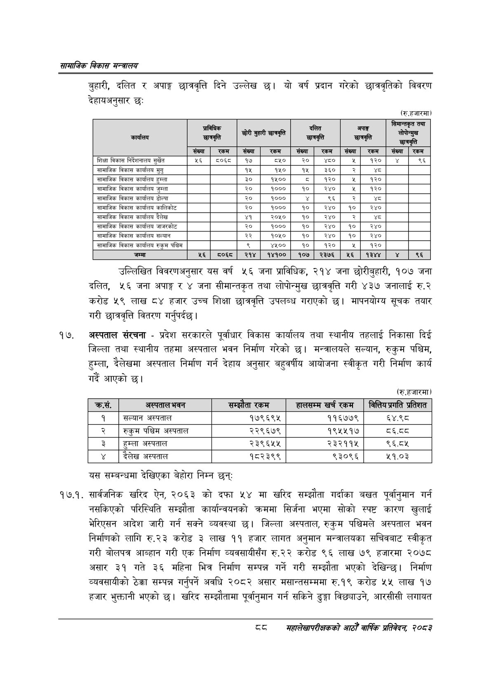

# Page 110 QA

## Rendered page


## Extracted text

```text
सायाजिक विकास
बुहारी, दलित र अपाङ्ग छात्रवृत्ति दिने उल्लेख छ। यो वर्ष प्रदान गरेको छात्रवृतिको विवरण देहायअनुसार छः
(रु.हजारमा)
उल्लिखित विवरणअनुसार यस वर्ष ५६ जना प्राविधिक, २१४ जना छौरीबुहारी, १०७ जना दलित, ५६ जना अपाङ्ग र ४ जना सीमान्तकृत तथा लोपोन्मुख छात्रवृत्ति गरी ४३७ जनालाई रु.२ करोड ५९ लाख ८४ हजार उच्च शिक्षा छात्रवृत्ति उपलब्ध गराएको छ। मापनयोग्य सूचक तयार गरी छात्रवृत्ति वितरण गर्नुपर्दछ |
अस्पताल संरचना -प्रदेश सरकारले पूर्वाधार विकास कार्यालय तथा स्थानीय तहलाई निकासा दिई जिल्ला तथा स्थानीय तहमा अस्पताल भवन निर्माण गरेको छ। मन्त्रालयले सल्यान, रुकुम पश्चिम, हुम्ला, दैलेखमा अस्पताल निर्माण गर्न देहाय अनुसार बहुवर्षीय आयोजना स्वीकृत गरी निर्माण कार्य गर्दै आएको छ।
(रु.हजारमा)
यस सम्बन्धमा देखिएका बेहोरा निम्न छन्‌
१७.१. सार्वजनिक खरिद ऐन, २०६३ को दफा ५४ मा खरिद सम्झौता गर्दाका बखत पूर्वानुमान गर्न नसकिएको परिस्थिति सम्झौता कार्यान्वयनको क्रममा सिर्जना भएमा सोको स्पष्ट कारण खुलाई भेरिएसन आदेश जारी गर्न सक्ने व्यवस्था छ। जिल्ला अस्पताल, रुकुम पश्चिमले अस्पताल भवन निर्माणको लागि रु.२३ करोड ३ लाख ११ हजार लागत अनुमान मन्त्रालयका सचिवबाट स्वीकृत गरी बोलपत्र आव्हान गरी एक निर्माण व्यवसायीसँग रु.२२ करोड ९६ लाख ७९ हजारमा २०७८ असार ३१ गते ३६ महिना भित्र निर्माण सम्पन्न गर्ने गरी सम्झौता भएको देखिन्छ। निर्माण व्यवसायीको ठेक्का सम्पन्न गर्नुपर्ने अवधि २०८२ असार मसान्तसम्ममा रु.१९ करोड ५५ लाख १७ हजार भुक्तानी भएको छ। खरिद सम्झौतामा पूर्वानुमान गर्न सकिने ढुङ्गा विछ्याउने, आरसीसी लगायत
महालेखापरीक्षकको भाठोँ वार्षिक प्रतिवेदन २०८२

| कार्यालय |  | प्राबिधिक छात्रवृत्ति | छोरी बुहारी | छात्रवृत्ति |  |  |  | अपाङ्ग | सिमान्तकृत | तथा |
| --- | --- | --- | --- | --- | --- | --- | --- | --- | --- | --- |
|  | संख्या | रकम | संख्या | रकम | संख्या | रकम | सख्या | रकम | संख्या | रकम |
| शिक्षा विकास [न४२।७०५ सुर्खेत | ५२६ | ५०६८ | १७ | ८५० | २० |  |  | १२० | ४ | ६६ |
| सामाजिक विकास कार्यालय मुगु |  |  | १५ | १५० | १५ | ३६० | र |  |  |  |
| सामाजिक विकास कार्यालय हुम्ला |  |  | ३० | १४०० | ५ | १२० | ४ | १२० |  |  |
| सामाजिक विकास कार्यालय जुम्ला |  |  | २० | १००० | १० | २४० |  | ९२० |  |  |
| सामाजिक विकास कार्यालय डोल्पा |  |  | २० | १००० |  | ९६ | २ | थ्व |  |  |
| सामाजिक विकास कार्यालय कालिकोट |  |  | २० | १००० | १० | २४० | १० | २४० |  |  |
| सामाजिक विकास कार्यालय दैलेख |  |  | ४१ | २०५० | १० | २४० | र | श्द |  |  |
| सामाजिक विकास कार्यालय जाजरकोट |  |  | २० | १००० | १० | २४० | १० | २४० |  |  |
| सामाजिक विकास कार्यालय सल्यान |  |  | २२ | १०५० | १० | र४० | १० | २४० |  |  |
| सामाजिक विकास कार्यालय रुकुम पश्चिम |  |  |  | ४४०० | १० | १२० | ४५ | १२० |  |  |
| जम्मा | ५६ |  | २१४ | १४१०० | १०७ | २३७६ | ५६ | १३४४ | ४ | ९६ |

| कस | जस्पताल भवन | रकम | हाससन्न खर्च रकम | प्रतिशत |
| --- | --- | --- | --- | --- |
| १ | सल्यान अस्पताल | १७९६९४५ | ११६७७९ | ६४.९८ |
| २ | रुकुम पश्चिम अस्पताल | २२९६७९ | १९५५१७ | ८६.८८ |
| ३ | हुम्ला अस्पताल | २३९६५४५ | २३२११५ | ९६.८४५ |
| ४ | दैलेख अस्पताल | १८२३९९ | ९३०९६ | ५१.०३ |
```

## Flags
- table_page
- medium_quality_table
