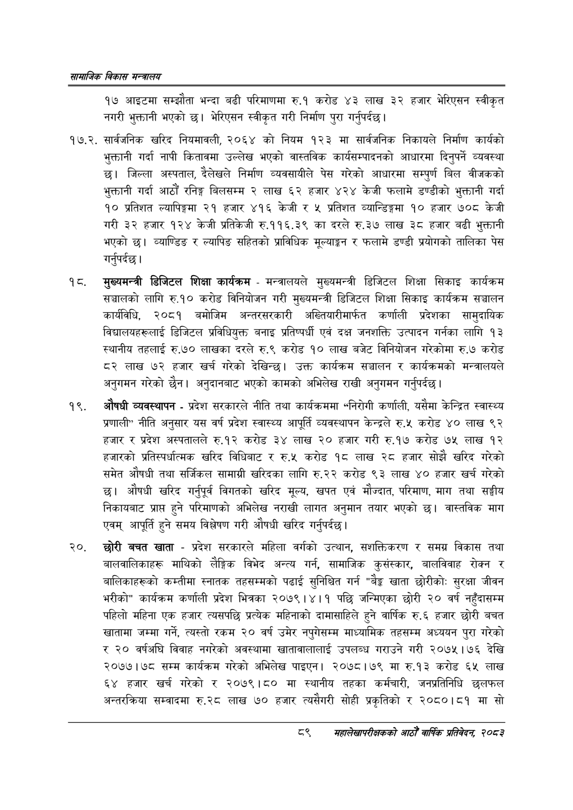

# Page 111 QA

## Rendered page


## Extracted text

```text
सायाजिक विकास
१७ आइटमा सम्झौता भन्दा बढी परिमाणमा रु.१ करोड ४३ लाख ३२ हजार भेरिएसन स्वीकृत नगरी भुक्तानी भएको छ। भेरिएसन स्वीकृत गरी निर्माण पुरा गर्नुपर्दछ |
१७.२. सार्वजनिक खरिद नियमावली, २०६४ को नियम १२३ मा सार्वजनिक निकायले निर्माण कार्यको भुक्तानी गर्दा नापी कितावमा उल्लेख भएको वास्तविक कार्यसम्पादनको आधारमा दिनुपर्ने व्यवस्था छ। जिल्ला अस्पताल, देलेखले निर्माण व्यवसायीले पेस गरेको आधारमा सम्पुर्ण बिल वीजकको भुक्तानी गर्दा आठौं रनिङ्ग बिलसम्म २ लाख ६२ हजार ४२४ केजी फलामे डण्डीको भुक्तानी गर्दा १० प्रतिशत ल्यापिङ्गमा २१ हजार ४१६ केजी र ५ प्रतिशत व्यान्डिङ्गमा १० हजार ७०८ केजी गरी ३२ हजार १२४ केजी प्रतिकेजी रु.११६.३९ का दरले रु.३७ लाख ३८ हजार बढी भुक्तानी भएको | व्याण्डिङ र ल्यापिङ सहितको प्राविधिक मूल्याङ्गन र फलामे डण्डी प्रयोगको तालिका पेस गर्नुपर्दछ |
मुख्यमन्त्री डिजिटल शिक्षा कार्यक्रम -मन्त्रालयले मुख्यमन्त्री डिजिटल शिक्षा सिकाइ कार्यक्रम सञ्चालको लागि रु.१० करोड विनियोजन गरी मुख्यमन्त्री डिजिटल शिक्षा सिकाइ कार्यक्रम सञ्चालन कार्यविधि, २०८१ बमोजिम अन्तरसरकारी अख्तियारीमार्फत कर्णाली प्रदेशका सामुदायिक विद्यालयहरूलाई डिजिटल प्रविधियुक्त बनाइ प्रतिष्पर्धी एवं दक्ष जनशक्ति उत्पादन गर्नका लागि १३ स्थानीय तहलाई रु.७० लाखका दरले रु.९ करोड १० लाख बजेट विनियोजन गरेकोमा रु.७ करोड ८२ लाख ७२ हजार खर्च गरेको देखिन्छ। उक्त कार्यक्रम सञ्चालन र कार्यक्रमको मन्त्रालयले अनुगमन गरेको छैन। अनुदानबाट भएको कामको अभिलेख राखी अनुगमन गर्नुपर्दछ |
औषधी व्यवस्थापन -प्रदेश सरकारले नीति तथा कार्यक्रममा "निरोगी कर्णाली, यसैमा केन्द्रित स्वास्थ्य प्रणाली" नीति अनुसार यस वर्ष प्रदेश स्वास्थ्य आपूर्ति व्यवस्थापन केन्द्रले € करोड ४० लाख ९२ हजार र प्रदेश अस्पतालले रु.१२ करोड ३४ लाख ० हजार गरी रु.१७ करोड ७५ लाख १२ हजारको प्रतिस्पर्धात्मक खरिद विधिबाट र रु.५ करोड १८ लाख २८ हजार सोझै खरिद गरेको समेत औषधी तथा सर्जिकल सामाग्री खरिदका लागि रु.२२ करोड ९३ लाख ४० हजार खर्च गरेको छ। औषधी खरिद गर्नुपूर्व विगतको खरिद मूल्य, खपत एवं मौज्दात, परिमाण, माग तथा सङ्घीय निकायबाट प्राप्त हुने परिमाणको अभिलेख नराखी लागत अनुमान तयार भएको छ। वास्तविक माग एवम्‌ आपूर्ति हुने समय विश्लेषण गरी औषधी खरिद गर्नुपर्दछ |
छोरी बचत खाता -प्रदेश सरकारले महिला वर्गको उत्थान, सशक्तिकरण र समग्र विकास तथा बालवालिकाहरू माथिको लैङ्गिक विभेद अन्त्य गर्न, सामाजिक कुसंस्कार, बालविवाह रोक्न र बालिकाहरूको कम्तीमा स्नातक तहसम्मको पढाई सुनिश्चित गर्न ३ खाता छोरीको: सुरक्षा जीवन भरीको" कार्यक्रम कर्णाली प्रदेश भित्रका २०७९।४।१ पछि जन्मिएका छोरी २० वर्ष नहुँदासम्म पहिलो महिना एक हजार त्यसपछि प्रत्यक महिनाको दामासाहिले हुने वार्षिक रु.६ हजार छोरी बचत खातामा जम्मा गर्ने, त्यस्तो रकम २० वर्ष उमेर नपुगेसम्म माध्यामिक तहसम्म अध्ययन पुरा गरेको र ० वर्षअघि विवाह नगरेको अवस्थामा खातावालालाई उपलब्ध गराउने गरी २०७५।७६ देखि २०७७।७८ सम्म कार्यक्रम गरेको अभिलेख पाइएन। २०७८।७९ मा रु.१३ करोड ६५ लाख ६४ हजार खर्च गरेको र २०७९।८० मा स्थानीय तहका कर्मचारी, जनप्रतिनिधि छलफल अन्तरक्रिया सम्वादमा रु.२८ लाख ७० हजार त्यसैगरी सोही प्रकृतिको र २०८०।८१ मा सो
३
सहालेखापरीक्षकको आठोँ वाषिक प्रतिवेदन २०८२
```

## Flags
- None
