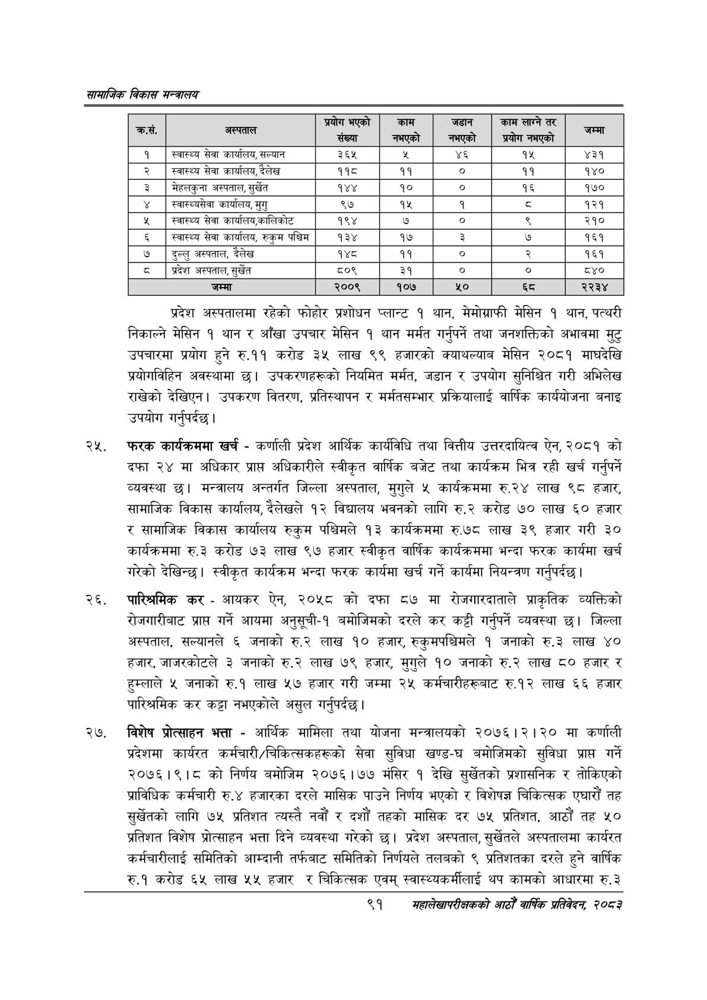

# Page 113 QA

## Rendered page


## Extracted text

```text
सायाजिक विकास
प्रदेश अस्पतालमा रहेको फोहोर प्रशोधन प्लान्ट १ थान, मेमोग्राफी मेसिन १ थान, पत्थरी निकाल्ने मेसिन १ थान र आँखा उपचार मेसिन १ थान मर्मत गर्नुपर्ने तथा जनशक्तिको अभावमा मुटु उपचारमा प्रयोग हुने रु.११ करोड ३५ लाख ९९ हजारको क्याथल्याब मेसिन २०८१ माघदेखि प्रयोगविहिन अवस्थामा छ। उपकरणहरूको नियमित मर्मत, जडान र उपयोग सुनिश्चित गरी अभिलेख राखेको देखिएन। उपकरण वितरण, प्रतिस्थापन र मर्मतसम्भार प्रक्रियालाई वार्षिक कार्ययोजना बनाइ उपयोग गर्नुपर्दछ |
फरक कार्यक्रममा खर्च -कर्णाली प्रदेश आर्थिक कार्यविधि तथा वित्तीय उत्तरदायित्व ऐन, २०८१ को दफा २४ मा अधिकार प्राप्त अधिकारीले स्वीकृत वार्षिक बजेट तथा कार्यक्रम भित्र रही खर्च गर्नुपर्ने व्यवस्था छ। मन्त्रालय अन्तर्गत जिल्ला अस्पताल, मुगुले ५ कार्यक्रममा रु.२४ लाख ९८ हजार, सामाजिक विकास कार्यालय, देलेखले १२ विद्यालय भवनको लागि रु.२ करोड ७० लाख ६० हजार र सामाजिक विकास कार्यालय रुकुम पश्चिमले १३ कार्यक्रममा रु.७८ लाख ३९ हजार गरी ३० कार्यक्रममा रु.३२ करोड ७३ लाख ९७ हजार स्वीकृत वार्षिक कार्यक्रममा भन्दा फरक कार्यमा खर्च गरेको देखिन्छ। स्वीकृत कार्यक्रम भन्दा फरक कार्यमा खर्च गर्ने कार्यमा नियन्त्रण गर्नुपर्दछ |
पारिश्रमिक कर -आयकर ऐन, २०५८ को दफा ८७ मा रोजगारदाताले प्राकृतिक व्यक्तिको रोजगारीबाट प्राप्त गर्ने आयमा अनुसूची-१ बमोजिमको दरले कर कट्टी गर्नुपर्ने व्यवस्था छ। जिल्ला अस्पताल, सल्यानले ६ जनाको रु.२ लाख १० हजार, रुकुमपश्चिमले १ जनाको रु.३ लाख ४० हजार, जाजरकोटले ३ जनाको रु.२ लाख ७९ हजार, मुगुले १० जनाको रु.२ लाख ८० हजार र हुम्लाले ५ जनाको रु.१ लाख ५७ हजार गरी जम्मा २५ कर्मचारीहरूबाट रु.१२ लाख ६६ हजार पारिश्रमिक कर कट्टा नभएकोले असुल गर्नुपर्दछ।
विशेष प्रोत्साहन भत्ता -आर्थिक मामिला तथा योजना मन्त्रालयको २०७६।२।२० मा कर्णाली प्रदेशमा कार्यरत कर्मचारी/चिकित्सकहरूको सेवा सुविधा खण्ड-घ बमोजिमको सुविधा प्राप्त गर्ने २०७६।९।८ को निर्णय बमोजिम २०७६।७७ मंसिर १ देखि सुर्खेतको प्रशासनिक र तोकिएको प्राविधिक कर्मचारी रु.४ हजारका दरले मासिक पाउने निर्णय भएको र विशेषज्ञ चिकित्सक एघारौं तह सुर्खेतको लागि ७५ प्रतिशत त्यस्तै नवौं र दशौं तहको मासिक दर ७५ प्रतिशत, आठौं तह ५० प्रतिशत विशेष प्रोत्साहन भत्ता दिने व्यवस्था गरेको छ। प्रदेश अस्पताल, सुर्खेतले अस्पतालमा कार्यरत कर्मचारीलाई समितिको आम्दानी तर्फबाट समितिको निर्णयले तलबको ९ प्रतिशतका दरले हुने वार्षिक रु.१ करोड ६५ लाख ५५ हजार र चिकित्सक एवम्‌ स्वास्थ्यकर्मीलाई थप कामको आधारमा रु.३
९१
सहालेखापरीक्षकको वाषिक प्रतिवेदन २०८२

| . कस. | - अस्पताल | प्रयोग भएको संख्या | काम = | जडान \| == \| | काम लाग्ने तर ५ | जम्मा |
| --- | --- | --- | --- | --- | --- | --- |
| १ | स्वास्थ्य सेवा , सल्यान | ३६४ |  | ४६ | १५ | ४३१ |
| २ | स्वास्थ्य सेवा कार्यालय, दैलेख | ११८ | ११ | ० | ११ | १४० |
| ३ | भमेहलकुना अस्पताल, सुर्खेत | १४४ | १० |  | १६ | १७० |
| ४ | ल्वास्थ्वसेवा कार्यालब, मुगु | ९७ | १५ | १ | व्‌ | १२१ |
| ५ | स्वास्थ्य सेवा कार्वालब,कालिकोट | १९४ | ७ | ० | ९ | २१० |
| ६ | स्वास्थ्य सेवा कार्यालय, रुकुम पश्चिम | १३४ | १७ | ३ | ७ | १६१ |
| ७ | दुल्लु अस्पताल, दैलेख | १४८ | ११ | ० | २ | १६१ |
| ८ | प्रदेश अस्पताल, सुर्खेत | ८०९ | ३१ | ० |  |  |
| ९ | जम्मा | २००९ | १०७ |  |  | २२३४ |
```

## Flags
- table_page
- medium_quality_table
