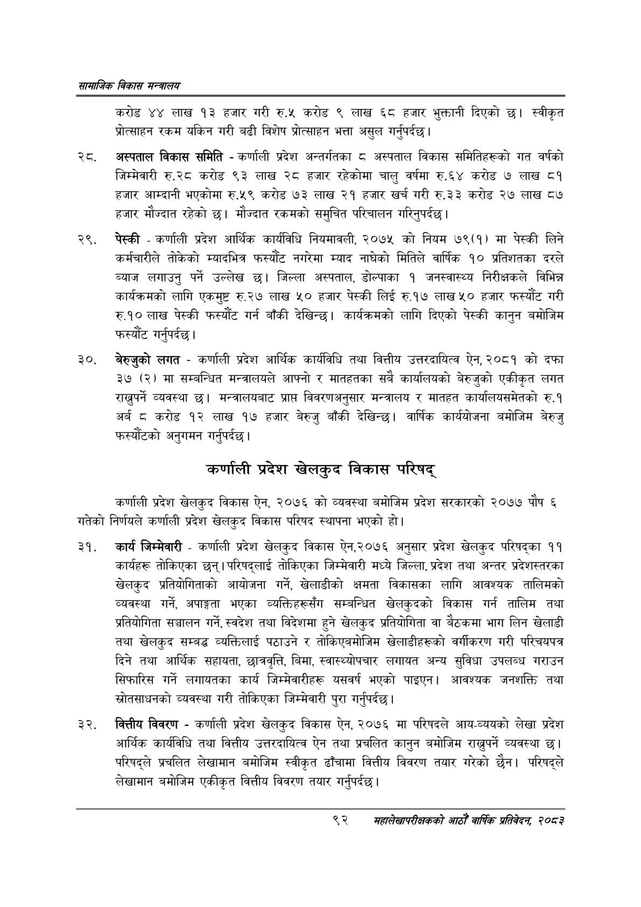

# Page 114 QA

## Rendered page


## Extracted text

```text
सायाजिक विकास
करोड ४४ लाख १३ हजार गरी रु.५ करोड ९ लाख ६८ हजार भुक्तानी दिएको छ। स्वीकृत प्रोत्साहन रकम यकिन गरी बढी विशेष प्रोत्साहन भत्ता असुल गर्नुपर्दछ।
. अस्पताल विकास समिति -कर्णाली प्रदेश अन्तर्गतका ८ अस्पताल विकास समितिहरूको गत वर्षको जिम्मेवारी रु.२८ करोड ९३ लाख २८ हजार रहेकोमा चालु वर्षमा रु.६४ करोड ७ लाख ८१ हजार आम्दानी भएकोमा रु.५९ करोड ७३ लाख २१ हजार खर्च गरी रु.३३ करोड २७ लाख ८७ हजार मौज्दात रहेको छ। मौज्दात रकमको समुचित परिचालन गरिनुपर्दछ |
पेस्की -कर्णाली प्रदेश आर्थिक कार्यविधि नियमावली, २०७५ को नियम ७९(१) मा पेस्की लिने कर्मचारीले तोकेको म्यादभित्र फस्यौट नगरेमा म्याद नाघेको मितिले वार्षिक १० प्रतिशतका दरले ब्याज लगाउनु पर्ने उल्लेख छ। जिल्ला अस्पताल, डोल्पाका १ जनस्वास्थ्य निरीक्षकले विभिन्न कार्यक्रमको लागि एकमुष्ट रु.२७ लाख ५० हजार पेस्की लिई रु.१७ लाख ५० हजार फस्यौंट गरी रु.१० लाख पेस्की फस्यौट गर्न बाँकी देखिन्छ। कार्यक्रमको लागि दिएको पेस्की कानुन बमोजिम फस्यौट |
गर्नुपर्दछ
बेरुजुको लगत -कर्णाली प्रदेश आर्थिक कार्यविधि तथा वित्तीय उत्तरदायित्व ऐन, २०८१ को दफा ३७ (२) मा सम्बन्धित मन्त्रालयले आफ्नो र मातहतका सबै कार्यालयको बेरुजुको एकीकृत लगत राख्नुपर्ने व्यवस्था | मन्त्रालयबाट प्राप्त विवरणअनुसार मन्त्रालय र मातहत कार्यालयसमेतको रु. अर्ब ८ करोड १२ लाख १७ हजार बेरुजु बाँकी देखिन्छ। वार्षिक कार्ययोजना बमोजिम बेरुजु फरस्यौटको अनुगमन गर्नुपर्दछ |
कर्णाली प्रदेश खेलकुद विकास परिषद्‌
कर्णाली प्रदेश खेलकुद विकास ऐन, २०७६ को व्यवस्था बमोजिम प्रदेश सरकारको २०७७ पौष ६ गतेको निर्णयले कर्णाली प्रदेश खेलकुद विकास परिषद स्थापना भएको हो।
कार्य जिम्मेवारी -कर्णाली प्रदेश खेलकुद विकास ऐन,२०७६ अनुसार प्रदेश खेलकुद परिषद्का ११ कार्यहरू तोकिएका छन्‌। परिषद्लाई तोकिएका जिम्मेवारी मध्ये जिल्ला, प्रदेश तथा अन्तर प्रदेशस्तरका खेलकुद प्रतियोगिताको आयोजना गर्ने, खेलाडीको क्षमता विकासका लागि आवश्यक तालिमको व्यवस्था गर्ने, अपाङ्गता भएका व्यक्तिहरूसँग सम्बन्धित खेलकुदको विकास गर्न तालिम तथा प्रतियोगिता सञ्चालन गर्ने, स्वदेश तथा विदेशमा हुने खेलकुद प्रतियोगिता वा बैठकमा भाग लिन खेलाडी तथा खेलकुद सम्बद्ध व्यक्तिलाई पठाउने र तोकिएबमोजिम खेलाडीहरूको वर्गीकरण गरी परिचयपत्र दिने तथा आर्थिक सहायता, छात्रवृत्ति, बिमा, स्वास्थ्योपचार लगायत अन्य सुविधा उपलब्ध गराउन सिफारिस गर्ने लगायतका कार्य जिम्मेवारीहरू यसवर्ष भएको पाइएन। आवश्यक जनशक्ति तथा स्रोतसाधनको व्यवस्था गरी तोकिएका जिम्मेवारी पुरा गर्नुपर्दछ |
वित्तीय विवरण -कर्णाली प्रदेश खेलकुद विकास ऐन, २०७६ मा परिषदले आय-व्ययको लेखा प्रदेश आर्थिक कार्यविधि तथा वित्तीय उत्तरदायित्व ऐन तथा प्रचलित कानुन बमोजिम राख्नुपर्ने व्यवस्था छ। परिषद्ले प्रचलित लेखामान बमोजिम स्वीकृत ढाँचामा वित्तीय विवरण तयार गरेको छैन। परिषद्ले लेखामान बमोजिम एकीकृत वित्तीय विवरण तयार गर्नुपर्दछ |
९२
सहालेखापरीक्षकको वाषिक प्रतिवेदन २०८२
```

## Flags
- None
