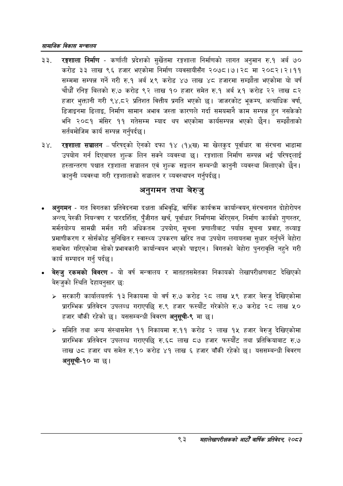

# Page 115 QA

## Rendered page


## Extracted text

```text
सायाजिक विकास
रङ्गशाला निर्माण -कर्णाली प्रदेशको सुर्खेतमा रङ्गशाला निर्माणको लागत अनुमान रु.१ अर्ब ७० करोड ३३ लाख ९६ हजार भएकोमा निर्माण व्यवसायीसँग २०७८।७। २८ मा २०८२। २।११ सम्ममा सम्पन्न गर्ने गरी रु.१ अर्ब ५९ करोड ४७ लाख ४८ हजारमा सम्झौता भएकोमा यो बर्ष चौधौं रनिङ्ग बिलको रु.७ करोड ९२ लाख १० हजार समेत रु.१ अर्ब ५१ करोड २२ लाख ८२ हजार भुक्तानी गरी ९४.८२ प्रतिशत वित्तीय प्रगति भएको छ। जाजरकोट भूकम्प, अत्याधिक वर्षा, डिजाइनमा ढिलाइ, निर्माण सामान अभाव जस्ता कारणले गर्दा समयमानै काम सम्पन्न हुन नसकेको भनि २०८१ मंसिर ११ गतेसम्म म्याद थप भएकोमा कार्यसम्पन्न भएको छैन। सम्झौताको सर्तवमोजिम कार्य सम्पन्न |
गर्नुपर्दछ
सञ्चालन -परिषद्को ऐनको दफा १४ (१)(ख) मा खेलकुद पूर्वाधार वा संरचना भाडामा उपयोग गर्न दिएबापत शुल्क लिन सक्ने व्यवस्था छ। रङ्गशाला निर्माण सम्पन्न भई परिषद्लाई हस्तान्तरण पश्चात रङ्गशाला सञ्चालन एवं शुल्क सङ्कलन सम्बन्धी कानुनी व्यवस्था मिलाएको छैन। कानुनी व्यवस्था गरी रङ्गशालाको सञ्चालन र व्यवस्थापन गर्नुपर्दछ |
अनुगमन तथा बेरुजु
अनुगमन -गत विगतका प्रतिवेदनमा दक्षता अभिवृद्धि, वार्षिक कार्यक्रम कार्यान्वयन, संरचनागत दोहोरोपन अन्त्य, पेस्की नियन्त्रण र पारदर्शिता, पुँजीगत खर्च, पूर्वाधार निर्माणमा भेरिएसन, निर्माण कार्यको गुणस्तर, मर्मतयोग्य सामग्री मर्मत गरी अधिकतम उपयोग, सूचना प्रणालीबाट पर्याप्त सूचना प्रवाह, तथ्याङ्क प्रमाणीकरण र सोर्सकोड सुनिश्चित र स्वास्थ्य उपकरण खरिद तथा उपयोग लगायतमा सुधार गर्नुपर्ने बेहोरा समावेश गरिएकोमा सोको प्रभावकारी कार्यान्वयन भएको पाइएन। विगतको बेहोरा पुनरावृत्ति नहुने गरी कार्य सम्पादन गर्नु पर्दछ।
बेरुजु रकमको विवरण -यो वर्ष मन्त्रालय र मातहतसमेतका निकायको लेखापरीक्षणबाट देखिएको बेरुजुको स्थिति देहायनुसार छः:
> सरकारी कार्यालयतर्फ १३ निकायमा यो वर्ष रु.७ करोड २८ लाख ५९ हजार बेरुजु देखिएकोमा प्रारम्भिक प्रतिवेदन उपलब्ध गराएपछि रु.९ हजार फस्यौट गरेकोले रु.७ करोड २८ लाख ५० हजार बाँकी रहेको छ। यससम्बन्धी विवरण अनुसूची-९ मा छ।
समिति तथा अन्य संस्थासमेत ११ निकायमा रु.११ करोड २ लाख १५ हजार बेरुजु देखिएकोमा प्रारम्भिक प्रतिवेदन उपलब्ध गराएपछि रु.६८ लाख ८७ हजार फस्यौट तथा प्रतिक्रियाबाट रु.७ लाख ७८ हजार थप समेत रु.१० करोड ४१ लाख ६ हजार बाँकी रहेको छ। यससम्बन्धी विवरण अनुसूची-१० मा छ।
९३
सहालेखापरीक्षकको वाषिक प्रतिवेदन २०८२
```

## Flags
- None
