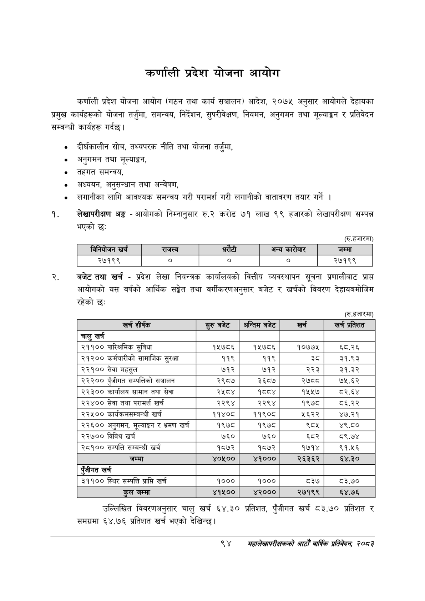

# Page 116 QA

## Rendered page


## Extracted text

```text
कर्णाली प्रदेश योजना आयोग
कर्णाली प्रदेश योजना आयोग (गठन तथा कार्य सञ्चालन) आदेश, २०७५ अनुसार आयोगले देहायका प्रमुख कार्यहरूको योजना तर्जुमा, समन्वय, निर्देशन, सुपरीवेक्षण, नियमन, अनुगमन तथा मूल्याङ्कन र प्रतिवेदन सम्बन्धी कार्यहरू गर्दछु।
० दीर्घकालीन सोच, तथ्यपरक नीति तथा योजना तर्जुमा,
० अनुगमन तथा मूल्याङ्कन,
तहगत समन्वय,
अध्ययन, अनुसन्धान तथा अन्वेषण,
लगानीका लागि आवश्यक समन्वय गरी परामर्श गरी लगानीको वातावरण तयार गर्ने।
लेखापरीक्षण अङ्ग -आयोगको निम्नानुसार रु.२ करोड ७१ लाख ९९ हजारको लेखापरीक्षण सम्पन्न भएको छः:
(रु.हजारमा)
बजेटतथा खर्च -प्रदेश लेखा नियन्त्रक कार्यालयको वित्तीय व्यवस्थापन सूचना प्रणालीबाट प्राप्त आयोगको यस वर्षको आर्थिक सङ्गेत तथा वर्गीकरणअनुसार बजेट र खर्चको विवरण देहायबमोजिम रहेको छः
(रु.हजारमा)
उल्लिखित विवरणअनुसार चालु खर्च ६४.३० समग्रमा ६४.७६ प्रतिशत खर्च भएको देखिन्छ। प्रतिशत, पुँजीगत खर्च ८३.७० प्रतिशत र
९४
सहालेखापरीक्षकको वाषिक प्रतिवेदन २०८२

|  |  | निनबोणन खर्च | राजस्व |  |  | अन्य कारोबार | जम्मा |
| --- | --- | --- | --- | --- | --- | --- | --- |
|  |  | २७१९९ | ० | ० |  | ० | २७१९९ |

| खच शीर्षक | सुरुबबेट | अन्तिम बजेट | खच | खच प्रतिशत |
| --- | --- | --- | --- | --- |
| चालु खर्च |  |  |  |  |
| २११०० पारिश्रमिक सुविधा | १५७८६ | १५७८६ | १०७७४५ | ६८.२६ |
| २१२०० कर्मचारीको लामाजिक सुरक्षा | ११९ | ११९ |  | ३१.९३ |
| २२१०० सेवा महसुल | ७१२ | ७१२ | २२३ | ३१.३२ |
| २२२०० पुँजीगत सम्पत्तिको सञ्चालन | २९८७ | ३६८७ | २७८८ | ७५.६२ |
| २२३०० कार्यालय सामान तथा सेवा | २५८४ | १४ | १५५७ | ८२.६४ |
| २२४०० सेवा तथा परामर्श खर्च | २२९४ | २२९४ | १९७८ | ८६.२२ |
| २२५०० कार्यक्रमसम्बन्धी खर्च | ११४०८ | ११९०८ | ५६२२ | ४७.२१ |
| २२६०० अनुगमन, र भ्रमण खर्च | १९७८ | १९७८ | ब्व्श | ४९.८० |
| २२७०० विविध खर्च | ७६० | ७६० | ६८२ | ८९.७४ |
| २८१०० सम्पत्ति सम्बन्धी खर्च | १८७२ | १८७२ | १७१४ | ९१.५६ |
| जम्मा | ४०५०० | ४१००० | २६३६२ | ६४.३० |
| पुँजीगत खर्च |  |  |  |  |
| ३११०० स्थिर सम्पत्ति प्राप्ति खर्च | १००० | १००० | ८३७ | ८३.७० |
| तल जम्मा | ४१५०० | ४२००० | २७१९९ | ६४.७६ |
```

## Flags
- table_page
- medium_quality_table
