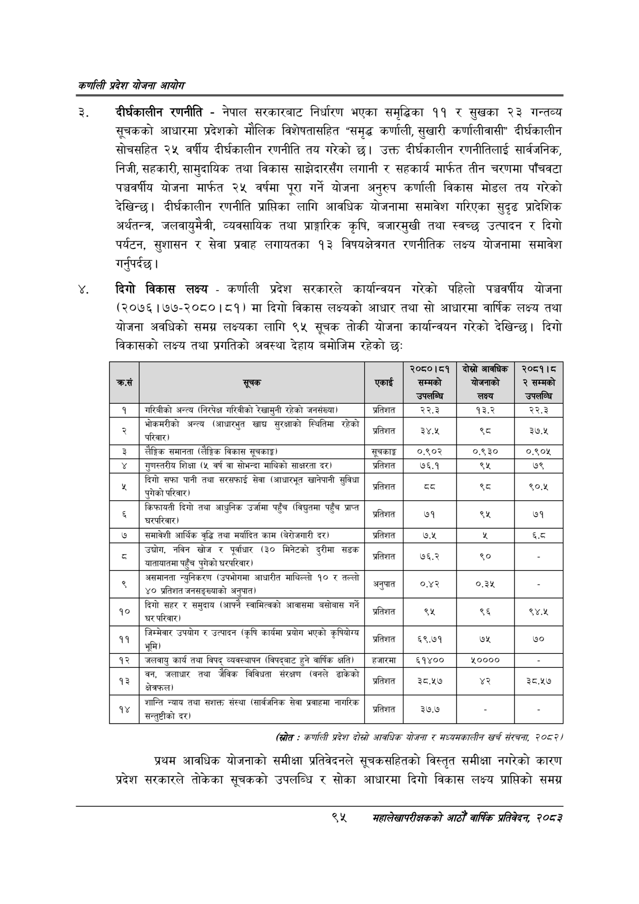

# Page 117 QA

## Rendered page


## Extracted text

```text
कणलिी प्रदेश योजना आयोग
दीर्घकालीन रणनीति -नेपाल सरकारबाट निर्धारण भएका समृद्धिका ११ र सुखका २३ गन्तव्य सूचकको आधारमा प्रदेशको मौलिक विशेषतासहित "समृद्ध कर्णाली, सुखारी कर्णालीवासी" दीर्घकालीन सोचसहित २५ वर्षीय दीर्घकालीन रणनीति तय गरेको छ। उक्त दीर्घकालीन रणनीतिलाई सार्वजनिक, निजी, सहकारी, सामुदायिक तथा विकास साझेदारसँग लगानी र सहकार्य मार्फत तीन चरणमा पाँचवटा पञ्चवर्षीय योजना मार्फत २५ वर्षमा पूरा गर्ने योजना अनुरुप कर्णाली विकास मोडल तय गरेको देखिन्छ। दीर्घकालीन रणनीति प्राप्तिका लागि आवधिक योजनामा समावेश गरिएका सुदृढ प्रादेशिक अर्थतन्त्र, जलवायुमैत्री, व्यवसायिक तथा प्राङ्गारिक कृषि, बजारमुखी तथा स्वच्छ उत्पादन र दिगो पर्यटन, सुशासन र सेवा प्रवाह लगायतका १३ विषयक्षेत्रगत रणनीतिक लक्ष्य योजनामा समावेश गर्नुपर्दछ |
दिगो विकास लक्ष्य -कर्णाली प्रदेश सरकारले कार्यान्वयन गरेको पहिलो पञ्चवर्षीय योजना (२०७६।१७७-२०८०।८१) मा दिगो विकास लक्ष्यको आधार तथा सो आधारमा वार्षिक लक्ष्य तथा योजना अवधिको समग्र लक्ष्यका लागि ९५ सूचक तोकी योजना कार्यान्वयन गरेको देखिन्छ। दिगो विकासको लक्ष्य तथा प्रगतिको अवस्था देहाय बमोजिम रहेको छ:
(रित - कर्णाली प्रदेश दोस्रो आवधिक योजना र सध्यसकालीन खर्च संरचना; २०८२४
प्रथम आवधिक योजनाको समीक्षा प्रतिवेदनले सूचकसहितको विस्तृत समीक्षा नगरेको कारण प्रदेश सरकारले तोकेका सूचकको उपलब्धि र सोका आधारमा दिगो विकास लक्ष्य प्राप्तिको समग्र
९४
सहालेखापरीक्षकको आठौँ वा्िकि प्रतिवेदन २०८२

| क्रस | 'सूचक | एकाई | २०८०।८१ सम्मको 'उपलब्धि | दोस्रो आवधिक लक्ष्य | २०८१।८ २ सम्मको 'उपलब्धि |
| --- | --- | --- | --- | --- | --- |
| १ | गरिबीको अन्त्य (निरपेक्ष गरिवीको रेखामुनी रहेको जनसंख्या) | प्रतिशत | २२.३ | १३.२ | २२.३ |
| २ | भोकनरीको अन्त्य (आधारभुत खाद्य सुरक्षाको स्थितिमा रहेको = परिवार) | प्रतिशत | ३४.५ | %५ | ३७.५ |
| ३ | लैङ्गिक समानता (लैङ्गिक विकास सूचकाङ्क) | सूचकाङ् | ०.९०२ | ०.९३० | ०.९०४५ |
| ४ | पुणत्तरीय शिक्षा (५ वर्ष वा सोभन्दा माथिको साक्षरता दर) | प्रतिशत | ७६.१ | ९५ | ७९ |
| ५ | दिगो सफा पानी तथा सरसफाई सेवा (आधारभूत खानेपानी सुविधा पुरेको भल ™ पुगेको परिवार) | प्रतिशत | ५३ | थ्व | ९०.४५ |
| ६ | किफाबती दिगो तथा आधुनिक उर्जामा पहुँच (विद्युतमा पहुँच प्राप्त हुँच ( पहुँ | प्रतिशत | ७१ | ९५ | ७१ |
| ७ | समावेशी आर्थिक वृद्धि तथा मर्यादित काम दर) | प्रतिशत | ७.५ | त | ६.८ |
| ८ | उच्चोग, नविन खोज र पूर्वाधार (३० मिनेटको दुरीमा सडक पुगेको ५२५२ आताबातमा पहुँच पुगेको ५९५२िवार) | प्रतिशत | ७६.२ | ९० |  |
| ९ | न्युनिकरण (उपभोगमा आधारीत माथिल्लो १० र तल्लो ४० प्रतिशत जनसङ्ख्याको अनुपात) | अनुपात = | ०.४२ | ०.३% |  |
| १० | दिगो सहर र समुदाय (आफ्नै स्वामित्वको आवासमा बसोबास गर्ने घर परिवार) | प्रतिशत | ९५ | ९६ | ९४.५ |
| ११ | जिम्मेवार उपयोग र उत्पादन (कृषि कार्यमा प्रयोग भएको कृषियोग्य पनि) र डत्मादन (कृ कृ | प्रतिशत | ६९.७१ | ७५ | ७० |
| १२ | जलबायु कार्य तथा विपद्‌ व्यवस्थापन (विपद्बाट हुने वार्षिक क्षति) | हजारमा | ६१४०० | ५०००० |  |
| १३ | वन, जलाधार तथा जैविक विविधता संरक्षण (वनले ढाकेको क्षेत्रफल) | प्रतिशत | ३८.५७ |  | ३८.५७ |
| १४ | शान्ति न्याय तथा सशक्त संस्था (शार्षजनिक सेवा प्रवाहमा नागरिक चन्तुटीको दर) | प्रतिशत | ३७.७ |  |  |
```

## Flags
- table_page
- medium_quality_table
