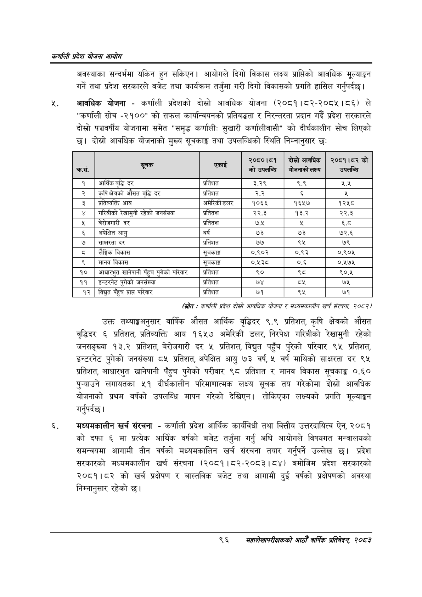

# Page 118 QA

## Rendered page


## Extracted text

```text
कणलिी प्रदेश योजना आयोग
अवस्थाका सन्दर्भमा यकिन हुन सकिएन। आयोगले दिगो विकास लक्ष्य प्राप्तिको आवधिक मूल्याङ्कन गर्ने तथा प्रदेश सरकारले बजेट तथा कार्यक्रम तर्जुमा गरी दिगो विकासको प्रगति हासिल गर्नुपर्दछ |
आवधिक योजना -कर्णाली प्रदेशको दोस्रो आवधिक योजना (२०८१।८२-२०८५।८६) ले "कर्णाली सोच -२१००"" को सफल कार्यान्वयनको प्रतिबद्धता र निरन्तरता प्रदान गर्दै प्रदेश सरकारले दोस्रो पञ्चवर्षीय योजनामा समेत "समृद्ध कर्णाली: सुखारी कर्णालीवासी" को दीर्घकालीन सोच लिएको छ। दोस्रो आवधिक योजनाको मुख्य सूचकाङ्क तथा उपलब्धिको स्थिति निम्नानुसार छः
(रित - कर्णाली प्रदेश दोस्रो आवधिक योजना र सध्यसकालीन खर्च संरचना; २०८२४
उक्त तथ्याङ्कअनुसार वार्षिक औसत आर्थिक वृद्धिदर ९.९ प्रतिशत, कृषि क्षेत्रको औसत वृद्धिदर ६ प्रतिशत, प्रतिव्यक्ति आय १६५७ अमेरिकी डलर, निरपेक्ष गरिबीको रेखामुनी रहेको जनसङ्ख्या १३.२ प्रतिशत, बेरोजगारी दर ५ प्रतिशत, विद्युत पहुँच पुरेको परिवार ९५ प्रतिशत, इन्टरनेट पुगेको जनसंख्या ८५ प्रतिशत, अपेक्षित आयु ७३ वर्ष, ५ वर्ष माथिको साक्षरता दर ९५ प्रतिशत, आधारभुत खानेपानी पहुच पुगेको परीवार ९८ प्रतिशत र मानव विकास सूचकाङ्क ०.६० पुन्याउने लगायतका ५१ दीर्घकालीन परिमाणात्मक लक्ष्य सूचक तय गरेकोमा दोस्रो आवधिक योजनाको प्रथम वर्षको उपलब्धि मापन गरेको देखिएन। तोकिएका लक्ष्यको प्रगति मूल्याङ्कन गर्नुपर्दछ |
मंध्यमकालीन खर्च संरचना -कर्णाली प्रदेश आर्थिक कार्यविधी तथा वित्तीय उत्तरदायित्व ऐन, २०८१ कोदफा ६ मा प्रत्येक आर्थिक वर्षको बजेट तर्जुमा गर्नु अघि आयोगले विषयगत मन्त्रालयको समन्वयमा आगामी तीन वर्षको मध्यमकालिन खर्च संरचना तयार गर्नुपर्ने उल्लेख छ। प्रदेश सरकारको मध्यमकालीन खर्च संरचना (२०८१।८२-२०८३।८४) बमोजिम प्रदेश सरकारको २०८१।८२ को खर्च प्रक्षेपण र वास्तविक बजेट तथा आगामी दुई वर्षको प्रक्षेपणको अवस्था निम्नानुसार रहेको छ।
९६
सहालेखापरीक्षकको वाषिक प्रतिवेदन २०८२

| कस. | सूचक | लि | २०८०।८१ को उपलन्धि | दोस्रो आवधिक बाजनाको लक्य | २०८१।५८२ को उपसान्च |
| --- | --- | --- | --- | --- | --- |
| १ | अआर्थिकवृद्धि दर | प्रतिशत | ३.२९ | ९.९ | २.५ |
| २ | कृषिक्षेत्रको औसत वृद्धि दर | प्रतिशत | २.२ | ३ | [बै |
| ३ | प्रतिव्यक्ति आय | अमेरिकी डलर | १०६६ | १६५७ | १२५८ |
| ४ | गरिबीको रेखामुनी रहेको जनसख्या | प्रतितश | २२.३ | १३.२ | २२.३ |
| ५ | नेरीजगारी दर | प्रतितश | ७.५ | र | €५ |
| ६ | अपेक्षित आयु | वर्ष | ७३ | ७३ | ७२.६ |
| ७ | साक्षरता दर | प्रतिशत | ७७ | ९५ | ७९ |
| ८ | लैङ्गिक विकास | सूचकाङ्क | ०.९०२ | ०.९३ | ०.९०५ |
| ९ | मानव विकास | सूचकाङ्ग | ०.१३८ | ०.६ | ०.१७५ |
| १० | आधारभुत खानेपानी पहुच पुगेको परिवार | प्रतिशत | ९० | थ्व | ९०.४५ |
| ११ | इन्टरनेट पुगेको शनसष्या | प्रतिशत | ७४ |  | ७५ |
| १२ | विद्युत पहुच प्राप्त परिवार | प्रतिशत | ७१ | ९५ | ७१ |
```

## Flags
- table_page
- medium_quality_table
