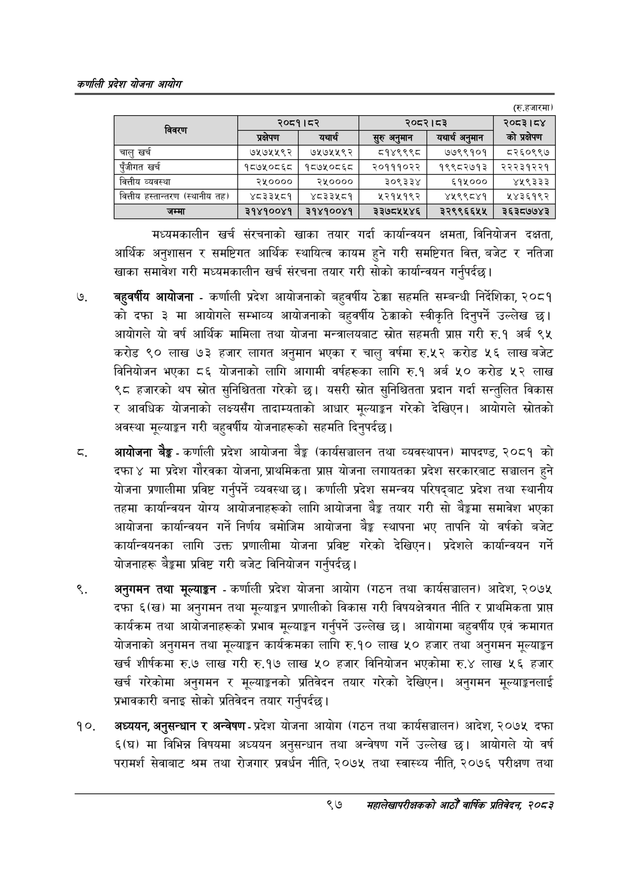

# Page 119 QA

## Rendered page


## Extracted text

```text
कणलिी प्रदेश योजना आयोग
(रु.हजारमा)
मध्यमकालीन खर्च संरचनाको खाका तयार गर्दा कार्यान्वयन क्षमता, विनियोजन दक्षता, आर्थिक अनुशासन र समष्टिगत आर्थिक स्थायित्व कायम हुने गरी समष्टिगत वित्त, बजेट र नतिजा खाका समावेश गरी मध्यमकालीन खर्च संरचना तयार गरी सोको कार्यान्वयन गर्नुपर्दछ।
बहुवर्षीय आयोजना -कर्णाली प्रदेश आयोजनाको बहुवर्षीय ठेक्का सहमति सम्बन्धी निर्देशिका, २०८१ को दफा ३ मा आयोगले सम्भाव्य आयोजनाको बहुवर्षीय ठेक्काको स्वीकृति दिनुपर्ने उल्लेख | आयोगले यो वर्ष आर्थिक मामिला तथा योजना मन्त्रालयबाट स्रोत सहमती प्राप्त गरी रु.१ अर्ब ९५ करोड ९० लाख ७३ हजार लागत अनुमान भएका र चालु वर्षमा रु.५२ करोड ५६ लाख बजेट विनियोजन भएका ८६ योजनाको लागि आगामी वर्षहरूका लागि रु.१ अर्ब ५० करोड ५२ लाख ९८ हजारको थप स्रोत सुनिश्चितता गरेको छ। यसरी स्रोत सुनिश्चितता प्रदान गर्दा सन्तुलित विकास र आवधिक योजनाको लक्ष्यसँग तादाम्यताको आधार मूल्याङ्गन गरेको देखिएन। आयोगले स्रोतको अवस्था मूल्याङ्कन गरी बहुवर्षीय योजनाहरूको सहमति दिनुपर्दछ |
आयोजना -कर्णाली प्रदेश आयोजना बेङ्ग (कार्यसञ्चालन तथा व्यवस्थापन) मापदण्ड, २०८१ को दफा ४ मा प्रदेश गौरवका योजना, प्राथमिकता प्राप्त योजना लगायतका प्रदेश सरकारबाट सञ्चालन हुने योजना प्रणालीमा प्रविष्ट गर्नुपर्ने व्यवस्था | कर्णाली प्रदेश समन्वय परिषद्बाट प्रदेश तथा स्थानीय तहमा कार्यान्वयन योग्य आयोजनाहरूको लागि आयोजना बैङ्ग तयार गरी सो बेङ्गमा समावेश भएका आयोजना कार्यान्वयन गर्ने निर्णय बमोजिम आयोजना बेङ्ग स्थापना भए तापनि यो वर्षको बजेट कार्यान्वयनका लागि उक्त प्रणालीमा योजना प्रविष्ट गरेको देखिएन। प्रदेशले कार्यान्वयन गर्ने योजनाहरू बैङ्कमा प्रविष्ट गरी बजेट विनियोजन गर्नुपर्दछ )
अनुगमन तथा मूल्याङ्कन -कर्णाली प्रदेश योजना आयोग (गठन तथा कार्यसञ्चालन) आदेश, २०७५ दफा ६(ख) मा अनुगमन तथा मूल्याङ्कन प्रणालीको विकास गरी विषयक्षेत्रगत नीति र प्राथमिकता प्राप्त कार्यक्रम तथा आयोजनाहरूको प्रभाव मूल्याङ्कन गर्नुपर्ने उल्लेख | आयोगमा बहुवर्षीय एवं क्रमागत योजनाको अनुगमन तथा मूल्याङ्कन कार्यक्रमका लागि रु.१० लाख ५० हजार तथा अनुगमन मूल्याङ्कन खर्च शीर्षकमा रु.७ लाख गरी रु.१७ लाख ५० हजार विनियोजन भएकोमा रु.४ लाख ५६ हजार खर्च गरेकोमा अनुगमन र मूल्याङ्कनको प्रतिवेदन तयार गरेको देखिएन। अनुगमन मूल्याङ्गनलाई प्रभावकारी बनाइ सोको प्रतिवेदन तयार गर्नुपर्दछ।
अध्ययन, अनुसन्धान र अन्वेषण -प्रदेश योजना आयोग (गठन तथा कार्यसञ्चालन) आदेश, २०७५ दफा ६(घ) मा विभिन्न विषयमा अध्ययन अनुसन्धान तथा अन्वेषण गर्ने उल्लेख छ। आयोगले यो वर्ष परामर्श सेवाबाट श्रम तथा रोजगार प्रवर्धन नीति, २०७५ तथा स्वास्थ्य नीति, २०७६ परीक्षण तथा
९७
सहालेखापरीक्षकको आठौँ वाक प्रतिवेदन २०८२

| विवरण |  | २०८१।८२ | २०८२।८३ |  | २०८३।८४ |
| --- | --- | --- | --- | --- | --- |
|  | प्रक्षेपण | यथार्थ |  | यथार्थ अन्मान | को प्रक्षेपण |
| चालु खर्च | ७५७५५९२ | ७५७५५९२ | ८१४९९९८ | ७७९९१०१ | ५२६०९९७ |
| पुँजीगत खर्च | १८७५०८६८ | १८७५०८६८ | २०१११०२२ | १९९८२७१३ | २२२३१२२१ |
| वित्तीय व्यवस्था | २५०००० | २५०००० | ३०९३३४ | ६१५००० | ४५९३३३ |
| वित्तीय हल्तान्तरण (स्थानीय त) | ४८३३५८१ | ४८३३५८१ | ५२१५१९२ | ४५९९८४१ | २४३६१९२ |
| जम्मा | ३१४१००४१ | ३१४१००४१ | ३३७८५५४६ | २२९९६६५५ | ३६३८७७४३ |
```

## Flags
- table_page
- medium_quality_table
