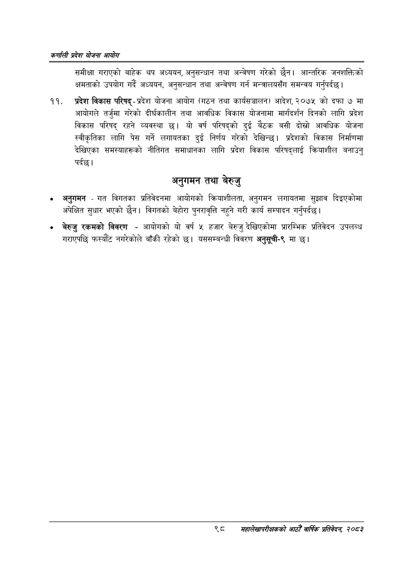

# Page 120 QA

## Rendered page


## Extracted text

```text
कणलिी प्रदेश योजना आयोग
समीक्षा गराएको बाहेक थप अध्ययन, अनुसन्धान तथा अन्वेषण गरेको छैन। आन्तरिक जनशक्तिको क्षमताको उपयोग गर्दै अध्ययन, अनुसन्धान तथा अन्वेषण गर्न मन्त्रालयसँग समन्वय गर्नुपर्दछ |
प्रदेश विकास परिषद्‌प्रदेश योजना आयोग (गठन तथा कार्यसञ्चालन) आदेश, २०७५ को दफा ७ मा आयोगले तर्जुमा गरेको दीर्घकालीन तथा आवधिक विकास योजनामा मार्गदर्शन दिनको लागि प्रदेश विकास परिषद्‌ रहने व्यवस्था छ। यो वर्ष परिषद्को दुई बैठक बसी दोस्रो आवधिक योजना स्वीकृतिका लागि पेस गर्ने लगायतका दुई निर्णय गरेको देखिन्छ। प्रदेशको विकास निर्माणमा देखिएका समस्याहरूको नीतिगत समाधानका लागि प्रदेश विकास परिषद्लाई क्रियाशील बनाउनु पर्दछ।
अनुगमन तथा बेरुजु
० अनुगमन -गत विगतका प्रतिवेदनमा आयोगको क्रियाशीलता, अनुगमन लगायतमा सुझाव दिइएकोमा अपेक्षित सुधार भएको छैन। विगतको बेहोरा पुनरावृत्ति नहुने गरी कार्य सम्पादन गर्नुपर्दछ |
बेरुजु रकमको विवरण -आयोगको यो वर्ष हजार बेरुजु देखिएकोमा प्रारम्भिक प्रतिवेदन उपलब्ध गराएपछि फस्यौट नगरेकोले बाँकी रहेको छ। यससम्बन्धी विवरण अनुसूची-९ मा छ।
९८
सहालेखापरीक्षकको आठौँ वा्िकि प्रतिवेदन २०८२
```

## Flags
- None
