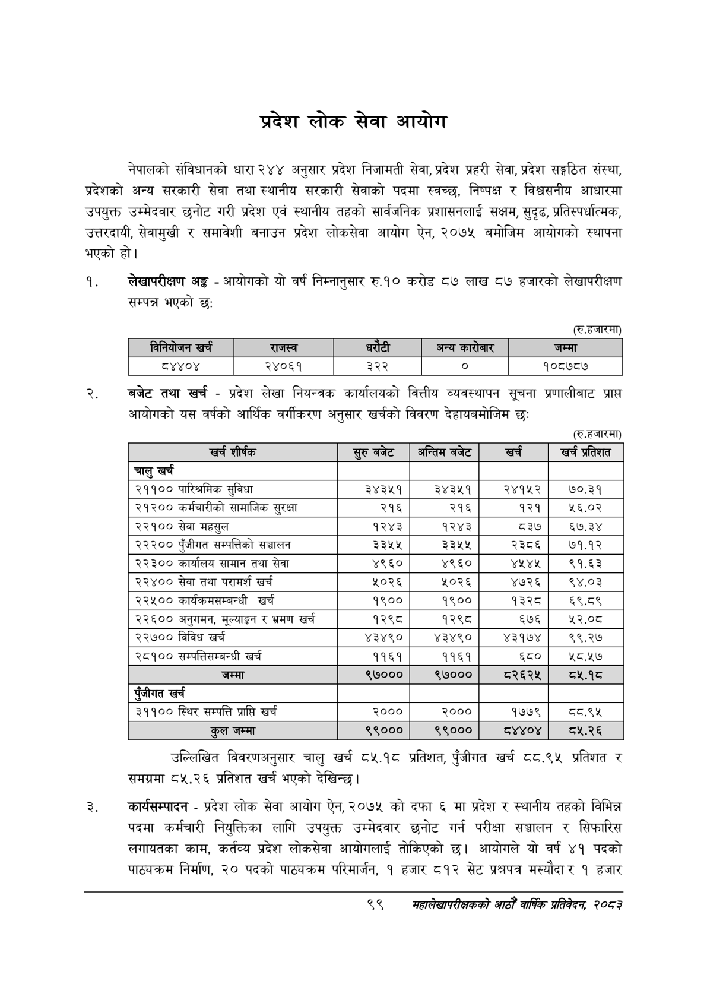

# Page 121 QA

## Rendered page


## Extracted text

```text
प्रदेश लोक सेवा आयोग
नेपालको संविधानको धारा २४४ अनुसार प्रदेश निजामती सेवा, प्रदेश प्रहरी सेवा, प्रदेश सङ्गठित संस्था, प्रदेशको अन्य सरकारी सेवा तथा स्थानीय सरकारी सेवाको पदमा स्वच्छ, निष्पक्ष र विश्वसनीय आधारमा उपयुक्त उम्मेदवार छनोट गरी प्रदेश एवं स्थानीय तहको सार्वजनिक प्रशासनलाई सक्षम, सुदृढ, प्रतिस्पर्धात्मक, उत्तरदायी, सेवामुखी र समावेशी बनाउन प्रदेश लोकसेवा आयोग ऐन, २०७५ बमोजिम आयोगको स्थापना भएको हो।
लेखापरीक्षण अङ्ग -आयोगको यो वर्ष निम्नानुसार रु.१० करोड ८७ लाख ८७ हजारको लेखापरीक्षण सम्पन्न भएको छ:
(रु.हजारमा)
बजेट तथा खर्च -प्रदेश लेखा नियन्त्रक कार्यालयको वित्तीय व्यवस्थापन सूचना प्रणालीबाट प्राप्त आयोगको यस वर्षको आर्थिक वर्गीकरण अनुसार खर्चको विवरण देहायबमोजिम छः
(रु.हजारमा)
उल्लिखित विवरणअनुसार चालु खर्च ८५.१८ प्रतिशत, पुँजीगत खर्च ८८.९५ प्रतिशत र समग्रमा ८५.२६ प्रतिशत खर्च भएको देखिन्छ।
कार्यसम्पादन -प्रदेश लोक सेवा आयोग ऐन, २०७५ को दफा ६ मा प्रदेश र स्थानीय तहको विभिन्न पदमा कर्मचारी नियुक्तिका लागि उपयुक्त उम्मेदवार छनोट गर्न परीक्षा सञ्चालन र सिफारिस लगायतका काम, कर्तव्य प्रदेश लोकसेवा आयोगलाई तोकिएको छ। आयोगले यो वर्ष ४१ पदको पाठ्यक्रम निर्माण, २० पदको पाठ्यक्रम परिमार्जन, १ हजार ८१२ सेट प्रश्नपत्र मस्यौदार १ हजार
९९
सहालेखापरीक्षकको वाषिक प्रतिवेदन २०८२

| विनियोजन खर्च   |   राजस्व | &#124; धरौटी &#124;   | अन्य कारोबार   |   जम्मा |
|-----------------|----------|-----------------------|----------------|---------|
| द४४०४           |    २४०६१ | ३२२ &#124;            | ० ]            |  १०८७८७ |

| खच शीष्क | स्रुबबेट | अन्तिम बजेट | खच |
| --- | --- | --- | --- |
| चालु खर्च |  |  |  |
| २११०० पारिश्रमिक सुविधा | ३४३५१ | ३४३५१ | २४१५२ |
| २१२०० कर्मचारीको सामाजिक सुरक्षा | २१६ | २१६ | १२१ |
| २२१०० सेवा महसुल | १२४३ | १२४३ | ८३७ |
| २२२०० पुँजीगत सम्पत्तिको सञ्चालन | ३३५५ | ३३५५ | २३८६ |
| २२३०० कार्यालय सामान तथा सेवा | ४९६० | ४९६० | ४५४५ |
| २२४०० सेवा तथा परामर्श खर्च | २०२६ | ५०२६ | ४७२६ |
| २२५०० कार्यक्रमसमन्बन्धी खर्च | १९०० | १९०० | १३२८ |
| २२६०० अनुगमन, र भ्रमण खर्च | १२९८ | १२९८ | ६७६ |
| २२७०० विविध खर्च | ४३४९० | ४३४९० | ४३१७४ |
| २८१०० चन्पततिसम्बन्धी खर्च | ११६१ | ११६१ | ६८० |
| जम्मा | ९७००० | ९७००० | ८२६२४५ |
| पूँजीगत खर्च |  |  |  |
| ३११०० स्थिर सम्पत्ति प्राप्ति खर्च | २००० | २००० | १७७९ |
| कुल जम्मा | ९९००० | ९९००० | ८४४०४ |
```

## Flags
- table_page
- medium_quality_table
