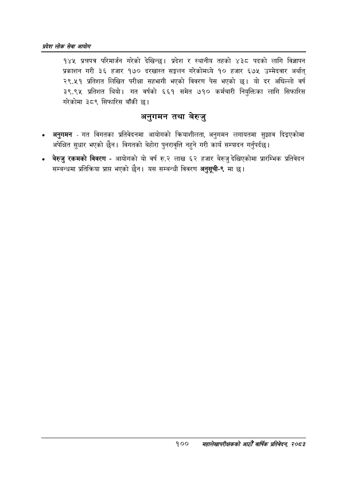

# Page 122 QA

## Rendered page


## Extracted text

```text
प्रदेश लोक सेवा आयोग
१४४ प्रश्नपत्र परिमार्जन गरेको देखिन्छ। प्रदेश र स्थानीय तहको ४३८ पदको लागि विज्ञापन प्रकाशन गरी ३६ हजार १७० दरखास्त सङ्लन गरेकोमध्ये १० हजार ६७५ उम्मेदवार अर्थात्‌ २९.४५१ प्रतिशत लिखित परीक्षा सहभागी भएको विवरण पेस भएको छ। यो दर अघिल्लो वर्ष २९.९५ प्रतिशत थियो। गत वर्षको ६६१ समेत ७१० कर्मचारी नियुक्तिका लागि सिफारिस गरेकोमा ३८९ सिफारिस बाँकी छ।
अनुगमन तथा बेरुजु
अनुगमन -गत विगतका प्रतिवेदनमा आयोगको क्रियाशीलता, अनुगमन लगायतमा सुझाव दिइएकोमा अपेक्षित सुधार भएको छैन। विगतको बेहोरा पुनरावृत्ति नहुने गरी कार्य सम्पादन गर्नुपर्दछ |
० बेरुजु रकमको विवरण -आयोगको यो वर्ष रु.२ लाख ६२ हजार बेरुजु देखिएकोमा प्रारम्भिक प्रतिवेदन सम्बन्धमा प्रतिक्रिया प्राप भएको छैन। यस सम्बन्धी विवरण अनुसूची-९ मा छ।
१००
सहालेखापरीक्षकको आठौँ वा्िकि प्रतिवेदन २०८२
```

## Flags
- None
