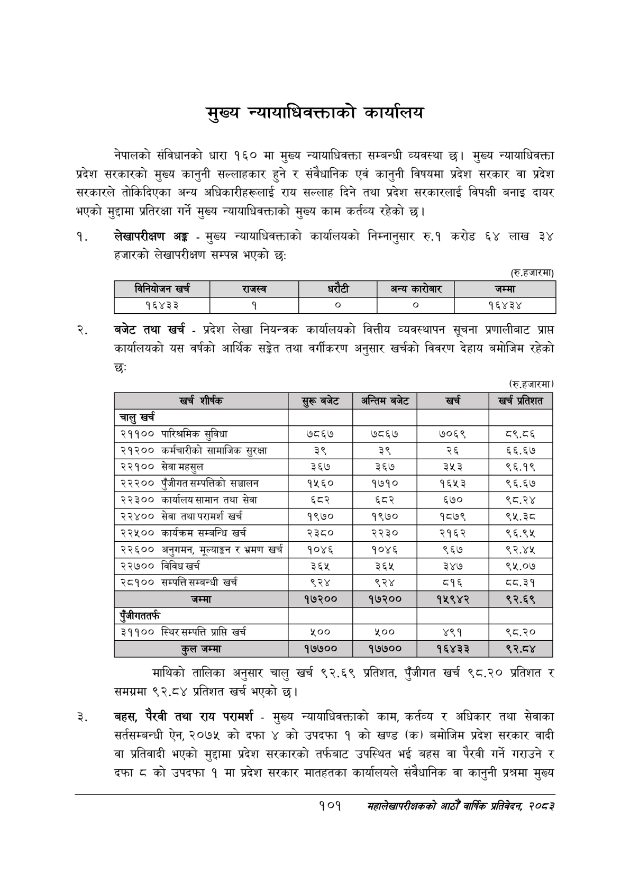

# Page 123 QA

## Rendered page


## Extracted text

```text
मुख्य न्यायाधिवक्ताको कार्यालय
नेपालको संविधानको धारा १६० मा मुख्य न्यायाधिवक्ता सम्बन्धी व्यवस्था छ। मुख्य न्यायाधिवक्ता प्रदेश सरकारको मुख्य कानुनी सल्लाहकार हुने र संवैधानिक एवं कानुनी विषयमा प्रदेश सरकार वा प्रदेश सरकारले तोकिदिएका अन्य अधिकारीहरूलाई राय सल्लाह दिने तथा प्रदेश सरकारलाई विपक्षी बनाइ दायर भएको मुद्दामा प्रतिरक्षा गर्ने मुख्य न्यायाधिवक्ताको मुख्य काम कर्तव्य रहेको छ।
लेखापरीक्षण अङ्ग -मुख्य न्यायाधिवक्ताको कार्यालयको निम्नानुसार रु.१ करोड ६४ लाख ३४ हजारको लेखापरीक्षण सम्पन्न भएको छ:
(रु.हजारमा)
।
बजेट तथा खर्च -प्रदेश लेखा नियन्त्रक कार्यालयको वित्तीय व्यवस्थापन सूचना प्रणालीबाट प्राप्त कार्यालयको यस वर्षको आर्थिक सङ्गेत तथा वर्गीकरण अनुसार खर्चको विवरण देहाय बमोजिम रहेको छः
(रु.हजारमा)
माथिको तालिका अनुसार चालु खर्च ९२.६९ प्रतिशत, पुँजीगत खर्च ९८,२० प्रतिशत र समग्रमा ९२.८४ प्रतिशत खर्च भएको छ।
बहस, पैरवी तथा राय परामर्श -मुख्य न्यायाधिवक्ताको काम, कर्तव्य र अधिकार तथा सेवाका सर्तसम्बन्धी ऐन, २०७५ को दफा ४ को उपदफा १ को खण्ड (क) बमोजिम प्रदेश सरकार वादी वा प्रतिवादी भएको मुद्दामा प्रदेश सरकारको तर्फबाट उपस्थित भई बहस वा पैरवी गर्ने गराउने र दफा ८ को उपदफा १ मा प्रदेश सरकार मातहतका कार्यालयले संवैधानिक वा कानुनी प्रश्नमा मुख्य
१०१
सहालेखापरीक्षकको आठोँ वाषिक प्रतिवेदन २०८२

|  |  | ननकोजन खर्च | राजस्व |  |  | अन्य बररेजार | जम्मा |
| --- | --- | --- | --- | --- | --- | --- | --- |
|  |  | १६४३३ |  | ० |  | ० | १६४३४ |

| खर्च शीर्षक                           | सुरू बजेट   | अन्तिम बजेट   |   खर्च | खर्च प्रतिशत   |
|---------------------------------------|-------------|---------------|--------|----------------|
| चालु खर्च                             |             |               |        |                |
| २११०० पारिश्रमिक सुविधा               | ७८६७        | ७८६७          |   ७०६९ | ८९.८६          |
| २१२०० कर्मचारीको सामाजिक सुरक्षा      | ३९          | ३९            |     २६ | ६६.६७          |
| २२१०० सेवा महसुल                      | ३६७         | ३६७           |    ३५३ | ९६.१९          |
| २२२०० पुँजीगत सम्पत्तिको सञ्चालन      | १५६०        | १७१०          |   १६५३ | ९६.६७          |
| २२३०० कार्यालय सामान तथा सेवा         | ६८२         | ६८२           |    ६७० | ९८.२४          |
| २२४०० सेवा तथा परामर्श खर्च           | १९७०        | १९७०          |   १८७९ | ९५.३८          |
| २२५०० कार्यक्रम सम्बन्धि खर्च         | २३८०        | २२३०          |   २१६२ | ९६.९५          |
| २२६०० अनुगमन, मूल्याङ्कन र भ्रमण खर्च | १०४६        | १०४६          |    ९६७ | ९२.४४५         |
| २२७०० विविध खर्च                      | ३६४२        | ३२६५          |    ३४७ | ९५,.०७         |
| २८१०० सम्पत्ति सम्बन्धी खर्च          | ९२४         | ९२४           |    ८१६ | ८व.३१          |
| जम्मा                                 | १७२००       | १७२००         | ११५९४२ | ९२.६९          |
| पुँजीगततर्फ                           |             |               |        |                |
| ३११०० स्थिर सम्पत्ति प्राप्ति खर्च    | ₹००         | ₹००           |    ४९१ | ९८.२०          |
| कुल जम्मा                             | १७७००       | १७७००         |  १६४३३ | ९२.ठ४          |
```

## Flags
- table_page
- medium_quality_table
