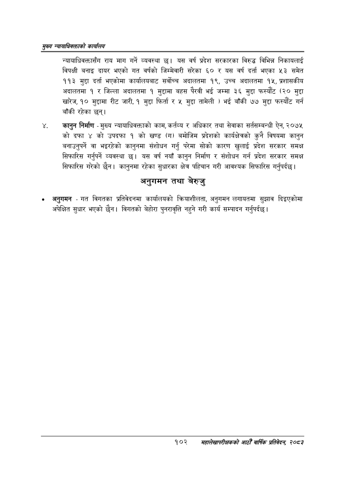

# Page 124 QA

## Rendered page


## Extracted text

```text
सृख्य न्यायाधिकक्ताको कायलिय
न्यायाधिवक्तासँग राय माग गर्ने व्यवस्था छु। यस वर्ष प्रदेश सरकारका विरुद्ध विभिन्न निकायलाई विपक्षी बनाइ दायर भएको गत वर्षको जिम्मेवारी सरेका ६० र यस वर्ष दर्ता भएका ५३ समेत ११३ मुद्दा दर्ता भएकोमा कार्यालयबाट सर्वोच्च अदालतमा १९, उच्च अदालतमा १५, प्रशासकीय अदालतमा १ र जिल्ला अदालतमा १ मुद्दामा बहस पैरवी भई जम्मा ३६ मुद्दा फस्यौट (२० मुद्दा खारेज, १० मुद्दामा रीट जारी, १ मुद्दा फिर्ता र ५ मुद्दा तामेली ) भई बाँकी ७७ मुद्दा फस्यौट गर्न बाँकी रहेका छन्‌।
कानुन निर्माण -मुख्य न्यायाधिवक्ताको काम, कर्तव्य र अधिकार तथा सेवाका सर्तसम्बन्धी ऐन, २०७५ को दफा ४ को उपदफा १ को खण्ड (ग) बमोजिम प्रदेशको कार्यक्षेत्रको कुनै विषयमा कानुन बनाउनुपर्ने वा भइरहेको कानुनमा संशोधन गर्नु परेमा सोको कारण खुलाई प्रदेश सरकार समक्ष सिफारिस गर्नुपर्ने व्यवस्था छ। यस वर्ष नयाँ कानुन निर्माण र संशोधन गर्न प्रदेश सरकार समक्ष सिफारिस गरेको छैन। कानुनमा रहेका सुधारका क्षेत्र पहिचान गरी आवश्यक सिफारिस गर्नुपर्दछ |
अनुगमन तथा बेरुजु
अनुगमन -गत विगतका प्रतिवेदनमा कार्यालयको क्रियाशीलता, अनुगमन लगायतमा सुझाव दिइएकोमा अपेक्षित सुधार भएको छैन। विगतको बेहोरा पुनरावृत्ति नहुने गरी कार्य सम्पादन गर्नुपर्दछ |
१०२
सहालेखापरीक्षकको आठोँ वाषिक प्रतिवेदन २०८२
```

## Flags
- None
