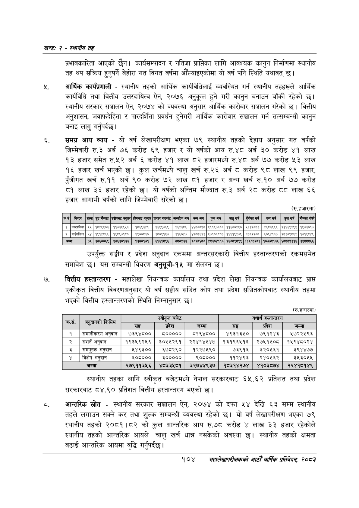

# Page 128 QA

## Rendered page


## Extracted text

```text
खण्ड: २ -स्थानीय तह
प्रभावकारिता आएको छैन। कार्यसम्पादन र नतिजा प्राप्तिका लागि आवश्यक कानुन निर्माणमा स्थानीय तह थप सक्रिय हुनुपर्ने बेहोरा गत विगत वर्षमा औंल्याइएकोमा यो वर्ष पनि स्थिति यथावत्‌ छ।
आर्थिक कार्यप्रणाली -स्थानीय तहको आर्थिक कार्यविधिलाई व्यवस्थित गर्न स्थानीय तहहरूले आर्थिक कार्यविधि तथा क्त्तीय उत्तरदायित्व ऐन, २०७६ अनुकूल हुने गरी कानुन बनाउन बाँकी रहेको छ। स्थानीय सरकार सञ्चालन ऐन, २०७४ को व्यवस्था अनुसार आर्थिक कारोबार सञ्चालन गरेको छ। वित्तीय अनुशासन, जवाफदेहिता र पारदर्शिता प्रवर्धन हुनेगरी आर्थिक कारोबार सञ्चालन गर्न तत्सम्बन्धी कानुन बनाइ लागु गर्नुपर्दछ |
समग्न आय व्यय -यो वर्ष लेखापरीक्षण भएका ७९ स्थानीय तहको देहाय अनुसार गत वर्षको जिम्मेवारी रु.३ अर्ब ७६ करोड ६९ हजार र यो वर्षको आय रु.४८ अर्ब ३० करोड ४१ लाख १३ हजार समेत रु.५२ अर्ब ६ करोड ४१ लाख ८२ हजारमध्ये रु.४८ अर्ब ७७ करोड ५३ लाख १६ हजार खर्च भएको | कुल खर्चमध्ये चालु खर्च रु.२६ अर्ब ८ करोड ९८ लाख ९९ हजार, पुँजीगत खर्च रु.११ अर्ब ९० करोड ७२ लाख ८१ हजार र अन्य खर्च रु.१० अर्ब ७७ करोड ८१ लाख ३६ हजार रहेको छ। यो वर्षको अन्तिम मौज्दात रु.३ अर्ब २८ करोड ८८ लाख ६६ हजार आगामी वर्षको लागि जिम्मेवारी सरेको छ।
(रु.हजारमा
उपर्युक्त सङ्घीय र प्रदेश अनुदान रकममा अन्तरसरकारी वित्तीय हस्तान्तरणको रकमसमेत समावेश छ। यस सम्बन्धी विवरण अनुसूची-१५ मा संलग्न छ।
वित्तीय हस्तान्तरण -महालेखा नियन्त्रक कार्यालय तथा प्रदेश लेखा नियन्त्रक कार्यालयबाट प्राप्त एकीकृत वित्तीय विवरणअनुसार यो वर्ष सङ्घीय सञ्चित कोष तथा प्रदेश सञ्चितकोषबाट स्थानीय तहमा भएको वित्तीय हस्तान्तरणको स्थिति निम्नानुसार छ।
(रु.हजारमा)
स्थानीय तहका लागि स्वीकृत बजेटमध्ये नेपाल सरकारबाट ६५.६२ प्रतिशत तथा प्रदेश सरकारबाट ८४.९० प्रतिशत वित्तीय हस्तान्तरण भएको छ।
आन्तरिक स्रोत -स्थानीय सरकार सञ्चालन ऐन, २०७४ को दफा ५४ देखि ६३ सम्म स्थानीय तहले लगाउन सक्ने कर तथा शुल्क सम्बन्धी व्यवस्था रहेको छ। यो वर्ष लेखापरीक्षण भएका ७९ स्थानीय तहको २०८१।८२ को कुल आन्तरिक आय रु.७८ करोड ४ लाख ३३ हजार रहेकोले स्थानीय तहको आन्तरिक आयले चालु खर्च धान्न नसकेको अवस्था | स्थानीय तहको क्षमता बढाई आन्तरिक आयमा वृद्धि गर्नुपर्दछ |
१०४
महालेखापरीक्षकको आठौँ वार्षिक प्रतिवेदन २०८२

| कस | बिवरण | सँख्या | सुरु मौज्दात | सङ्ीयबाट जनुदान | प्रदेशबाट अनुदान | राजस्व बाँडफाँट | आन्तरिक आय | बन्य आय | कुल आय | चालुखर्च | पुँजीगत खर्ब | बन्य खर्ष | कुल खर्च | मौज्दात बाँकी |
| --- | --- | --- | --- | --- | --- | --- | --- | --- | --- | --- | --- | --- | --- | --- |
| १ | नगरपालिका | २४ | १०४४२०३ | ११७३२९४३ | १०६९३४१ | २६४९७६९ |  | ४४७००७ \| | २११९७३०६ | ११६७०४२० | ४११४०७३ | ४६०३९९९ | २१४६९४९२ | १४७३०१४ |
| २ | गाउँपालिका | ४४ | १९१४८६६ | ५०९७१०० | २४००८३० | ३००७१२७ | इ१६०४७ | ४४०७६२३ | \| २७१०६००७ | १४४१९४७९ | ६७९२२०० | ६०९४१३७ | २७३०१८२४ | १७१४८४९ |
| जम्मा |  | ७९ | ३७६००६९ | २७६३०१३३ | ४३७०१७१ | ६४६४८९६ | ७५०४३३ | ९०४८४५० | ४८३०४११३ | २६०८९८९९ | ११९०७२८१ | १०७७८१३६ | ४८७७४३१६ | ३ |

|  | २ ५) |  | स्वीकृत बजेट |  |  | यथार्थ हस्तान्तरण |  |
| --- | --- | --- | --- | --- | --- | --- | --- |
|  | ४८४५ | सङ्घ | प्रदेश | जम्मा | सङ्घ | प्रदेश | जम्मा |
| १ | समानीकरण अनुदान | ७३९४८०० | ८००००० | ८१९४८०० | ४९३१३५० | ७९१२४३ | ५७२२५९३ |
| २ | सशार्त अनुदान | १९३५९२५६ | ३०५५२९१ | २२४१४५४७ | १३१९६५१६ | २७५१५०८ | १५९४८०२४ |
| डे | 'समपूरक अनुदान | ₹१४९३०० | ६७८२९० | १२२७५९० | ७३९१६ | ३२०५६१ | ३९४४७७ |
| ४ | विशेष अनुदान | ६०८००० | ३००००० | २०५००० | ११२४९३ | २४०५६२ | ३५३०५५ |
|  | जम्मा | २७९११३५६ | ४८३३५८१ | ३२७४४९३७ | १८३१४२७४ | ४१०३८७४ | २२४१८१४९ |
```

## Flags
- table_page
- medium_quality_table
