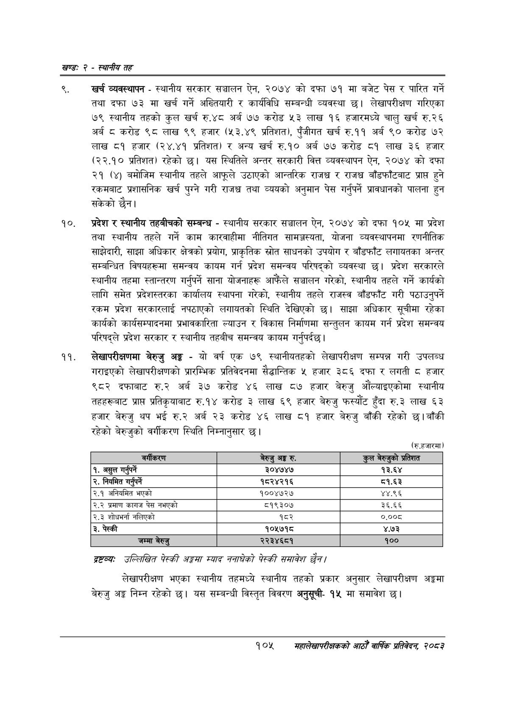

# Page 129 QA

## Rendered page


## Extracted text

```text
खण्ड: २ -स्थानीय तह
खर्च व्यवस्थापन -स्थानीय सरकार सञ्चालन ऐन, २०७४ को दफा ७१ मा बजेट पेस र पारित गर्ने तथा दफा ७३ मा खर्च गर्ने अख्तियारी र कार्यविधि सम्बन्धी व्यवस्था छ। लेखापरीक्षण गरिएका ७९ स्थानीय तहको कुल खर्च रु.४८ अर्ब ७७ करोड ५३ लाख १६ हजारमध्ये चालु खर्च रु.२६ अर्ब ८ करोड ९८ लाख ९९ हजार (५३.४९ प्रतिशत), पुँजीगत खर्च रु.११ अर्ब ९० करोड ७२ लाख ८१ हजार (२४.४१ प्रतिशत) र अन्य खर्च रु.१० अर्ब ७७ करोड ८१ लाख ३६ हजार (२२.१० प्रतिशत) रहेको छ। यस स्थितिले अन्तर सरकारी वित्त व्यवस्थापन ऐन, २०७४ को दफा २१ (४) बमोजिम स्थानीय तहले आफूले उठाएको आन्तरिक राजश्व र राजश्व बाँडफाँटबाट प्राप्त हुने रकमबाट प्रशासनिक खर्च पुग्ने गरी राजश्व तथा व्ययको अनुमान पेस गर्नुपर्ने प्रावधानको पालना हुन सकेको छैन।
प्रदेश र स्थानीय तहबीचको सम्बन्ध -स्थानीय सरकार सञ्चालन ऐन, २०७४ को दफा १०४ मा प्रदेश तथा स्थानीय तहले गर्ने काम कारवाहीमा नीतिगत सामञ्जस्यता, योजना व्यवस्थापनमा रणनीतिक साझेदारी, साझा अधिकार क्षेत्रको प्रयोग, प्राकृतिक स्रोत साधनको उपयोग र बाँडफाँट लगायतका अन्तर सम्बन्धित विषयहरूमा समन्वय कायम गर्न प्रदेश समन्वय परिषद्को व्यवस्था छ। प्रदेश सरकारले स्थानीय तहमा स्तान्तरण गर्नुपर्ने साना योजनाहरू आफैंले सञ्चालन गरेको, स्थानीय तहले गर्ने कार्यको लागि समेत प्रदेशस्तरका कार्यालय स्थापना गरेको, स्थानीय तहले राजस्व बाँडफाँट गरी पठाउनुपर्ने रकम प्रदेश सरकारलाई नपठाएको लगायतको स्थिति देखिएको छ। साझा अधिकार सूचीमा रहेका कार्यको कार्यसम्पादनमा प्रभावकारिता ल्याउन र विकास निर्माणमा सन्तुलन कायम गर्न प्रदेश समन्वय परिषद्ले प्रदेश सरकार र स्थानीय तहबीच समन्वय कायम गर्नुपर्दछ।
लेखापरीक्षणमा बेरुजु अङ्ग -यो वर्ष एक ७९ स्थानीयतहको लेखापरीक्षण सम्पन्न गरी उपलब्ध गराइएको लेखापरीक्षणको प्रारम्भिक प्रतिवेदनमा सैद्धान्तिक ५ हजार ३८६ दफा र लगती ८ हजार ९८२ दफाबाट रु.२ अर्ब ३७ करोड ४६ लाख ८७ हजार बेरुजु औंल्याइएकोमा स्थानीय तहहरूबाट प्राप्त प्रतिकृयाबाट रु.१४ करोड ३ लाख ६९ हजार बेरुजु फस्यौट हुँदा रु.३ लाख ६३ हजार बेरुजु थप भई रु.२ अर्ब २३ करोड ४६ लाख ८१ हजार बेरुजु बाँकी रहेको छ। बाँकी रहेको बेरुजुको वर्गीकरण स्थिति निम्नानुसार छ।
(रु.हजारमा)
द्रष्टव्यः उल्लिखित पेस्की अङ्कमा स्याद ननाघेको पेस्की समावेश छैन।
लेखापरीक्षण भएका स्थानीय तहमध्ये स्थानीय तहको प्रकार अनुसार लेखापरीक्षण अङ्कमा बेरुजु अङ्ग निम्न रहेको यस सम्बन्धी विस्तृत विवरण अनुसूची१५ मा समावेश छ।
१०४
महालेखापरीक्षकको आठौँ वार्षिक प्रतिवेदन २०८२

|  |  |  |  |
| --- | --- | --- | --- |
|  | ७२ |  |  |
| १. असुल | गर्नपर्ने | ३०४७४७ | १३.६४ |
| २. नियमित | गर्नुपर्ने | १८२४२१६ | ८१.६३ |
| २.१ अनिवनित | भएको | १००४७२४ | ४४.९६ |
| २.२ प्रमाण | कागज पेस नभएको | ८१९३०७ | ३६.६६ |
| २.३ शोधभर्ना | नलिएको | १८२ | ०.००८ |
| ३. पेस्की |  | १०५७१८ | ४.७३ |
|  |  |  |  |
```

## Flags
- table_page
- medium_quality_table
