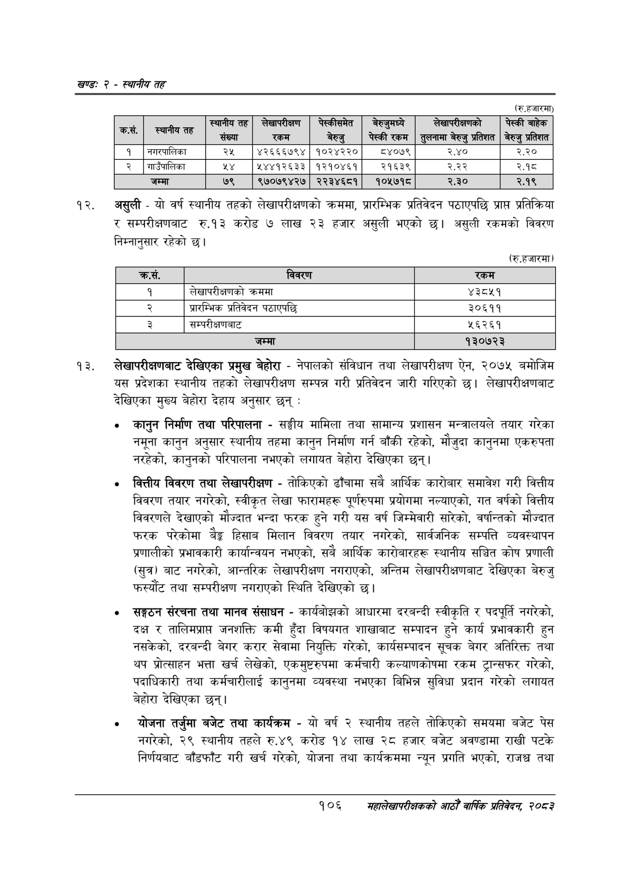

# Page 130 QA

## Rendered page


## Extracted text

```text
खण्ड: २ -स्थानीय तह
(रु.हजारमा)
असुली -यो वर्ष स्थानीय तहको लेखापरीक्षणको क्रममा, प्रारम्भिक प्रतिवेदन पठाएपछि प्राप्त प्रतिक्रिया र सम्परीक्षणबाट रु.१३ करोड ७ लाख २३ हजार असुली भएको | असुली रकमको विवरण निम्नानुसार रहेको छ।
(रु.हजारमा)
लेखापरीक्षणबाट देखिएका प्रमुख बेहोरा -नेपालको संविधान तथा लेखापरीक्षण ऐन, २०७५ बमोजिम यस प्रदेशका स्थानीय तहको लेखापरीक्षण सम्पन्न गरी प्रतिवेदन जारी गरिएको छ। लेखापरीक्षणबाट देखिएका मुख्य बेहोरा देहाय अनुसार छन्‌:
कानुन निर्माण तथा परिपालना -सङ्घीय मामिला तथा सामान्य प्रशासन मन्त्रालयले तयार गरेका नमूना कानुन अनुसार स्थानीय तहमा कानुन निर्माण गर्न बाँकी रहेको, मौजुदा कानुनमा एकरुपता नरहेको, कानुनको परिपालना नभएको लगायत बेहोरा देखिएका छन्‌।
वित्तीय विवरण तथा लेखापरीक्षण -तोकिएको ढाँचामा सबै आर्थिक कारोबार समावेश गरी वित्तीय विवरण तयार नगरेको, स्वीकृत लेखा फारामहरू पूर्णरुपमा प्रयोगमा नल्याएको, गत वर्षको वित्तीय विवरणले देखाएको मौज्दात भन्दा फरक हुने गरी यस वर्ष जिम्मेवारी सारेको, वर्षान्तको मौज्दात फरक परेकोमा बैङ्क हिसाब मिलान विवरण तयार नगरेको, सार्वजनिक सम्पत्ति व्यवस्थापन प्रणालीको प्रभावकारी कार्यान्वयन नभएको, सबै आर्थिक कारोबारहरू स्थानीय सञ्चित कोष प्रणाली (सुत्र) बाट नगरेको, आन्तरिक लेखापरीक्षण नगराएको, अन्तिम लेखापरीक्षणबाट देखिएका बेरुजु फस्यौट तथा सम्परीक्षण नगराएको स्थिति देखिएको छ।
सङ्गठन संरचना तथा मानव संसाधन -कार्यबोझको आधारमा दरबन्दी स्वीकृति र पदपूर्ति नगरेको, दक्ष र तालिमप्रापत जनशक्ति कमी हुँदा विषयगत शाखाबाट सम्पादन हुने कार्य प्रभावकारी हुन नसकेको, दरबन्दी बेगर करार सेवामा नियुक्ति गरेको, कार्यसम्पादन सूचक बेगर अतिरिक्त तथा थप प्रोत्साहन भत्ता खर्च लेखेको, एकमुष्टरुपमा कर्मचारी कल्याणकोषमा रकम ट्रान्सफर गरेको, पदाधिकारी तथा कर्मचारीलाई कानुनमा व्यवस्था नभएका बिभिन्न सुविधा प्रदान गरेको लगायत बेहोरा देखिएका छन्‌।
योजना तर्जुमा बजेट तथा कार्यक्रम -यो वर्ष २ स्थानीय तहले तोकिएको समयमा बजेट पेस नगरेको, २९ स्थानीय तहले रु.४९ करोड १४ लाख २८ हजार बजेट अवण्डामा राखी पटके निर्णयबाट बाँडफाँट गरी खर्च गरेको, योजना तथा कार्यक्रममा न्यून प्रगति भएको, राजश्व तथा
१०६
महालेखापरीक्षकको आठौँ वार्षिक प्रतिवेदन २०८२

|  |  |  |  |  |  |  |  |
| --- | --- | --- | --- | --- | --- | --- | --- |
|  |  | स्थानीय तह संख्या | सलखापरीकाण 'रकम | पेल्कीसमत बेरुजु | जनेरजुनन्पे पेस्कीरकम | लेखापरीकाणको ह्लनामा बेरुजु प्रतिशत | पेस्की बाहेक , प्रतिशत |
| १ | नगरपालिका | २५ | ४२६६६७९४ | १०२४२२० | ठ८४०७९ | २.४० | २.२० |
| २ | भाउँपालिका | २४ | १४४१२६३३ | १२१०४६१ | २१६३९ | २.२२ | २.१८ |

| कस. | विवरण | रकम |
| --- | --- | --- |
| १ | लेखापरीक्षणको क्रममा | ४३८५१ |
|  | प्रारम्भिक प्रतिवेदन ५०ा९पछि | ३०६११ |
| ३ | सम्परीक्षणबाट | २६२६१ |
|  | जम्मा | १३०७२३ |
```

## Flags
- table_page
- medium_quality_table
