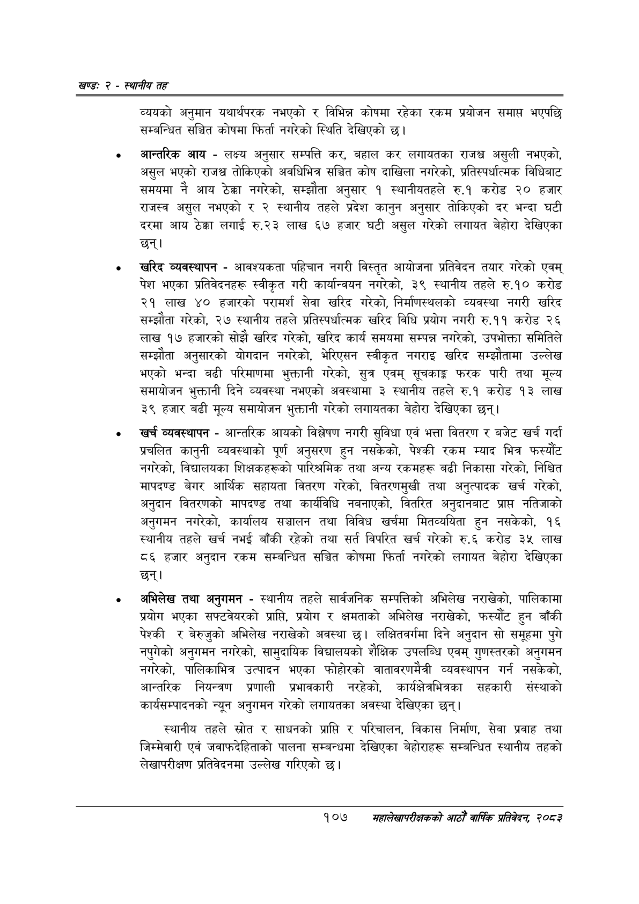

# Page 131 QA

## Rendered page


## Extracted text

```text
खण्ड: २ -स्थानीय तह
व्ययको अनुमान यथार्थपरक नभएको र विभिन्न कोषमा रहेका रकम प्रयोजन समाप्त भएपछि सम्बन्धित सञ्चित कोषमा फिर्ता नगरेको स्थिति देखिएको छ।
आन्तरिक आय -लक्ष्य अनुसार सम्पत्ति कर, बहाल कर लगायतका राजश्व असुली नभएको, असुल भएको राजश्व तोकिएको अवधिभित्र सञ्चित कोष दाखिला नगरेको, प्रतिस्पर्धात्मक विधिबाट समयमा नै आय ठेक्का नगरेको, सम्झौता अनुसार १ स्थानीयतहले रु.१ करोड २० हजार राजस्व असुल नभएको र २ स्थानीय तहले प्रदेश कानुन अनुसार तोकिएको दर भन्दा घटी दरमा आय ठेक्का लगाई रु.२३ लाख ६७ हजार घटी असुल गरेको लगायत बेहोरा देखिएका छन्‌।
० खरिद व्यवस्थापन -आवश्यकता पहिचान नगरी विस्तृत आयोजना प्रतिवेदन तयार गरेको एवम्‌ पेश भएका प्रतिवेदनहरू स्वीकृत गरी कार्यान्वयन नगरेको, ३९ स्थानीय तहले रु.१० करोड २१ लाख ४० हजारको परामर्श सेवा खरिद गरेको, निर्माणस्थलको व्यवस्था नगरी खरिद सम्झौता गरेको, २७ स्थानीय तहले प्रतिस्पर्धात्मक खरिद विधि प्रयोग नगरी रु.११ करोड २६ लाख १७ हजारको सोझै खरिद गरेको, खरिद कार्य समयमा सम्पन्न नगरेको, उपभोक्ता समितिले सम्झौता अनुसारको योगदान नगरेको, भेरिएसन स्वीकृत नगराइ खरिद सम्झौतामा उल्लेख भएको भन्दा बढी परिमाणमा भुक्तानी गरेको, सुत्र एवम्‌ सूचकाङ्ग फरक पारी तथा मूल्य समायोजन भुक्तानी दिने व्यवस्था नभएको अवस्थामा ३ स्थानीय तहले रु.१ करोड १३ लाख ३९ हजार बढी मूल्य समायोजन भुक्तानी गरेको लगायतका बेहोरा देखिएका छन्‌।
खर्च व्यवस्थापन -आन्तरिक आयको विश्लेषण नगरी सुविधा एवं भत्ता वितरण र बजेट खर्च गर्दा प्रचलित कानुनी व्यवस्थाको पूर्ण अनुसरण हुन नसकेको, पेश्की रकम म्याद भित्र फस्यौंट नगरेको, विद्यालयका शिक्षकहरूको पारिश्रमिक तथा अन्य रकमहरू बढी निकासा गरेको, निश्चित मापदण्ड बेगर आर्थिक सहायता वितरण गरेको, वितरणमुखी तथा अनुत्पादक खर्च गरेको, अनुदान वितरणको मापदण्ड तथा कार्यविधि नबनाएको, वितरित अनुदानबाट प्राप्त नतिजाको अनुगमन नगरेको, कार्यालय सञ्चालन तथा विविध खर्चमा मितव्ययिता हुन नसकेको, १६ स्थानीय तहले खर्च नभई बाँकी रहेको तथा सर्त विपरित खर्च गरेको रु.६ करोड ३५ लाख ८६ हजार अनुदान रकम सम्बन्धित सञ्चित कोषमा फिर्ता नगरेको लगायत बेहोरा देखिएका छन्‌।
० अभिलेख तथा अनुगमन -स्थानीय तहले सार्वजनिक सम्पत्तिको अभिलेख नराखेको, पालिकामा प्रयोग भएका सफ्टवेयरको प्राप्ति, प्रयोग र क्षमताको अभिलेख नराखेको, फस्यौट हुन बाँकी पेश्की र बेरुजुको अभिलेख नराखेको अवस्था | लक्षितवर्गमा दिने अनुदान सो समूहमा पुगे नपुगेको अनुगमन नगरेको, सामुदायिक विद्यालयको शैक्षिक उपलब्धि एवम्‌ गुणस्तरको अनुगमन नगरेको, पालिकाभित्र उत्पादन भएका फोहोरको वातावरणमैत्री व्यवस्थापन गर्न नसकेको, आन्तरिक नियन्त्रण प्रणाली प्रभावकारी नरहेको, कार्यक्षेतरभित्रका सहकारी संस्थाको कार्यसम्पादनको न्यून अनुगमन गरेको लगायतका अवस्था देखिएका छन्‌।
स्थानीय तहले स्रोत र साधनको प्राप्ति र परिचालन, विकास निर्माण, सेवा प्रवाह तथा जिम्मेवारी एवं जवाफदेहिताको पालना सम्बन्धमा देखिएका बेहोराहरू सम्बन्धित स्थानीय तहको लेखापरीक्षण प्रतिवेदनमा उल्लेख गरिएको छ।
१०७
महालेखापरीक्षकको आठौँ वार्षिक प्रतिवेदन २०८२
```

## Flags
- None
