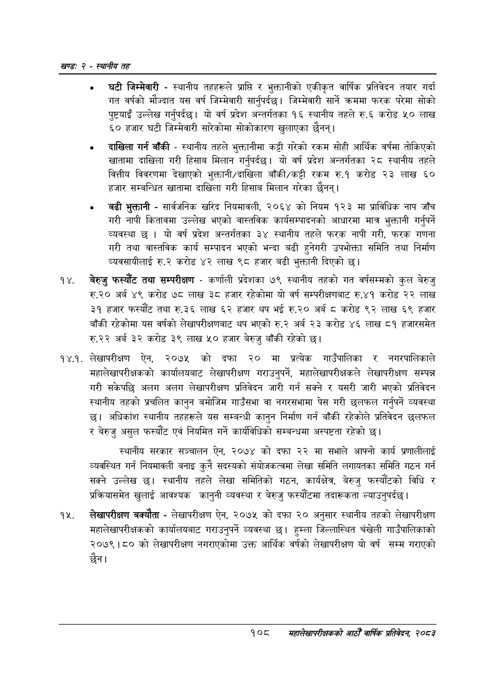

# Page 132 QA

## Rendered page


## Extracted text

```text
खण्ड: २ -स्थानीय तह
घटी जिम्मेवारी -स्थानीय तहहरूले प्राप्ति र भुक्तानीको एकीकृत वार्षिक प्रतिवेदन तयार गर्दा गत वर्षको मौज्दात यस वर्ष जिम्मेवारी सार्नुपर्दछ। जिम्मेवारी सार्ने क्रममा फरक परेमा सोको पुष्टयाइँ उल्लेख गर्नुपर्दछ। यो वर्ष प्रदेश अन्तर्गतका १६ स्थानीय तहले रु.६ करोड ५० लाख ६० हजार घटी जिम्मेवारी सारेकोमा सोकोकारण खुलाएका छैनन्‌।
दाखिला गर्न बाँकी -स्थानीय तहले भुक्तानीमा कट्टी गरेको रकम सोही आर्थिक वर्षमा तोकिएको खातामा दाखिला गरी हिसाब मिलान गर्नुपर्दछ। यो वर्ष प्रदेश अन्तर्गतका २८ स्थानीय तहले वित्तीय विवरणमा देखाएको भुक्तानी/दाखिला बाँकी/कट्टी रकम रु.१ करोड २३ लाख ६० हजार सम्बन्धित खातामा दाखिला गरी हिसाब मिलान गरेका छैनन्‌।
० बढी भुक्तानी -सार्वजनिक खरिद नियमावली, २०६४ को नियम १२३ मा प्राविधिक नाप जाँच गरी नापी कितावमा उल्लेख भएको वास्तविक कार्यसम्पादनको आधारमा मात्र भुक्तानी गर्नुपर्ने व्यवस्था छ | यो वर्ष प्रदेश अन्तर्गतका ३४ स्थानीय तहले फरक नापी गरी, फरक गणना गरी तथा वास्तविक कार्य सम्पादन भएको भन्दा बढी हुनेगरी उपभोक्ता समिति तथा निर्माण व्यवसायीलाई रु.२ करोड ४२ लाख ९८ हजार बढी भुक्तानी दिएको छ।
बेरुजु फस्यौट तथा सम्परीक्षण -कर्णाली प्रदेशका ७९ स्थानीय तहको गत वर्षसम्मको कुल बेरुजु रु.२० अर्ब ४९ करोड ७८ लाख ३८ हजार रहेकोमा यो वर्ष सम्परीक्षणबाट रु.४१ करोड २२ लाख ३१ हजार फस्यौट तथा रु.३६ लाख ६२ हजार थप भई रु.२० अर्ब ८ करोड ९२ लाख ६९ हजार बाँकी रहेकोमा यस वर्षको लेखापरीक्षणबाट थप भएको रु.२ अर्ब २३ करोड ४६ लाख ८१ हजारसमेत रु.२२ अर्ब ३२ करोड ३९ लाख ५० हजार बेरुजु बाँकी रहेको छ।
१४.१. लेखापरीक्षण ऐन, २०७५ को दफा २० मा प्रत्येक गाउँपालिका र नगरपालिकाले महालेखापरीक्षकको कार्यालयबाट लेखापरीक्षण गराउनुपर्ने, महालेखापरीक्षकले लेखापरीक्षण सम्पन्न गरी सकेपछि अलग अलग लेखापरीक्षण प्रतिवेदन जारी गर्न सक्ने र यसरी जारी भएको प्रतिवेदन स्थानीय तहको प्रचलित कानुन बमोजिम गाउँसभा वा नगरसभामा पेस गरी छलफल गर्नुपर्ने व्यवस्था छ। अधिकांश स्थानीय तहहरूले यस सम्बन्धी कानुन निर्माण गर्न बाँकी रहेकोले प्रतिवेदन छलफल र बेरुजु असुल फस्यौंट एवं नियमित गर्ने कार्यविधिको सम्बन्धमा अस्पष्टता रहेको छ।
स्थानीय सरकार सञ्चालन ऐन, २०७४ को दफा २२ मा सभाले आफ्नो कार्य प्रणालीलाई व्यवस्थित गर्न नियमावली बनाइ कुनै सदस्यको संयोजकत्वमा लेखा समिति लगायतका समिति गठन गर्न सक्ने उल्लेख छ। स्थानीय तहले लेखा समितिको गठन, कार्यक्षेत्र, बेरुजु फस्यौटको विधि र प्रक्रियासमेत खुलाई आवश्यक कानुनी व्यवस्था र बेरुजु फसस्यौटमा तदारूकता ल्याउनुपर्दछ।
लेखापरीक्षण बक्यौता -लेखापरीक्षण ऐन, २०७५ को दफा २० अनुसार स्थानीय तहको लेखापरीक्षण महालेखापरीक्षकको कार्यालयबाट गराउनुपर्ने व्यवस्था छ। हुम्ला जिल्लास्थित चंखेली गाउँपालिकाको २०७९।८० को लेखापरीक्षण नगराएकोमा उक्त आर्थिक वर्षको लेखापरीक्षण यो वर्ष सम्म गराएको छैन।
१०८
महालेखापरीक्षकको आठौँ वार्षिक प्रतिवेदन २०८२
```

## Flags
- None
