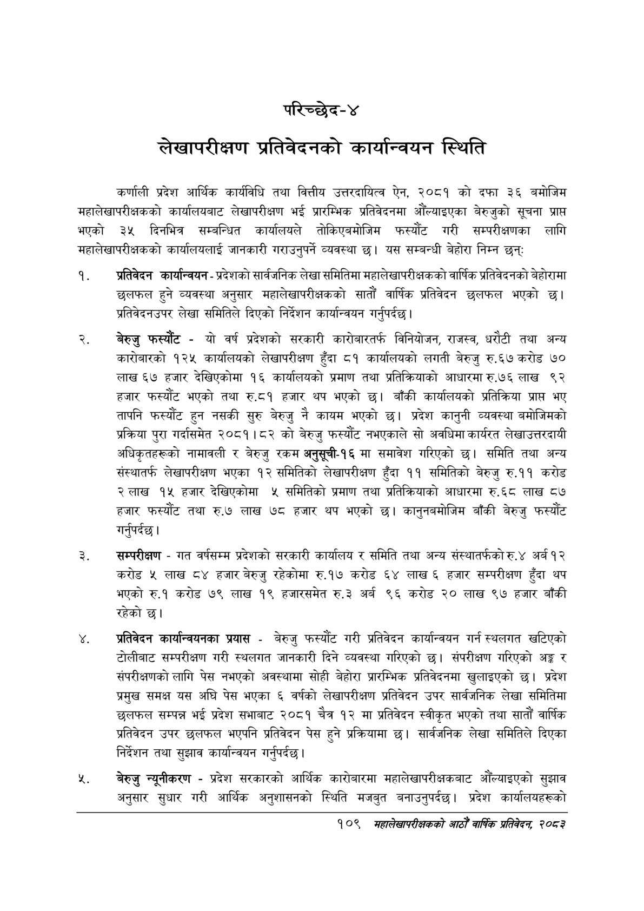

# Page 135 QA

## Rendered page


## Extracted text

```text
परिच्छेद-४
लेखापरीक्षण प्रतिवेदनको कार्यान्वयन स्थिति
कर्णाली प्रदेश आर्थिक कार्यविधि तथा वित्तीय उत्तरदायित्व ऐन, २०८१ को दफा ३६ बमोजिम महालेखापरीक्षकको कार्यालयबाट लेखापरीक्षण भई प्रारम्भिक प्रतिवेदनमा औंल्याइएका बेरुजुको सूचना प्राप्त भएको ३५ दिनभित्र सम्बन्धित कार्यालयले तोकिएबमोजिम फस्यौट गरी सम्परीक्षणका लागि महालेखापरीक्षकको कार्यालयलाई जानकारी गराउनुपर्ने व्यवस्था | यस सम्बन्धी बेहोरा निम्न छन्‌ः
प्रतिवेदन कार्यान्वयन -प्रदेशको सार्वजनिक लेखा समितिमा महालेखापरीक्षकको वार्षिक प्रतिवेदनको बेहोरामा छलफल हुने व्यवस्था अनुसार महालेखापरीक्षकको सातौं वार्षिक प्रतिविदन छलफल भएको प्रतिवेदनउपर लेखा समितिले दिएको निर्देशन कार्यान्वयन गर्नुपर्दछ |
बेरुजु फस्यौट -यो वर्ष प्रदेशको सरकारी कारोबारतर्फ विनियोजन, राजस्व, धरौटी तथा अन्य कारोबारको १२५ कार्यालयको लेखापरीक्षण हुँदा ८१ कार्यालयको लगती बेरुजु रु.६७ करोड ७० लाख ६७ हजार देखिएकोमा १६ कार्यालयको प्रमाण तथा प्रतिक्रियाको आधारमा रु.७६ लाख ९२ हजार फस्यौट भएको तथा रु.८१ हजार थप भएको | बाँकी कार्यालयको प्रतिक्रिया प्रापत भए तापनि फस्यौट हुन नसकी सुरु बेरुजु नै कायम भएको छ। प्रदेश कानुनी व्यवस्था बमोजिमको प्रक्रिया पुरा गर्दासमेत २०८१।८२ को बेरुजु फस्यौट नभएकाले सो अवधिमा कार्यरत लेखाउत्तरदायी अधिकृतहरूको नामावली र बेरुजु रकम अनुसूची-१६ मा समावेश गरिएको छ। समिति तथा अन्य संस्थातर्फ लेखापरीक्षण भएका १२ समितिको लेखापरीक्षण हुँदा ११ समितिको बेरुजु रु.११ करोड रलाख १५ हजार देखिएकोमा ५ समितिको प्रमाण तथा प्रतिक्रियाको आधारमा रु.६८ लाख ८७ हजार फस्यौट तथा रु.७ लाख ७८ हजार थप भएको छ। कानुनबमोजिम बाँकी बेरुजु फस्यौट गर्नुपर्दछ |
सम्परीक्षण -गत वर्षसम्म प्रदेशको सरकारी कार्यालय र समिति तथा अन्य संस्थातर्फको रु.४ अर्ब १२ करोड ५ लाख ८४ हजार बेरुजु रहेकोमा रु.१७ करोड ६४ लाख ६ हजार सम्परीक्षण हुँदा थप भएको रु.१ करोड ७९ लाख १९ हजारसमेत रु.३ अर्ब ९६ करोड २० लाख ९७ हजार बाँकी रहेको छ।
प्रतिवेदन कार्यान्वयनका प्रयास -बेरुजु फस्यौट गरी प्रतिवेदन कार्यान्वयन गर्न स्थलगत खटिएको टोलीबाट सम्परीक्षण गरी स्थलगत जानकारी दिने व्यवस्था गरिएको | संपरीक्षण गरिएको अङ्ग र संपरीक्षणको लागि पेस नभएको अवस्थामा सोही बेहोरा प्रारम्भिक प्रतिवेदनमा खुलाइएको छ। प्रदेश प्रमुख समक्ष यस अघि पेस भएका ६ वर्षको लेखापरीक्षण प्रतिवेदन उपर सार्वजनिक लेखा समितिमा छलफल सम्पन्न भई प्रदेश सभाबाट २०८१ चैत्र १२ मा प्रतिवेदन स्वीकृत भएको तथा सातौं वार्षिक प्रतिवेदन उपर छलफल भएपनि प्रतिवेदन पेस हुने प्रक्रियामा छ। सार्वजनिक लेखा समितिले दिएका निर्देशन तथा सुझाव कार्यान्वयन गर्नुपर्दछ |
बेरुजु न्यूनीकरण -प्रदेश सरकारको आर्थिक कारोबारमा महालेखापरीक्षकबाट औंँल्याइएको सुझाव अनुसार सुधार गरी आर्थिक अनुशासनको स्थिति मजबुत बनाउनुपर्दछ। प्रदेश कार्यालयहरूको
१०९ महालेखापरीक्षकको आठौँ वार्षिक प्रतिवेदन २०८२
```

## Flags
- None
