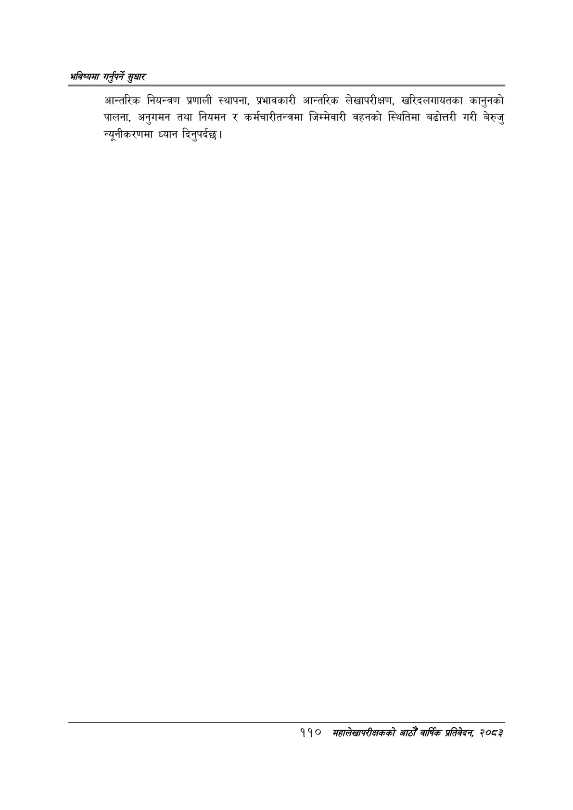

# Page 136 QA

## Rendered page


## Extracted text

```text
भविष्यमा गर्नुपर्ने ठुधार
आन्तरिक नियन्त्रण प्रणाली स्थापना, प्रभावकारी आन्तरिक लेखापरीक्षण, खरिदलगायतका कानुनको पालना, अनुगमन तथा नियमन र कर्मचारीतन्त्रमा जिम्मेवारी वहनको स्थितिमा बढोत्तरी गरी बेरुजु न्यूनीकरणमा ध्यान दिनुपर्दछ |
११० मृहालेखापरीक्षकको आठौँ वार्षिक प्रतिवेदन २०८२
```

## Flags
- None
