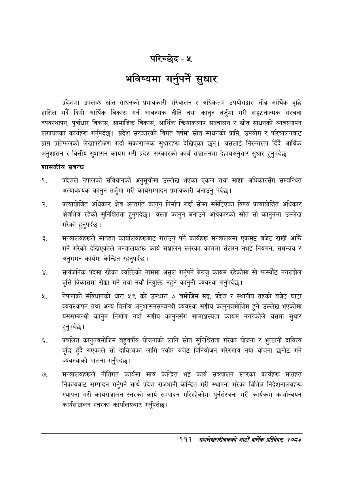

# Page 139 QA

## Rendered page


## Extracted text

```text
परिच्छेद -५
भविष्यमा गर्नुपर्ने सुधार
प्रदेशमा उपलब्ध स्रोत साधनको प्रभावकारी परिचालन र अधिकतम उपयोगद्वारा तीब्र आर्थिक वृद्धि हासिल गर्दै दिगो आर्थिक विकास गर्न आवश्यक नीति तथा कानुन तर्जुमा गरी सङ्गठनात्मक संरचना व्यवस्थापन, पूर्वाधार विकास, सामाजिक विकास, आर्थिक क्रियाकलाप सञ्चालन र स्रोत साधनको व्यवस्थापन लगायतका कार्यहरू गर्नुपर्दछ। प्रदेश सरकारको विगत वर्षमा स्रोत साधनको प्राप्ति, उपयोग र परिचालनबाट प्राप्त प्रतिफलको लेखापरीक्षण गर्दा सकारात्मक सुधारहरू देखिएका छन्‌। यसलाई निरन्तरता दिँदै आर्थिक अनुशासन र वित्तीय सुशासन कायम गरी प्रदेश सरकारको कार्य सञ्चालनमा देहायअनुसार सुधार हुन्‌पर्दछः
शासकीय प्रबन्ध
प्रदेशले नेपालको संविधानको अनुसूचीमा उल्लेख भएका एकल तथा साझा अधिकारसँग सम्बन्धित अत्यावश्यक कानुन तर्जुमा गरी कार्यसम्पादन प्रभावकारी बनाउनु पर्दछ।
प्रत्यायोजित अधिकार क्षेत्र अन्तर्गत कानुन निर्माण गर्दा सोमा समेटिएका विषय प्रत्यायोजित अधिकार क्षेत्रभित्र रहेको सुनिश्चितता हुनुपर्दछ। यस्ता कानुन बनाउने अधिकारको स्रोत सो कानुनमा उल्लेख गरेको हुनुपर्दछ |
मन्त्रालयहरूले मातहत कार्यालयहरूबाट गराउनु पर्ने कार्यहरू मन्त्रालयमा एकमुष्ट बजेट राखी आफैं गर्ने गरेको देखिएकोले मन्त्रालयहरू कार्य सञ्चालन स्तरका काममा संलग्न नभई नियमन, समन्वय र अनुगमन कार्यमा केन्द्रित रहनुपर्दछ।
सार्वजनिक पदमा रहेका व्यक्तिको नाममा असुल गर्नुपर्ने बेरुजु कायम रहेकोमा सो फस्यौट नगरुञ्जेल वृत्ति विकासमा रोक्का गर्ने तथा नयाँ नियुक्ति नहुने कानुनी व्यवस्था गर्नुपर्दछ |
नेपालको संविधानको धारा ५९ को उपधारा ७ बमोजिम सङ्घ, प्रदेश र स्थानीय तहको बजेट घाटा व्यवस्थापन तथा अन्य वित्तीय अनुशासनसम्बन्धी व्यवस्था सङ्घीय कानुनबमोजिम हुने उल्लेख भएकोमा यससम्बन्धी कानुन निर्माण गर्दा सङ्घीय कानुनसँग सामाञ्जस्यता कायम नगरेकोले यसमा सुधार हुनुपर्दछ |
प्रचलित कानुनबमोजिम बहुवर्षीय योजनाको लागि स्रोत सुनिश्चितता गरेका योजना र भुक्तानी दायित्व वृद्धि हुँदै गएकाले सो दायित्वका लागि पर्याप बजेट विनियोजन गरेरमात्र नया योजना छनोट गर्ने व्यवस्थाको पालना गर्नुपर्दछ |
मन्त्रालयहरूले नीतिगत कार्यमा मात्र केन्द्रित भई कार्य सञ्चालन स्तरका कार्यहरू मातहत निकायबाट सम्पादन गर्नुपर्ने साथै प्रदेश राजधानी केन्द्रित गरी स्थापना गरेका विभिन्न निर्देशनालयहरू स्थापना गरी कार्यसञ्चालन स्तरको कार्य सम्पादन गरिरहेकोमा पुर्नसंरचना गरी कार्यक्रम कार्यान्वयन कार्यसञ्चालन स्तरका कार्यालयबाट गर्नुपर्दछ |
१११ महालेखापरीक्षकको आठौँ वार्षिक प्रतिवेदन २०८२
```

## Flags
- None
