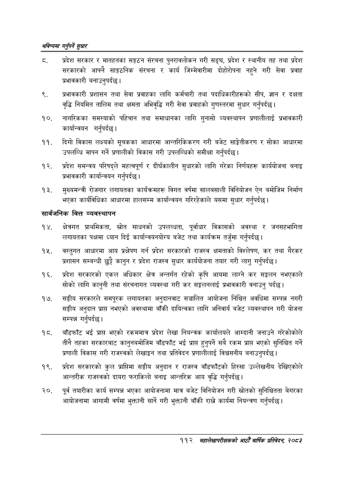

# Page 140 QA

## Rendered page


## Extracted text

```text
भविष्यमा गर्नुपर्ने सुक्षार
ठ. प्रदेश सरकार र मातहतका सङ्गठन संरचना पुनरावलोकन गरी सङ्घ, प्रदेश र स्थानीय तह तथा प्रदेश सरकारको आफ्नै साङ्गठनिक संरचना र कार्य जिम्मेवारीमा दोहोरोपना नहुने गरी सेवा प्रवाह प्रभावकारी बनाउनुपर्दछ |
प्रभावकारी प्रशासन तथा सेवा प्रवाहका लागि कर्मचारी तथा पदाधिकारीहरूको सीप, ज्ञान र दक्षता वृद्धि नियमित तालिम तथा क्षमता अभिवृद्धि गरी सेवा प्रवाहको गुणस्तरमा सुधार गर्नुपर्दछ |
नागरिकका समस्याको पहिचान तथा समाधानका लागि गुनासो व्यवस्थापन प्रणालीलाई प्रभावकारी कार्यान्वयन गर्नुपर्दछ।
दिगो विकास लक्ष्यको सूचकका आधारमा आन्तरिकिकरण गरी बजेट साङ्गेतीकरण र सोका आधारमा उपलब्धि मापन गर्ने प्रणालीको विकास गरी उपलब्धिको समीक्षा गर्नुपर्दछ |
प्रदेश समन्वय परिषद्ले महत्वपूर्ण र दीर्घकालीन सुधारको लागि गरेका निर्णयहरू कार्ययोजना बनाइ प्रभावकारी कार्यान्वयन गर्नुपर्दछ |
मुख्यमन्त्री रोजगार लगायतका कार्यक्रमहरू विगत वर्षमा सालबसाली विनियोजन ऐन बमोजिम निर्माण भएका कार्यविधिका आधारमा हालसम्म कार्यान्वयन गरिरहेकाले यसमा सुधार गर्नुपर्दछ।
सार्वजनिक वित्त व्यवस्थापन
क्षेत्रगत प्राथमिकता, स्रोत साधनको उपलब्धता, पूर्वाधार विकासको अवस्था र जनसहभागिता लगायतका पक्षमा ध्यान दिई कार्यान्वयनयोग्य बजेट तथा कार्यक्रम तर्जुमा गर्नुपर्दछ |
वस्तुगत आधारमा आय प्रक्षेपण गर्न प्रदेश सरकारको राजस्व क्षमताको विश्लेषण, कर तथा गैरकर प्रशासन सम्बन्धी छुट्टै कानुन र प्रदेश राजस्व सुधार कार्ययोजना तयार गरी लागु गर्नुपर्दछ |
प्रदेश सरकारको एकल अधिकार क्षेत्र अन्तर्गत रहेको कृषि आयमा लाग्ने कर सङ्कलन नभएकाले सोको लागि कानुनी तथा संरचनागत व्यवस्था गरी कर सङ्कलनलाई प्रभावकारी वनाउनु पर्दछ।
सङ्घीय सरकारले समपूरक लगायतका अनुदानवाट सञ्चालित आयोजना निश्चित अवधिमा सम्पन्न नगरी सङ्घीय अनुदान प्राप नभएको अवस्थामा बाँकी दायित्वका लागि अनिवार्य बजेट व्यवस्थापन गरी योजना सम्पन्न गर्नुपर्दछ |
बाँडफाँट भई प्राप्त भएको रकममात्र प्रदेश लेखा नियन्त्रक कार्यालयले आम्दानी जनाउने गरेकोकोले तीनै तहका सरकारबाट कानुनबमोजिम बाँडफाँट भई प्राप्त हुनुपर्ने सबै रकम प्राप्त भएको सुनिश्चित गर्ने प्रणाली विकास गरी राजस्वको लेखाङ्गन तथा प्रतिवेदन प्रणालीलाई विश्वसनीय बनाउनुपर्दछ |
प्रदेश सरकारको कुल प्राप्तिमा सङ्घीय अनुदान र राजस्व बाँडफाँटको हिस्सा उल्लेखनीय देखिएकोले आन्तरीक राजस्वको दायरा फराकिलो बनाइ आन्तरिक आय वृद्धि गर्नुपर्दछ |
पूर्व तयारीका कार्य सम्पन्न भएका आयोजनामा मात्र बजेट विनियोजन गरी स्रोतको सुनिश्चितता बेगरका आयोजनामा आगामी वर्षमा भुक्तानी सार्ने गरी भुक्तानी बाँकी राख्ने कार्यमा नियन्त्रण गर्नुपर्दछ |
११२ मृहालेखापरीक्षकको आठौँ वार्षिक प्रतिवेदन २०८२
```

## Flags
- None
