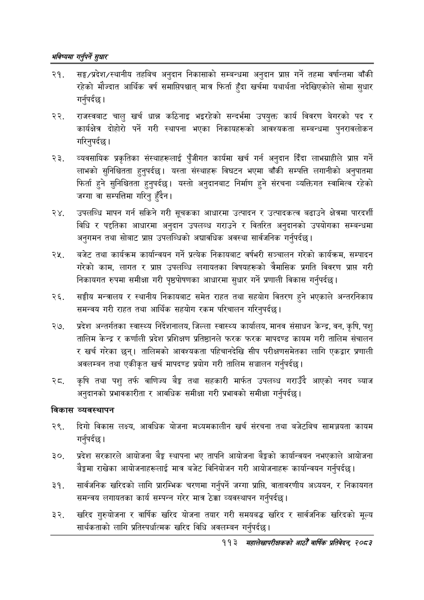

# Page 141 QA

## Rendered page


## Extracted text

```text
भविष्यमा गर्नुपर्ने सुक्षार
सङ्घ/प्रदेश/स्थानीय तहबिच अनुदान निकासाको सम्बन्धमा अनुदान प्राप्त गर्ने तहमा वर्षान्तमा बाँकी रहेको मौज्दात आर्थिक वर्ष समापिपश्चात्‌ मात्र फिर्ता हुँदा खर्चमा यथार्थता नदेखिएकोले सोमा सुधार गर्नुपर्दछ |
राजस्वबाट चालु खर्च धान्न कठिनाइ भइरहेको सन्दर्भमा उपयुक्त कार्य विवरण बेगरको पद र कार्यक्षेत्र दोहोरो पर्ने गरी स्थापना भएका निकायहरूको आवश्यकता सम्बन्धमा पुनरावलोकन गरिनुपर्दछ |
व्यवसायिक प्रकृतिका संस्थाहरूलाई पुँजीगत कार्यमा खर्च गर्न अनुदान दिँदा लाभग्राहीले प्राप्त गर्ने लाभको सुनिश्चितता हुनुपर्दछ। यस्ता संस्थाहरू विघटन भएमा बाँकी सम्पत्ति लगानीको अनुपातमा फिर्ता हुने सुनिश्चितता हुन्‌पर्दछ। यस्तो अनुदानबाट निर्माण हुने संरचना व्यक्तिगत स्वामित्व रहेको जग्गा वा सम्पत्तिमा गरिनु हुँदैन।
उपलब्धि मापन गर्न सकिने गरी सूचकका आधारमा उत्पादन र उत्पादकत्व बढाउने क्षेत्रमा पारदर्शी विधि र पद्दतिका आधारमा अनुदान उपलब्ध गराउने र वितरित अनुदानको उपयोगका सम्बन्धमा अनुगमन तथा सोबाट प्राप्त उपलब्धिको अद्यावधिक अवस्था सार्वजनिक गर्नुपर्दछ।
बजेट तथा कार्यक्रम कार्यान्वयन गर्ने प्रत्यक निकायबाट वर्षभरी सञ्चालन गरेको कार्यक्रम, सम्पादन गरेको काम, लागत र प्राप्त उपलब्धि लगायतका विषयहरूको त्रैमासिक प्रगति विवरण प्राप्त गरी निकायगत रुपमा समीक्षा गरी पृष्ठपोषणका आधारमा सुधार गर्ने प्रणाली विकास गर्नुपर्दछ |
सङ्घीय मन्त्रालय र स्थानीय निकायबाट समेत राहत तथा सहयोग वितरण हुने भएकाले अन्तरनिकाय समन्वय गरी राहत तथा आर्थिक सहयोग रकम परिचालन गरिनुपर्दछ |
२७, प्रदेश अन्तर्गतका स्वास्थ्य निर्देशनालय, जिल्ला स्वास्थ्य कार्यालय, मानव संसाधन केन्द्र, वन, कृषि, पशु तालिम केन्द्र र कर्णाली प्रदेश प्रशिक्षण प्रतिष्ठानले फरक फरक मापदण्ड कायम गरी तालिम संचालन र खर्च गरेका छन्‌। तालिमको आवश्यकता पहिचानदेखि सीप परीक्षणसमेतका लागि एकद्वार प्रणाली अवलम्बन तथा एकीकृत खर्च मापदण्ड प्रयोग गरी तालिम सञ्चालन गर्नुपर्दछ।
रट. कृषि तथा पशु तर्फ वाणिज्य बैङ्क तथा सहकारी मार्फत उपलब्ध गराउँदै आएको नगद ब्याज अनुदानको प्रभावकारीता र आवधिक समीक्षा गरी प्रभावको समीक्षा गर्नुपर्दछ |
विकास व्यवस्थापन
२९, दिगो विकास लक्ष्य, आवधिक योजना मध्यमकालीन खर्च संरचना तथा बजेटबिच सामञ्जयता कायम गर्नुपर्दछ |
प्रदेश सरकारले आयोजना बैङ्क स्थापना भए तापनि आयोजना बैङ्कको कार्यान्वयन नभएकाले आयोजना बैङ्कमा राखेका आयोजनाहरूलाई मात्र बजेट विनियोजन गरी आयोजनाहरू कार्यान्वयन गर्नुपर्दछ |
सार्वजनिक खरिदको लागि प्रारम्भिक चरणमा गर्नुपर्ने जग्गा प्राप्ति, वातावरणीय अध्ययन, र निकायगत समन्वय लगायतका कार्य सम्पन्न गरेर मात्र ठेक्का व्यवस्थापन गर्नुपर्दछ |
खरिद गुरुयोजना र वार्षिक खरिद योजना तयार गरी समयबद्ध खरिद र सार्वजनिक खरिदको मूल्य सार्थकताको लागि प्रतिस्पर्धात्मक खरिद विधि अवलम्बन गर्नुपर्दछ |
११३ महालेखापरीक्षकको आठौँ वार्षिक प्रतिवेदन २०८२
```

## Flags
- None
