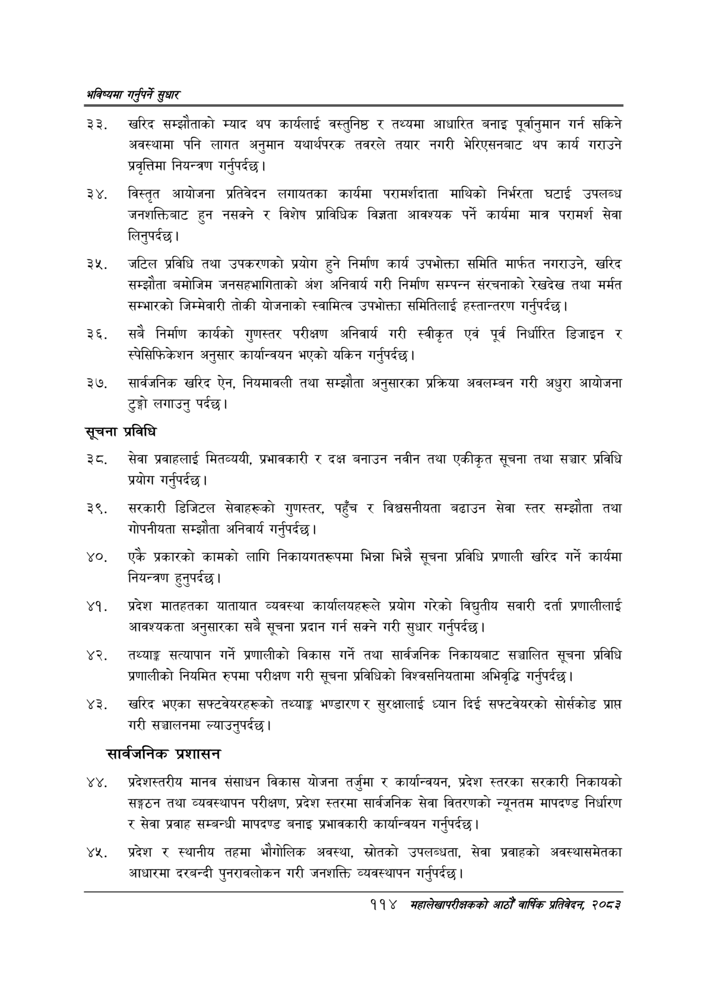

# Page 142 QA

## Rendered page


## Extracted text

```text
भविष्यमा गर्नुपर्ने सुक्षार
खरिद सम्झौताको म्याद थप कार्यलाई वस्तुनिष्ठ र तथ्यमा आधारित बनाइ पूर्वानुमान गर्न सकिने अवस्थामा पनि लागत अनुमान यथार्थपरक तवरले तयार नगरी भेरिएसनबाट थप कार्य गराउने प्रवृत्तिमा नियन्त्रण गर्नुपर्दछ।
विस्तृत आयोजना प्रतिवेदन लगायतका कार्यमा परामर्शदाता माथिको निर्भरता घटाई उपलब्ध जनशक्तिबाट हुन नसक्ने र विशेष प्राविधिक विज्ञता आवश्यक पर्ने कार्यमा मात्र परामर्श सेवा लिनुपर्दछ |
जटिल प्रविधि तथा उपकरणको प्रयोग हुने निर्माण कार्य उपभोक्ता समिति मार्फत नगराउने, खरिद सम्झौता बमोजिम जनसहभागिताको अंश अनिवार्य गरी निर्माण सम्पन्न संरचनाको रेखदेख तथा मर्मत सम्भारको जिम्मेवारी तोकी योजनाको स्वामित्व उपभोक्ता समितिलाई हस्तान्तरण गर्नुपर्दछ |
सबै निर्माण कार्यको गुणस्तर परीक्षण अनिवार्य गरी स्वीकृत एवं पूर्व निर्धारित डिजाइन र स्पेसिफिकेशन अनुसार कार्यान्वयन भएको यकिन गर्नुपर्दछ।
सार्वजनिक खरिद ऐन, नियमावली तथा सम्झौता अनुसारका प्रक्रिया अवलम्बन गरी अधुरा आयोजना टुङ्गो लगाउनु पर्दछ।
सूचना प्रविधि
सेवा प्रवाहलाई मितव्ययी, प्रभावकारी र दक्ष बनाउन नवीन तथा एकीकृत सूचना तथा सञ्चार प्रविधि प्रयोग गर्नुपर्दछ |
सरकारी डिजिटल सेवाहरूको गुणस्तर, पहुँच र विश्वसनीयता बढाउन सेवा स्तर सम्झौता तथा गोपनीयता सम्झौता अनिवार्य गर्नुपर्दछ |
एकै प्रकारको कामको लागि निकायगतरूपमा भिन्ना भिन्नै सूचना प्रविधि प्रणाली खरिद गर्ने कार्यमा नियन्त्रण हुनुपर्दछ |
प्रदेश मातहतका यातायात व्यवस्था कार्यालयहरूले प्रयोग गरेको विद्युतीय सवारी दर्ता प्रणालीलाई आवश्यकता अनुसारका सबै सूचना प्रदान गर्न सक्ने गरी सुधार गर्नुपर्दछ |
तथ्याङ्क सत्यापान गर्ने प्रणालीको विकास गर्ने तथा सार्वजनिक निकायबाट सञ्चालित सूचना प्रविधि प्रणालीको नियमित रुपमा परीक्षण गरी सूचना प्रविधिको विश्वसनियतामा अभिवृद्धि गर्नुपर्दछ |
खरिद भएका सफ्टवेयरहरूको तथ्याङ्क भण्डारण र सुरक्षालाई ध्यान दिई सफ्टवेयरको सोर्सकोड प्राप्त गरी सञ्चालनमा ल्याउनुपर्दछ।
सार्वजनिक प्रशासन
प्रदेशस्तरीय मानव संसाधन विकास योजना तर्जुमा र कार्यान्वयन, प्रदेश स्तरका सरकारी निकायको सङ्गठन तथा व्यवस्थापन परीक्षण, प्रदेश स्तरमा सार्वजनिक सेवा वितरणको न्यूनतम मापदण्ड निर्धारण र सेवा प्रवाह सम्बन्धी मापदण्ड बनाइ प्रभावकारी कार्यान्वयन गर्नुपर्दछ।
११४ प्रदेश र स्थानीय तहमा भौगोलिक अवस्था, स्रोतको उपलब्धता, सेवा प्रवाहको अवस्थासमेतका आधारमा दरबन्दी पुनरावलोकन गरी जनशक्ति व्यवस्थापन गर्नुपर्दछ |
११४ महालेखापरीक्षकको आठौँ वार्षिक प्रतिवेदन २०८२
```

## Flags
- None
