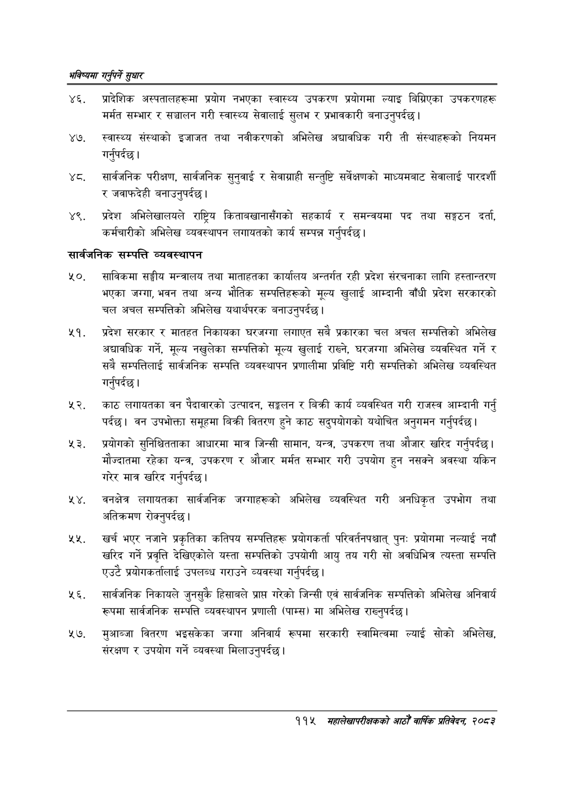

# Page 143 QA

## Rendered page


## Extracted text

```text
भविष्यमा गर्नुपर्ने सुक्षार
प्रादेशिक अस्पतालहरूमा प्रयोग नभएका स्वास्थ्य उपकरण प्रयोगमा ल्याइ बिग्रिएका उपकरणहरू मर्मत सम्भार र सञ्चालन गरी स्वास्थ्य सेवालाई सुलभ र प्रभावकारी बनाउनुपर्दछ |
स्वास्थ्य संस्थाको इजाजत तथा नवीकरणको अभिलेख अद्यावधिक गरी ती संस्थाहरूको नियमन गर्नुपर्दछ |
. सार्वजनिक परीक्षण, सार्वजनिक सुनुवाई र सेवाग्राही सन्तुष्टि सर्वेक्षणको माध्यमबाट सेवालाई पारदर्शी र जवाफदेही बनाउनुपर्दछ |
४९, प्रदेश अभिलेखालयले राष्ट्रिय किताबखानासँगको सहकार्य र समन्वयमा पद तथा सङ्गठन दर्ता, कर्मचारीको अभिलेख व्यवस्थापन लगायतको कार्य सम्पन्न गर्नुपर्दछ |
सार्वजनिक सम्पत्ति व्यवस्थापन
साविकमा सङ्घीय मन्त्रालय तथा माताहतका कार्यालय अन्तर्गत रही प्रदेश संरचनाका लागि हस्तान्तरण भएका जग्गा, भवन तथा अन्य भौतिक सम्पत्तिहरूको मूल्य खुलाई आम्दानी वाँधी प्रदेश सरकारको चल अचल सम्पत्तिको अभिलेख यथार्थपरक बनाउनुपर्दछ |
प्रदेश सरकार र मातहत निकायका घरजग्गा लगाएत सबै प्रकारका चल अचल सम्पत्तिको अभिलेख अद्यावधिक गर्ने, मूल्य नखुलेका सम्पत्तिको मूल्य खुलाई राख्ने, घरजग्गा अभिलेख व्यवस्थित गर्ने र सबै सम्पत्तिलाई सार्वजनिक सम्पत्ति व्यवस्थापन प्रणालीमा प्रविष्टि गरी सम्पत्तिको अभिलेख व्यवस्थित गर्नुपर्दछ |
काठ लगायतका वन पैदावारको उत्पादन, सङ्कलन र बिक्री कार्य व्यवस्थित गरी राजस्व आम्दानी गर्नु पर्दछ। वन उपभोक्ता समूहमा बिक्री वितरण हुने काठ सदुपयोगको यथोचित अनुगमन गर्नुपर्दछ |
प्रयोगको सुनिश्चितताका आधारमा मात्र जिन्सी सामान, यन्त्र, उपकरण तथा औजार खरिद गर्नुपर्दछ | मौज्दातमा रहेका यन्त्र, उपकरण र औजार मर्मत सम्भार गरी उपयोग हुन नसक्ने अवस्था यकिन गरेर मात्र खरिद गर्नुपर्दछ |
वनक्षेत्र लगायतका सार्वजनिक जग्गाहरूको अभिलेख व्यवस्थित गरी अनधिकृत उपभोग तथा अतिक्रमण रोक्नुपर्दछ।
खर्च भएर नजाने प्रकृतिका कतिपय सम्पत्तिहरू प्रयोगकर्ता परिवर्तनपश्चात्‌ पुनः प्रयोगमा नल्याई नयाँ खरिद गर्ने प्रवृत्ति देखिएकोले यस्ता सम्पत्तिको उपयोगी आयु तय गरी सो अवधिभित्र त्यस्ता सम्पत्ति एउटै प्रयोगकर्तालाई उपलब्ध गराउने व्यवस्था गर्नुपर्दछ |
सार्वजनिक निकायले जुनसुकै हिसाबले प्राप्त गरेको जिन्सी एवं सार्वजनिक सम्पत्तिको अभिलेख अनिवार्य रूपमा सार्वजनिक सम्पत्ति व्यवस्थापन प्रणाली (पाम्स) मा अभिलेख राख्नुपर्दछ |
मुआब्जा वितरण भइसकेका जग्गा अनिवार्य रूपमा सरकारी स्वामित्वमा ल्याई सोको अभिलेख, संरक्षण र उपयोग गर्ने व्यवस्था मिलाउनुपर्दछ।
११४ महालेखापरीक्षकको आठौँ वार्षिक प्रतिवेदन २०८२
```

## Flags
- None
