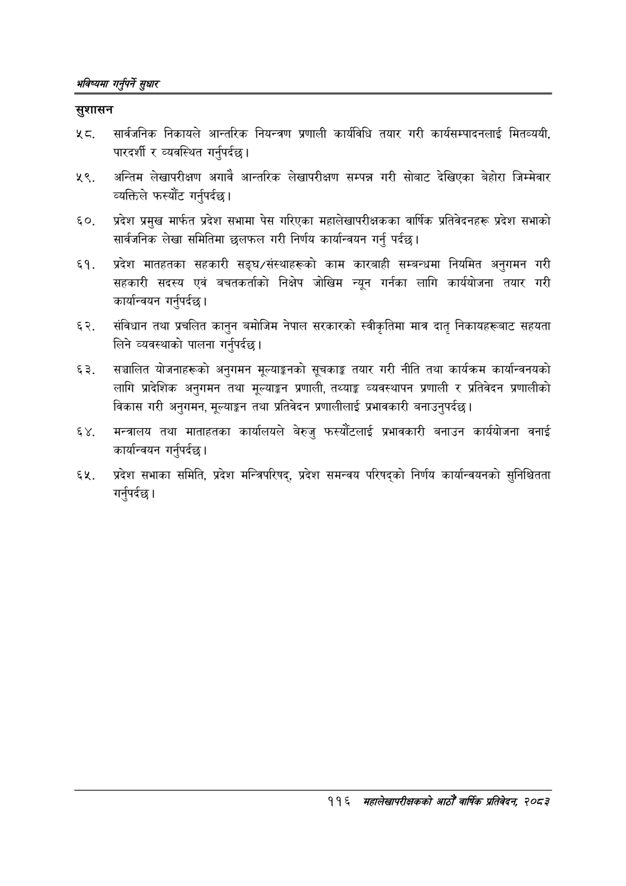

# Page 144 QA

## Rendered page


## Extracted text

```text
भविष्यमा गर्नुपर्ने सुक्षार
सुशासन
सार्वजनिक निकायले आन्तरिक नियन्त्रण प्रणाली कार्यविधि तयार गरी कार्यसम्पादनलाई मितव्ययी, पारदर्शी र व्यवस्थित गर्नुपर्दछ |
५९, अन्तिम लेखापरीक्षण अगावै आन्तरिक लेखापरीक्षण सम्पन्न गरी सोबाट देखिएका बेहोरा जिम्मेवार व्यक्तिले फस्यौट गर्नुपर्दछ |
प्रदेश प्रमुख मार्फत प्रदेश सभामा पेस गरिएका महालेखापरीक्षकका वार्षिक प्रतिवेदनहरू प्रदेश सभाको सार्वजनिक लेखा समितिमा छलफल गरी निर्णय कार्यान्वयन गर्नु पर्दछ।
प्रदेश मातहतका सहकारी सङ्घ/संस्थाहरूको काम कारबाही सम्बन्धमा नियमित अनुगमन गरी सहकारी सदस्य एवं बचतकर्ताको निक्षेप जोखिम न्यून गर्नका लागि कार्ययोजना तयार गरी कार्यान्वयन गर्नुपर्दछ |
संविधान तथा प्रचलित कानुन बमोजिम नेपाल सरकारको स्वीकृतिमा मात्र दातृ निकायहरूबाट सहयता लिने व्यवस्थाको पालना गर्नुपर्दछ |
सञ्चालित योजनाहरूको अनुगमन मूल्याङ्कनको सूचकाङ्क तयार गरी नीति तथा कार्यक्रम कार्यान्वनयको लागि प्रादेशिक अनुगमन तथा मूल्याङ्कन प्रणाली, तथ्याङ्क व्यवस्थापन प्रणाली र प्रतिवेदन प्रणालीको विकास गरी अनुगमन, मूल्याङ्कन तथा प्रतिवेदन प्रणालीलाई प्रभावकारी बनाउनुपर्दछ |
मन्त्रालय तथा माताहतका कार्यालयले बेरुजु फस्यौटलाई प्रभावकारी बनाउन कार्ययोजना वनाई कार्यान्वयन गर्नुपर्दछ |
प्रदेश सभाका समिति, प्रदेश मन्त्रिपरिषद्‌, प्रदेश समन्वय परिषद्को निर्णय कार्यान्वयनको सुनिश्चितता गर्नुपर्दछ |
११६ महालेखापरीक्षकको आठौँ वार्षिक प्रतिवेदन २०८२
```

## Flags
- None
