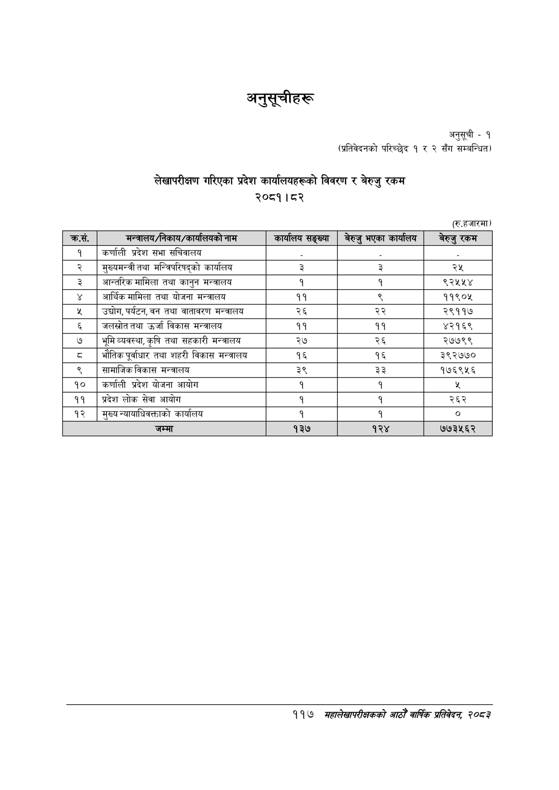

# Page 147 QA

## Rendered page


## Extracted text

```text
अनुसूचीहरू
अनुसूची -१
(प्रतिवेदनको परिच्छेद १ र २ सँग सम्बन्धित)
लेखापरीक्षण गरिएका प्रदेश कार्यालयहरूको विवरण र बेरुजु रकम २०८१।८२
(रु.हजारमा)
११७
महालेखापरीक्षकको आठौँ वार्षिक प्रतिवेदन २०८२

| क्रस. | सन्नालब/निकाय/कार्व लबको नाम | कार्षाणष सङ्ख्या | बेरुउ भएका ५ १ १ १ १ ९ ६९९ ७ ५७ १९ २१.७०३७९३ कार्य ५ १ १ १ १ १० ७४० ३ १९ ३३ ३५.८९०४६५ लव ५ १ १ १ १ ११ ८०० ३ ३८ ३३ ९०.५३०६१७ बेरुउ ५ १ १ १ १ १२ ८४२ १२ ४६ १५ ४८.४९१६१५ रकम ४ १ १ १ २ ० ३६ ३८ ८१२ २० -१ ५ १ १ १ २ १ ३६ ४३ ७ १५ ९६.३७५४३५ १ ५ १ १ १ २ २ ८७ ३९ ५२ १८ ९३.३८४१९३ कर्णाली ५ १ १ १ २ ३ १५० ३८ ३६ १९ ९४.९५६७०३ प्रदेश ५ १ १ १ २ ४ १९४ ४४ २९ १३ ९६.८५६४७६ सभा ५ १ १ १ २ ५ २३२ ३८ ६६ १९ ६५.६२९७४५ सचिवालय ५ १ १ १ २ ६ ५११ ५५ ४ २ ९२.०५२९६३ - ५ १ १ १ २ ७ ६७९ ५५ ४ २ ९२.०३६८४२ - ५ १ १ १ २ ८ ८४४ ५५ ४ २ ९२.०१३१६१ - ४ १ १ १ ३ ० ३५ ७० ८२२ २४ -१ ५ १ १ १ ३ १ ३५ ७४ ९ १५ ८९.९८३५८२ २ ५ १ १ १ ३ २ ८९ ७० १०० २४ ०.०००००० समुल्यबन्त्रीतयथा ५ १ १ १ ३ ३ १९९ ७० ९६ २३ २३.३०४८२९ मन्त्रिपरिषद्को ५ १ १ १ ३ ४ ३०६ ७० ५७ १८ ७०.९६२५४० कार्यालय ५ १ १ १ ३ ५ ५०९ ७४ ८ १५ ९४.८३१४७४ ३ ५ १ १ १ ३ ६ ६७७ ७४ ८ १५ ९५.३९९४६० ३ ५ १ १ १ ३ ७ ८३४ ७४ २३ १५ ९५.६०७००२ २५ ४ १ १ १ ४ ० ३६ १०१ ८४१ २४ -१ ५ १ १ १ ४ १ ३६ १०६ ८ १४ ९६.२८३२७२ ३ ५ १ १ १ ४ २ ८९ १०१ ६४ १९ ७३.५२४९४० अन्तरिक ५ १ १ १ ४ ३ १५६ १०१ ५२ १८ ९१.८५८५२८ मामिला ५ १ १ १ ४ ४ २१६ १०७ २८ १२ ९६.९८१४१५ तथा ५ १ १ १ ४ ५ २५२ १०७ ४३ १८ ९६.६२१४१४ कानुन ५ १ १ १ ४ ६ ३०४ ११० ५८ ९ ०.०००००० मन्त्रालय ५ १ १ १ ४ ७ ५०९ १०६ ७ १५ ९३.४९८८७८ १ ५ १ १ १ ४ ८ ६७७ १०६ ७ १५ ९३.८०५९३९ १ ५ १ १ १ ४ ९ ८१५ १०६ ६२ १५ ४१.१०५७४७ ९२५४५४ ४ १ १ १ ५ ० ३४ १३२ ८४२ २० -१ ५ १ १ १ ५ १ ३४ १३७ ११ १४ ९१.९४७६०९ ४ ५ १ १ १ ५ २ ८९ १३२ १०४ १९ २५.५९१२४४ आर्थिकमामिला ५ १ १ १ ५ ३ २०० १३८ २९ १३ ९६.६०९३४४ तथा ५ १ १ १ ५ ४ २३७ १३२ ४५ १९ ९६.८४२९६४ योजना ५ १ १ १ ५ ५ २९१ १४१ ५८ १० ६७.५१३८४७ मन्त्रालय ५ १ १ १ ५ ६ ५०२ १३७ २० १५ ९६.९०१६५७ ११ ५ १ १ १ ५ ७ ६७६ १३७ ९ १५ ५५.२३३६०४ ९ ५ १ १ १ ५ ८ ८१६ १३७ ६० १५ ५५.६५९०८१ ११९०५ ४ १ १ १ ६ ० ३५ १६३ ८४२ २१ -१ ५ १ १ १ ६ १ ३५ १६८ १० १५ ९३.१९६८९२ ५ ५ १ १ १ ६ २ ८७ १६३ ९७ २१ ४४.७९५१७४ उद्योग,पर्यटन, ५ १ १ १ ६ ३ १८८ १६९ २४ १२ ९५.४१३३५३ वन ५ १ १ १ ६ ४ २१९ १६९ २९ १२ ९६.५५३३९१ तथा ५ १ १ १ ६ ५ २५८ १७२ ५५ १० ६७.४१२८८० वातावरण ५ १ १ १ ६ ६ ३२९ १७२ ५८ ९ ३६.४२४८८५ भन्त्रालय ५ १ १ १ ६ ७ ५०२ १६८ २१ १५ ९५.३९७३६९ २६ ५ १ १ १ ६ ८ ६७० १६८ २१ १५ ९६.७५३७४६ २२ ५ १ १ १ ६ ९ ८१५ १६८ ६२ १५ ३८.७००६०३ २९११७ ४ १ १ १ ७ ० ३६ १९४ ८४० २० -१ ५ १ १ १ ७ १ ३६ १९९ ८ १५ ९२.६७६८०४ ६ ५ १ १ १ ७ २ ८७ १९४ ८८ १९ ९०.९१७३८१ जलस्रोततथा ५ १ १ १ ७ ३ १८३ १९५ ३५ १९ ९४.९९०४०२ उर्जा ५ १ १ १ ७ ४ २२६ १९४ ४८ १९ ९५.७९४७०१ विकास ५ १ १ १ ७ ५ २८४ २०३ ५७ १० ५६.५४९७४४ मन्त्रालय ५ १ १ १ ७ ६ ५०२ १९९ २० १५ ९६.८६००८५ ११ ५ १ १ १ ७ ७ ६७० १९९ २० १५ ९६.८८२०९५ ११ ५ १ १ १ ७ ८ ८१४ १९९ ६२ १५ ९१.२९१२२९ ४२१६९ ४ १ १ १ ८ ० ३४ २२६ ८४२ २४ -१ ५ १ १ १ ८ १ ३४ २३२ ११ १२ ९२.९४९२१९ ७ ५ १ १ १ ८ २ ८८ २२६ १२५ २४ ४१.२९६१२० भूमिव्यवस्था,कृषि ५ १ १ १ ८ ३ २२१ २३२ २८ १२ ९६.६३७७६४ तथा ५ १ १ १ ८ ४ २५७ २२६ ५७ १९ ९६.५०१०८३ सहकारी ५ १ १ १ ८ ५ ३२३ २३४ ५८ १० ४४.०३७६२१ मन्त्रालय ५ १ १ १ ८ ६ ५०१ २३० २३ १५ ९६.२६५८८४ २७ ५ १ १ १ ८ ७ ६७० २३० २१ १५ ९६.७७३६८९ २६ ५ १ १ १ ८ ८ ८१५ २३० ६१ १६ ९१.३२२४५६ २७७९९ ४ १ १ १ ९ ० ३५ २५५ ८४८ २५ -१ ५ १ १ १ ९ १ ३५ २६३ १० १२ ९२.८३०३९९ ८ ५ १ १ १ ९ २ ८८ २५५ १०१ २५ ८६.१२६१३७ भौतिकपूर्वाधार ५ १ १ १ ९ ३ १९७ २६३ २८ १२ ९६.९८३५८९ तथा ५ १ १ १ ९ ४ २३३ २५८ ३९ १८ ९६.३८८७३३ शहरी ५ १ १ १ ९ ५ २७९ २५७ ४८ १८ ९२.९२४८३५ विकास ५ १ १ १ ९ ६ ३३७ २६६ ५८ ९ ५६.६३५५०९ भन्त्रालय ५ १ १ १ ९ ७ ५०२ २६२ २१ १५ ९६.९६१९५२ १६ ५ १ १ १ ९ ८ ६७० २६२ २१ १५ ९६.९२०२६५ १६ ५ १ १ १ ९ ९ ८०९ २६२ ७४ १५ ९२.६६७३८१ ३९२७७० ४ १ १ १ १० ० ३५ २८८ ८४७ २० -१ ५ १ १ १ १० १ ३५ २९३ ९ १५ ९१.३४०२१० ९ ५ १ १ १ १० २ ८९ २८८ ११५ १९ ४३.९०३८७७ सामाजिकविकास ५ १ १ १ १० ३ २१४ २९७ ५८ १० ४६.७४४०८७ मन्त्रालय ५ १ १ १ १० ४ ५०२ २९३ २२ १५ ९६.७२३६२५ ३९ ५ १ १ १ १० ५ ६७० २९३ २१ १५ ९६.७०८४६६ ३३ ५ १ १ १ १० ६ ८०९ २९३ ७३ १५ ८५.४७७६०८ १७६९५६ ४ १ १ १ ११ ० २९ ३२० ८२२ २० -१ ५ १ १ १ ११ १ २९ ३२४ २२ १६ ९४.२१२०२१ १० ५ १ १ १ ११ २ ८७ ३२० ५२ १८ ९५.१०२४०९ कर्णाली ५ १ १ १ ११ ३ १५१ ३२० ३५ १८ ९६.०४६४९४ प्रदेश ५ १ १ १ ११ ४ १९४ ३२० ४५ १८ ९६.२०३१७८ योजना ५ १ १ १ ११ ५ २४८ ३२० ४५ १८ ९६.५८९०३५ आयोग ५ १ १ १ ११ ६ ५०९ ३२४ ७ १६ ९४.५४८४७० १ ५ १ १ १ ११ ७ ६७७ ३२४ ७ १६ ९४.७३१०८७ १ ५ १ १ १ ११ ८ ८४१ ३२४ 
```

## Flags
- table_page
- medium_quality_table
