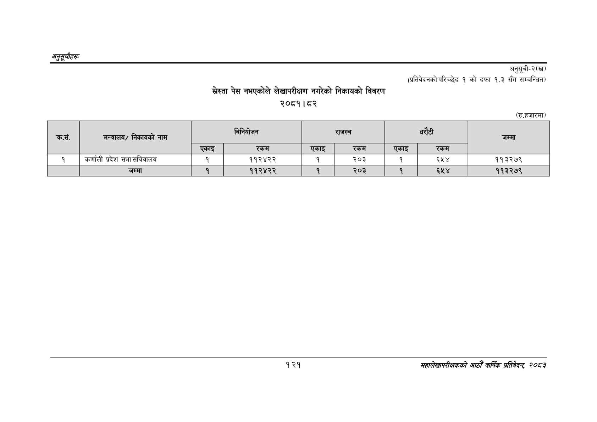

# Page 151 QA

## Rendered page


## Extracted text

```text
अनुतूचीहरू
स्ेस्ता पेस नभएकोले लेखापरीक्षण नगरेको निकायको विवरण २०८१।८२
अनुसूची२
(प्रतिवेदनको परिच्छेद १ को दफा १.३ सँग सम्बन्धित)
(रु.हजारमा)
१२१
सहालेखापरीक्षकको आठौँ वा्िकै प्रतिवेदन २०८२

| . क्रस. | मन्त्रालय/ निकायको नाम |  | विनेयोजन |  | राजस्व |  |  | जम्मा |
| --- | --- | --- | --- | --- | --- | --- | --- | --- |
|  |  | एकाइ | रकम | एकाइ | रकम | एकाइ | रकम |  |
| १ | कर्णाली प्रदेश सभा सचिवालय | १ | ११२४२२ | १ | २०३ | १ | ६५४ | ११३२७९ |
|  | जम्मा | १ | ११२४२२ | १ | २०३ | १ | ६५४ | ११३२७९ |
```

## Flags
- table_page
- medium_quality_table
