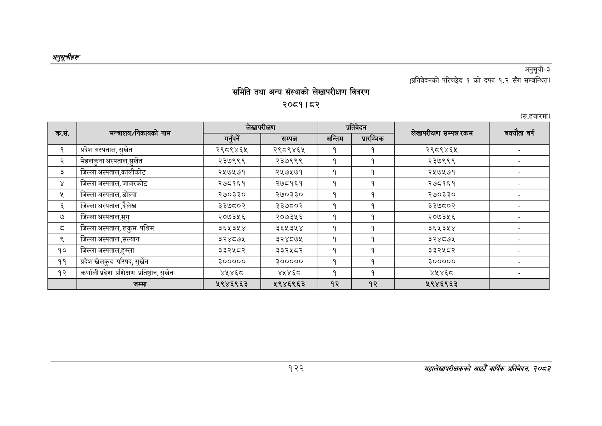

# Page 152 QA

## Rendered page


## Extracted text

```text
अनुतूचीहरू
समिति तथा अन्य संस्थाको लेखापरीक्षण विवरण २०८१।८२
अनुसूची-३
(प्रतिवेदनको परिच्छेद १ को दफा १.२ सँग सम्बन्धित)
(रु.हजारमा)
१२२
महालेखापरीक्षकको आठौ वार्षिक प्रतिवेदन २०८२

|  | मन्त्रालय/नेकायको |  |  |  | काल | लेखापरीक्षण | बक्यँता वर्ष |
| --- | --- | --- | --- | --- | --- | --- | --- |
| क्रस. | नाम | गफ | सम्पन्न | अन्तिम |  | सम्पन्न रकम |  |
| १ | प्रदेश अस्पताल, सुर्खेत | २९८९४६५ | २९८९४६४५ | १ | १ | २९८९४६४ |  |
| २ | मेहलकुना अस्पताल,सुर्खेत | २३७९९९ | २३७९९९ | १ | १ | २३७९९९ |  |
| ३ | जिल्ला अस्पताल,कालीकोट | २५७५७१ | २५७५७१ | १ | १ | २५७५७१ |  |
| ४ | जिल्ला अस्पताल, जाजरकोट | २७८१६१ | २७८१६१ | १ | १ | २७८१६१ |  |
| [हि | जिल्ला अस्पताल, डोल्पा | २७०३३० | २७०३३० |  |  | ३०३३० |  |
| ६ | जिल्ला अस्पताल,दैलेख | ३३७८०२ | ३३७८०२ | १ | १ | ३३७८०२ |  |
| ७ | जिल्ला अस्पताल,मुगु | २०७३५६ | २०७३५६ | १ | १ | २०७३५६ |  |
| ८ | जिल्ला अस्पताल, रुकुम पश्चिम | ३६५३५४ | ३६५३५४ | १ | १ | ३६५३५४ |  |
| ९ | जिल्ला अस्पताल /सल्यान | ३२४८७५ | ३२४८७५ | १ | १ | ३२४८७५ |  |
| १० | जिल्ला अस्पताल,हुम्ला | ३३२५८२ | ३३२५८२ | १ | १ | ३३२४५८२ |  |
| ११ | प्रदेशखेलकुद परिषद्‌, सुर्खेत | ३००००० | ३००००० |  |  | ३००००० |  |
| १२ | कर्णाली प्रदेश प्रशिक्षण प्रतिष्ठान, सुर्खेत | ४४६८ | ४४४६ | १ | १ | १३४३ |  |
```

## Flags
- table_page
- medium_quality_table
