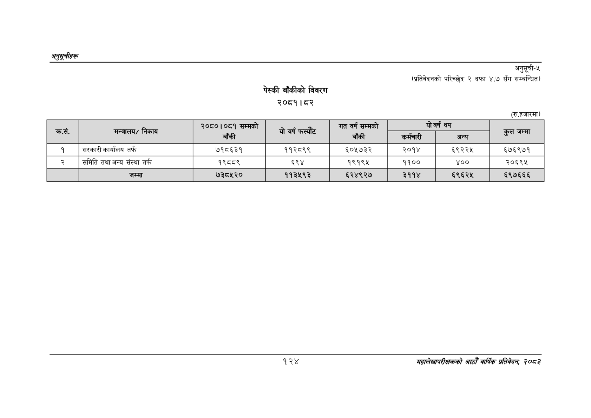

# Page 154 QA

## Rendered page


## Extracted text

```text
अनुतूचीहरू
पेस्की बाँकीको विवरण
२०८१।८२
अनुसूची-५
(प्रतिवेदनको परिच्छेद २ दफा ४.७ सँग सम्बन्धित)
१२४
सहालेखापरीक्षकको आठौँ वा्िकै प्रतिवेदन २०८२

| कस | मन्त्रालय/ निकाय | बाँकी | यो वर्ष फस्यँट | बाँकी | 'कर्मचारी | अन्य | हल जम्मा |
| --- | --- | --- | --- | --- | --- | --- | --- |
| १ | सरकारी कार्यालय तर्फ | ७१८६३१ | ११२८९९ | ६०५७३२ | २०१४ | ६९२२५ | ६७६९७१ |
| २ | समिति तथा अन्य संस्था तर्फ | १९८८९ | ६९४ | १९१९५ | ११०० | ४०० | २०६९४५ |
```

## Flags
- table_page
- medium_quality_table
